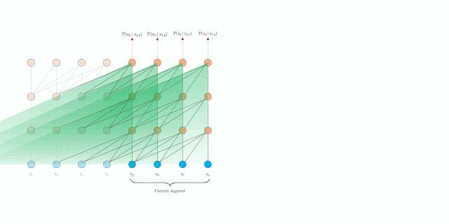

## What's the big idea

- By compressing memories, transformers are able to model long range sequences more efficiently and effectively, 
outperforming state-of-the-art benchmarks on various sequence based tasks.
  
## What's Wrong With Attention

- Attention is expensive in both computation time and memory
  
- It's also not a great model of how memory really works (most do not remember every detail of every second of their lives, yet that is the transformer model)

- Current architecture is forced to move on and limit themselves to a fixed size window of attention

## How Can We Improve Attention

- Not all memories deserve the same amount of memory or detail (think of the resolution of short-term vs long-term memories)
  
- We can reduce the dimensions (and thus the resolution of the representation) for a subset of memories in the sequence

    - Compressed memories are now coarser and have a rough analogy to long-term memories
    - UnCompressed memories often contain more important information and have a rough analogy to short-term memories

  
## How Does This Work (How Is It Realized)

1.) You pass a sequence $$S_i = x_t, ..., x_n$$ through the network

2.) As the model progresses to the next sequence $$S_i$$ is moved into memory of past activation (we can still attend to it)

3.) Eventually, the memory gets to large so we evict the oldest memory

4.) Instead of deleting the oldest memory, we create a mapping to compress it and store it in a stack

## How do we compress an activation aka "memory"

- The main idea is to use a mapping from uncompressed to compressed: $$f_c: R^{n_s \ x \ d} \rightarrow R^{[\frac{n_s}{c}] \ x \ d}$$

- There are tons of types of mappings, the authors explore a few
  - Max/Mean Pooling
  - 1D Convolution
  - Dilated Convolutions
  - Most Used: Take the most relevant parts of the activation
    
**TODO: Explain best performing method**

## So... did it work?

- Yes, due to the compact representation of the memories the Compressive Transformer has increased range when dealing with sequences
  - TransformerXL Temporal Range:             $$l \ x \ n$$
  - Compressive Transformer Temporal Range:   $$l \ x \ (n_m \ + \ c \ * \ n_cm)$$
  
## What are the effects of longer temporal ranges

- Longer temporal ranges allow the model to attend to items that happened a long time ago in the sequence, think of reading a book, watching a movie, etc.

- Because we are compressing memories and saving what is relevant, the older activations get, the more salient they become

## How does it perform? 

- Compressive Transformer outperformed TransformerXL (its closest comparison) on every benchmark, but shows the most promise on large sequence datasets

- PG-19 is a new dataset the authors released in order to show off long range tasks (holds entire books)

- Compressive Transformer reduced the Test Perplexity of PG-19 from Transformer XLs result of 36.3 to 33.6 

## Down sides?

- There are more hyperparameters to tune
  - Size of the compressive memory
  - How to compress the memory
  - Ratio between regular memories and compressed memories
  
- Really only beneficial if you are working on tasks with long sequences
    
## TL;DR

- Fixed Sized Attention windows hurt long range sequence tasks, compressed memories can help overcome that 
- Compressed memories accumulate Salient information over time
- Long Range Attention can help in various domains and tasks
