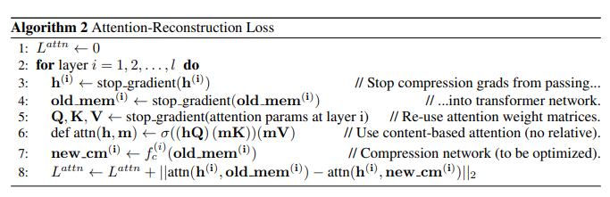

## core idea
In this article, the authors proposed Compressive Transformer, a variant of Transformer, which achieved the-state-of-art results on character-based language modelling and word-level language modelling.
Compressive Transformer also performed very well on the book-level language modelling. The Compressive Transformer, neither like Transformer that computationally expensive, nor like TransformerXL that discard old enough activations, it compress past activations into compressed memory.
The Compressive Transformer not only achieved computational and storage efficiency, but also remember all the past activations. 

## how is it realized?
The Compressive Transformer only uses attention to propagate information, and it has two parts of memories --- respective memory (FIFO) and compressed memory. Sequences first come to the respective memory, and with newer sequences come in, old activations are compressed to compressed memory by using some compression functions. In other words, memories obtained recently are make up larger storage while all the old memories make up small part of storage. The following algorithm describes this process: 

## technical details
There are four choices for compression functions, which are max/mean pooling, 1D convolution, dilated convolutions, and "most-used"。 Here, the "most-used" function makes memory most used to be preserved. All compression functions can be trained.  As for the loss, there are two supplementary losses should be considered ---- auto-encoding loss, which recover compressed memories, and attention-reconstruction loss, which recover the context-based attention from respective memories and compressed memories. Attention-reconstruction loss is a bit more complicated and more essentailly used, whose algorithm is as follows:

# results
It seems the Compressive Transformer outperforms TransformerXL on PG-19, which is a large datasets with datas are long-context extracted from project Gutenberg. the Compressive Transformer model also achieved the-state-of-art resutls on Enwik8. In addition, if people use 1D convolution compression function together with attention reconstruction loss function, the result will be the best among all other Compressive Transformer models. The Compressive Transformer also did a good job in speech, comparable to the-state-of-art model, but more parameters efficient. The authors also found that the older memories are not less frequently accessed. 

# three points I like
1. Compressive Transformer compress old memories rather than discard it. Compressive Transformer doesn't keep all activations, but compress them, which let it becomes more storage efficient
2. Attention increased from the oldest activations stored in respective memory to the compressed memory.
3. This compressive transformer achieved great performance on long-range context extracted from books
 

