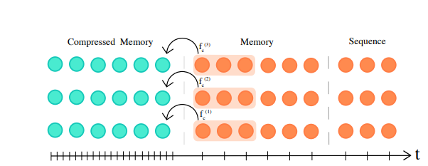
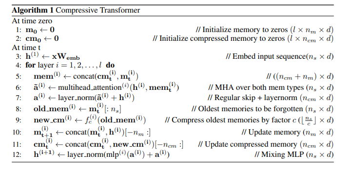

## core idea
In this article, the authors proposed Compressive Transformer, a variant of Transformer, which achieved the-state-of-art resutls on character-based language modelligng and word-level language modelling.
Compressive Transformer also performed very well on the book-level language modelling. The Compressive Transformer, neither like Transformer that computationally expensive, nor like TransformerXL that discard old enough activations, it compress past activations into compressed memory.
The Compressive Transformer not only achieved computational and storage efficiency, but also remember all the past activations. 

## how is it realized?
The Compressive Transformer only uses attention to propagate information, and it has two parts of memories --- respective memory (FIFO memory) and compressed memory. Sequences first come to the respective memory, and with newer sequences come in, old activations are compressed to compressed memory by using some compression functions. In other words, memories obtained recently are make up larger storage while all the old memories make up small part of storage. The following algorithm describes this process: 

## technical details
There are four choices for compression functions, which are max/mean pooling, 1D convolution, dilated convolutions, and "most-used"。 Here, the "most-used" function makes memory most used to be preserved. All compression functions can be trained.  

