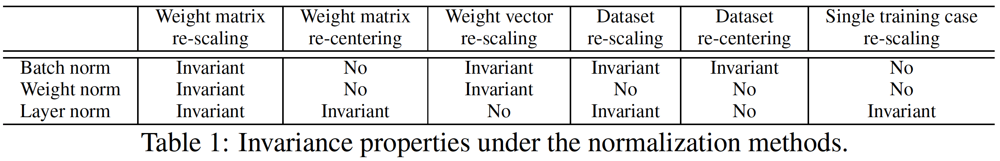
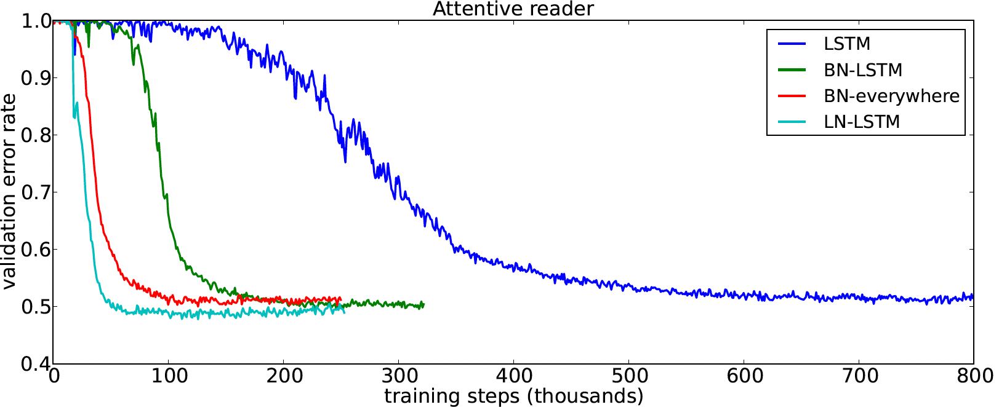

## What is the core idea?

* The motivation behind normalization techniques is to achieve faster convergence and reduce training time by fixing the problem due to "covariate shift", i.e. high correlation in the summed inputs to different neurons in a layer caused as an effect of correlated changes in the outputs of the previous layer. This causes the gradient of the weights to be highly dependent on the outputs of previous layer.

* The primary contribution of the paper is to overcome some of the shortcomings of the batch normalization technique proposed recently (at that time) by Ioffe and Szegedy (2015) for FFNs; essentially eliminate the dependence on the size of the mini-batch and thereby adapt it for RNNs (and online learning settings) as well.

* The paper builds on top of the idea in batch normalization to make the training faster but instead of normalizing the summed inputs to a neuron using parameters computed over a mini-batch for that neuron, it computes the normalization parameters over all neurons in a layer and independently for each training sample.

* Additionally, through analyzing the manifold of the parameter space, the paper also shows that normalization has an implicit effect of reducing the learning rate and making the learning more stable.

## How is it realized (technically)?

Ioffe and Szegedy (2015) had proposed the idea of eliminating the effect of covariate shift by normalizing the summed inputs to a neuron before applying the non-linear activation on top of that. They wanted to normalize the inputs to each neuron independently using mean and variance (of the inputs) computed over the distribution of the data. So, 

$$ a_i^l = {w_i^l}^T h^l \qquad h_i^{l+1} = f(a_i^l + b_i^l)$$

changed to

$$ \overline{a}_i^l = \frac{g_i^l}{\sigma_i^l}(a_i^l-\mu_i^l) \qquad \mu_i^l = \underset{\mathrm{x}\sim P(\mathrm{x})}{\mathbb{E}}[a_i^l] \qquad \sigma_i^l = \sqrt{\underset{\mathrm{x}\sim P(\mathrm{x})}{\mathbb{E}} \left [\left ( a_i^l-\mu_i^l \right )^2 \right ] }$$

where $a_i^l$ are the summed inputs to neuron $i$ in layer $l$, $w_i^l$ is the incoming weight vector for that neuron, $h^l$ is the output from previous layer, $b_i^l$ is the bias term, $f(\cdot)$ is the activation of the neuron, $\mathrm{x}$ is the input data, $g_i^l$ is the gain parameter and $\overline{a}_i^l$ is the normalized sum of inputs. 

Obviously, it is impractical to compute the above expectations exactly, hence the batch normalization paper computes it empirically over the samples in the current mini-batch. This layer normalization paper modifies that and computes the normalization statistics (mean and variance) over all the neurons in the layer for each training sample:

$$ \mu^l = \frac{1}{H} \sum_{i=1}^{H}a_i^l \qquad \sigma^l = \sqrt{\frac{1}{H}\sum_{i=1}^{H} \left ( a_i^l-\mu_i^l\right )^2}$$

Note that the mean and variance above are defined for a layer and are same for all neurons in that layer.

### Why is layer normalization superior to batch normalization?

* As shown above, batch normalization computes the normalization parameters over a mini-batch of samples which makes it sensitive to the batch size. Therefore, one cannot reduce the batch size arbitrarily. Layer normalization, on the other hand, does not put a constraint on the batch size during training and hence, can be applied even with batch size = 1 as in online learning.
* For reasons similar to that in previous point, it is not easy to apply batch normalization in RNNs because one would need to compute and store the parameters for **each time-step across sequences** in a batch and that is a problem when the sequence length varies a lot as it commonly does. Layer normalization does not run into this problem because it computes the statistics from the inputs to all nodes in layer at the **current time-step**.

### Invariance properties

Table 1 compares the invariance properties (if the output changes or not) of 3 normalization techniques -- layer, batch and weight when the model weights and input data are re-scaled and re-centered. 

In weight normalization, the summed inputs are scaled by the L2 norm of the incoming weights and there is no centering by subtracting mean. There is no clear favourite from the table but it is worth noting from the last column that with layer normalization, the prediction of model does not change even if an individual data point is re-scaled.

## How well does the paper perform?

The paper does extensive experimentation to show that layer normalization provides a considerable improvement in performance over the baseline models and batch normalization. 

They evaluate their proposal on 6 tasks: image-sentence ranking, question-answering, contextual language modelling, generative modelling, handwriting sequence generation and MNIST classification with different kinds of models (focusing on RNNs though) and show that layer normalization outperforms batch normalization on **both convergence speed and final results** in all tests.

Figure above is an exemplar result that shows the speedup in convergence (in terms of validation error) with layer normalization. This is for attentive reader model from the experiment on question-answering task.

## TL;DR
* Modifies batch normalization to compute the normalization statistics over all nodes in a layer for each training sample, instead of all the samples in a batch for each node.
* Makes the normalization independent of batch size and therefore easily applicable to RNNs unlike batch normalization.
* Outperforms baseline models (with and without batch normalization) in convergence speed as well as final results for 6 different tasks.
