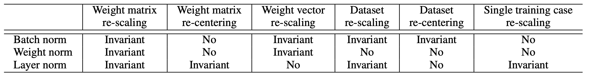
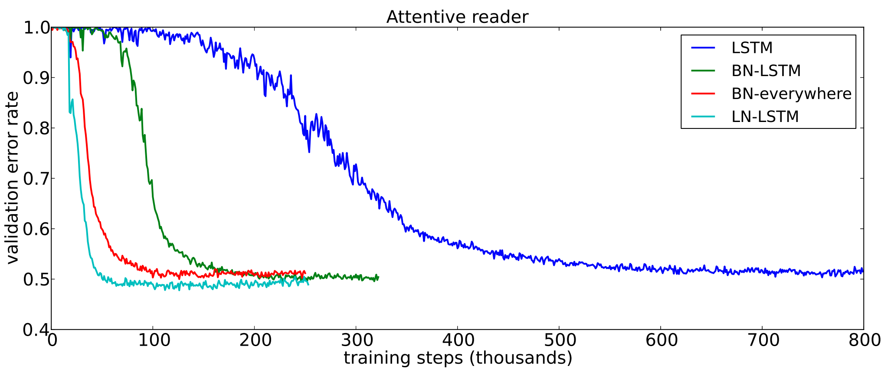
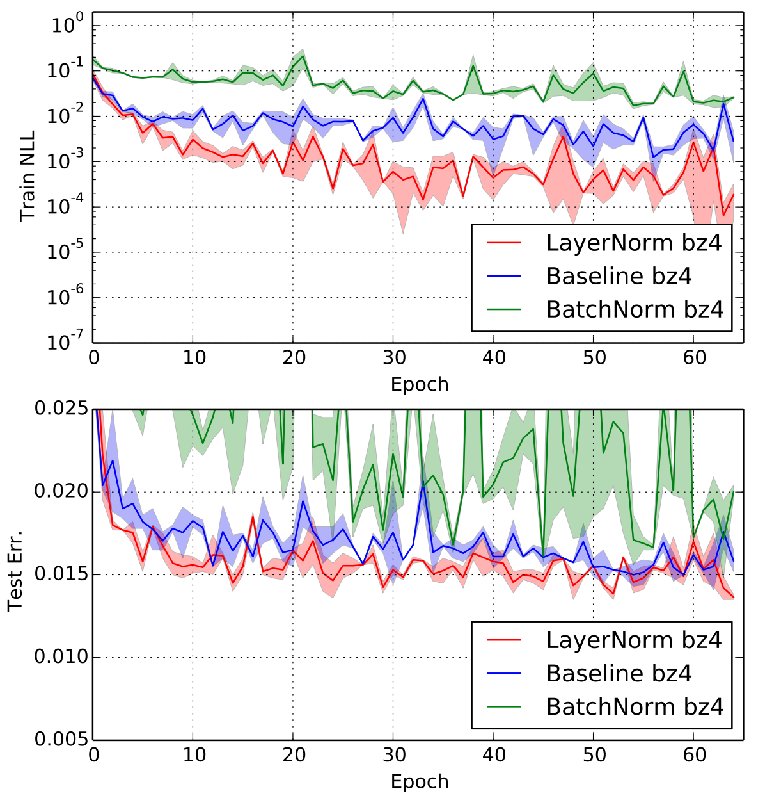

## Core Idea

In this paper, the authors propose _Layer Normalization_ (also called LayerNorm), an alternative to Batch Normalization (BN) for improving training stability and convergence.
The core idea is to derive the shift and scale parameters for normalization _within the layer itself_, unlike BN which relies on batch statistics.
An important distinction to BN is that all hidden units of a layer share the same normalization terms, but may be normalized differently across training examples.

While the paper presents a preliminary theoretical analysis on generalized linear models,
the main strength of the paper is in its thorough empirical evaluation compared to the competing approaches,
namely Batch Normalization [Ioffe and Szegedy, 2015] and Weight Normalization [Salimans and Kingma, 2016].

### What issues does it solve?

LayerNorm solves three major drawbacks of BN:
1. BN's normalization terms are computed from the minibatch, so it cannot be used when batch size is 1 or small.
2. BN's normalization terms are updated as an running mean/stddev during training, so there is a mismatch between training and test time.
3. When applied to a Recurrent Neural Network (RNN), BN requires keeping track of separate batch statistics for each time step.
   This is problematic when the sequence length is longer at test time, as there would not be corresponding statistics to normalize with.

In short, LayerNorm can be applied (1) regardless of the batch size, (2) has identical behavior at training and test time, and (3) can be seamlessly applied to RNNs.

## Technical Description

For a layer $$a$$ with $$H$$ neurons, LayerNorm computes the mean and standard deviation across the neurons themselves:

$$
\mu = \frac{1}{H}\sum\limits_{i=1}^{H} a_i, \hspace{3em} \sigma = \sqrt{\frac{1}{H}\sum\limits_{i=1}^{H}(a_i-\mu)^2}
$$

Notice that all neurons ($$a_1, \ldots, a_H$$) share the same scalar parameters $$\mu$$ and $$\sigma$$.

Again, it should be noted that the normalization terms ($$\mu, \sigma$$) are computed _for each example separately_ and do not depend on the batch.

## Invariance Properties

LayerNorm makes different trade-offs compared to the two related techniques, namely Batch Normalization and Weight Normalization.
Table 1 summarizes the trade-offs clearly:

 
<b>Table 1: Trade-off comparison to BN and WN.</b>

 

Notably, LayerNorm is invariant to rescaling and shifting of the entire weight matrix.
Given how neural network weight initializations are most commonly done at the weight matrix level,
one could expect LayerNorm to be robust to various initialization schemes.

In addition, LayerNorm's lack of invariance to dataset re-centering likely poses little challenge,
as most deep learning implementations shift the dataset to have zero mean.

## Experimental Results

The paper presents six evaluation results showcasing the effectiveness of LayerNorm, with a focus on RNNs.
We present two particularly interesting results here.
The first is a comparison to different BN variants considered by [Cooijmans et al., 2016].

 
<b>Figure 1: Comparison to Batch Normalization for a LSTM network.</b>

 

As shown in **Figure 1**, using LayerNorm significantly increases the convergence speed of the LSTM-based Attentive Reader model [Vendrov et al., 2016] compared to BN.
The important point here is that LayerNorm outperformed a variant of BN specially designed for RNNs, labeled "BN-LSTM" in the plot [Cooijmans et al., 2016].

Secondly, the authors also consider a feed-forward network by training a permutation-invariant MNIST classification network.

 
<b>Figure 2: Evaluation on the Permutation MNIST task.</b>

 

While **Figure 2** is a bit noisy, it clearly shows that using LayerNorm leads to gains in both training loss and test error compared to both the baseline and BN for feed-forward networks as well.

## Theoretical Results

The authors present a theoretical analysis of LayerNorm on generalized linear models (GLM) by analyzing its effect on the Fisher Information matrix.
In particular, they show that LayerNorm can stabilize training by implicitly reducing the learning rate for weight vectors with large norm.

## References

* [Ioffe and Szegedy, 2015] Sergey Ioffe and Christian Szegedy. Batch normalization: Accelerating deep network training by reducing internal covariate shift. _ICML_, 2015.
* [Gregor et al., 2015] K. Gregor, I. Danihelka, A. Graves, and D. Wierstra. DRAW: a recurrent neural network for image generation. _arXiv:1502.04623_, 2015.
* [Cooijmans et al., 2016] Tim Cooijmans, Nicolas Ballas, Cesar Laurent, and Aaron Courville. Recurrent batch normalization. _arXiv preprint arXiv:1603.09025_, 2016.
* [Vendrov et al., 2016] Ivan Vendrov, Ryan Kiros, Sanja Fidler, and Raquel Urtasun. Order-embeddings of images and language. _ICLR_, 2016.
* [Salimans and Kingma, 2016] Tim Salimans and Diederik P Kingma. Weight normalization: A simple reparameterization to accelerate training of deep neural networks. _arXiv preprint arXiv:1602.07868_, 2016.

## TL;DR
* Unlike BN, LayerNorm computes normalization terms within a hidden layer rather than batch statistics.
* LayerNorm is agnostic to batch size, has identical training/test time behavior, and is directly applicable to RNNs.
* Experimental results show that LayerNorm improves the performance of the network across several different tasks and architectures, including RNNs.
