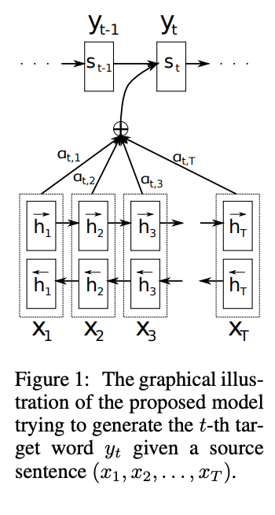
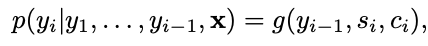
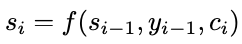
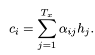
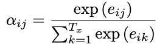

What is the core idea?

The core idea of the paper is doing neural machine translation using a encoder and decoder architecture. The primary model consists of an encoder, which takes in the input embeddings, as well as the embedding of the previous time step and outputs a hidden state. The decoder does the similar, where it takes the output embeddings (embedding of the translation), the previous time step and a context vector c. The context vector is a weighted sum of the hidden states of the encoder model, where there is a submodel, which takes the hidden state and the input and outputs a weight.

How is it realized (technically)?

Encoder and decoder models were popularized with the growth of RNN models. They work by encoding the input using an encoding RNN and then feeding the output hidden state to a decoder RNN which takes hidden state and outputs an output sequence. These models are popular for NLP (although RNN have been replaced). This paper offers an improvement to existing sequence to sequence RNN models by introducing the concept of alignment. Instead of using just the output of the encoder model, the decoder also calculates a context vector, which represents the alignment between the current hidden state and the hidden states of the encoder.

We calculate the next sequence using the above proability.

S represents the input to the function g

To calculate the context vector we simply compute a weighted sum of the previous hidden states. The "weight" is how much that previous hidden state should be attended to predict the next token.

To figure out this weight. The authors make an alignment model, which takes in the current hidden state (representing the context for the current step) and then take the input hidden state and use a MLP to calculate alignment score. This model is trained concurrently when we do backprop.

How well does the paper perform?

The model reaches high BLEU scores. However, suffers as the sentences get larger. The authors compare their model to the baseline model, which doesn't use the same approach. We see that the model outperforms for all sequence lengths. Therefore, they have still made a substantial improvement.

We see in the bottom table outperformance in BLEU scores.

We see the qualititative results of the approach below. This shows that the alignment scores are working for certain translations (english/french).

What interesting variants are explored?

No real variants explored.

## TL;DR
* The core idea of the paper is doing neural machine translation using a encoder and decoder architecture.
* Introduce idea of attention
* Show improvement using BLEU score metric, however, does much worse on larger sentences.
