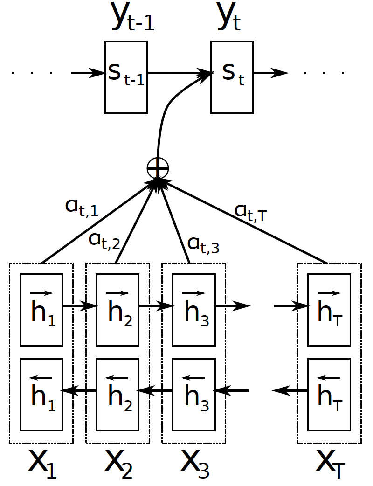
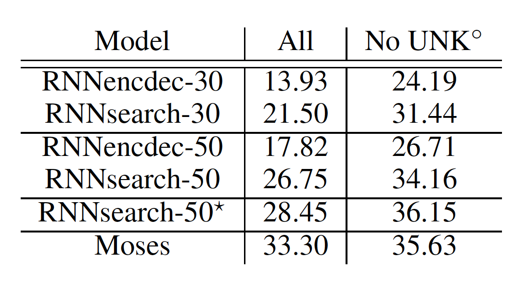
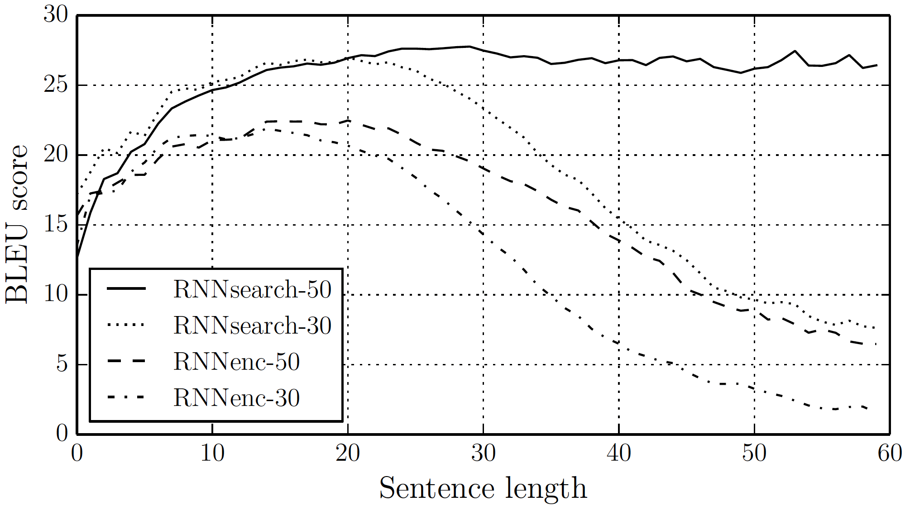

## The core idea

Neural Machine Translation (NMT) techniques before this paper used an encoder-decoder architecture with **fixed-length encoding** of the source sequences which acts as a bottleneck in case of long sequences. This paper proposes the idea of generating independent context-vectors for each word in the output sequence by implementing an **attention mechanism** over the encoded source sequence. This allows the model to encode all the important information equally accurately for long sequences. 

Further, it uses a bi-directional RNN (BiRNN) as the encoder to summarise both the preceding and the following words in the encoding of each word.

## How is it realized?

The baseline RNN encoder-decoder encodes the input sequence $$\mathrm{x}=(x_1,\cdots,x_{T_x})$$ into a fixed-length vector $$c$$ using an RNN as follows:

$$h_t=f(x_t,h_{t-1}), \qquad c=q(\{h_1,\cdots,h_{T_x}\})$$

where $$h_t$$ is the hidden state at time $$t$$ and $$f(\cdot)$$ and $$q(\cdot)$$ are some nonlinear functions. The decoder part of the architecture uses another RNN which is trained to predict the probability of the next word at time $$t$$ using another RNN as some nonlinear function $$g(\cdot)$$ of the previous word $$y_{t-1}$$, the fixed-length encoding $$c$$ and the current state of the RNN $$s_t$$.

The proposed architecture also uses a similar encoder as above, except that it uses two RNNs - one running in each direction to generate two sets of hidden states $$(\overrightarrow{h_1},\cdots,\overrightarrow{h_{T_x}})$$ and $$(\overleftarrow{h_1},\cdots,\overleftarrow{h_{T_x}})$$ for each input sequence.  The final hidden state (also called _annotation_) for each word is simply the concatenation of the forward and backward hidden states, i.e. $$h_{j}=\left [ \overrightarrow{h_j^T}; \overleftarrow{h_j^T} \right ]^T$$. This is to include information from both preceding and following words in the annotation of each word. Note that for the proposed model, $$j$$ and $$i$$ are used to index the input and output sequences respectively.

The paper largely modifies the decoder architecture of the baseline model where instead of having a fixed encoding $$c$$ for each sequence pair, there is an independent **context-vector $$c_{i}$$** for predicting each word in the output sequence. So, $$c$$ is replaced by $$c_{i}$$ in all equations for predicting the next word $$y_{i}$$ and computing the next state $$s_{i}$$ of the decoder RNN. 

As earlier, the encoding vector(s) are computed from the hidden states generated by the encoder. However, here the hidden states are weighted by the parameters of an attention layer $$\alpha_{ij}$$:

$$c_{i} = \sum_{j=1}^{T_x} \alpha_{i j} h_{j} \qquad \boldsymbol{\alpha}_i = softmax(\mathbf{e}_{i}) \qquad e_{ij} = a(s_{i-1},h_{j})$$

where the last equation represents the parameters of an _alignment model_ that learns to assign an importance to inputs around $$j$$ for the output at $$i$$. This model $$a(\cdot)$$ is jointly trained with the other parts of the encoder-decoder architecture. This allows the model to search for positions in the input sequence with the most relevant information (captured in the context-vectors) for predicting next word.

## Benefits of proposed model

* The model no longer requires to encode long sequences into fixed-length vectors which allows a better encoding of the information around all words in the long sequence.
* By having a context vector for each word in the output, it automatically takes care of cases where source and target sequences are of different lengths.
* With BiRNN and a soft alignment (using attention) over the annotations of the input sequence, the model is able to look at various parts of the source sequence before predicting the next output word. This improves the quality of the translation.
* The alignment parameters in the $$\alpha$$ matrix above represent the importance of each word in the source sentence to generate a target word. Thus, a simple visualization of this matrix can be used to qualitatively evaluate if the alignments learnt by the model are intuitive for some example translations.

## Performance

The proposed model RNNsearch is evaluated on English-to-French translation task and compared against the baseline RNNencdec model. The authors train 2 versions of each model - one with input sequences of length up to 30 and another with length up to 50. The architecture includes 1000 hidden units each in the decoder and encoder RNNs. In the BiRNN encoder of RNNsearch, each RNN has 1000 units. Other hyper-parameter choices are as follows:
  * Optimizer: SGD with Adadelta
  * Batch size: 80 sentences
  * Training time: 5 days
  * Inference: Beam search

The table above compares the performance of the models on the test set of 3003 sentences as measured by the **BLEU score**. The last column corresponds to testing on sentences which do not contain any words not seen during training. RNNsearch-50* model is trained for much longer.

* The translation model with attention clearly outperforms the baseline model by a substantial margin. 
* In fact, the performance of the RNNsearch-30 is better than RNNencdec-50 which shows the strength of RNNsearch in encoding long sequences.
* In the _No UNK_ case, the performance of the attention-based NMT model is also comparable with a conventional phrase-based machine translator (Moses) given that Moses uses an additional monolingual corpus of 418M words. 
* The plot illustrates the superiority of RNNsearch as the sequence length increases. The performance of the baseline model deteriorates but RNNsearch-50 is stable even beyond the length of 50.

## TL;DR
* Conjectures and empirically proves that the deterioration of the performance of the conventional RNN encoder-decoder model in case of long sequences is due to the use of fixed-length vectors for encoding the source sequences.
* Eliminates above problem by proposing a novel architecture with distinct context-vectors for each word in the target sequence using attention mechanism over the input.
* Outperforms state-of-the-art NMT model on the task of English-to-French translation. Performs at par with conventional phrase-based machine translator.
