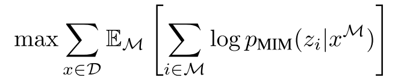

TODO: Summarize the paper:
* What is the core idea?
* How is it realized (technically)?

    There are 2 types of **Image Representations**, and these are described below:
    * **Image Patch**: Split the 2D image $$\textbf{x} \in \mathbb{R}^{H \times W \times C}$$ into $$N = HW/P^2$$ patches. Original 2D image has dimensions $$(H, W)$$. A patch has dimensions $$(P, P)$$. $$C$$ is the number of channels. In this paper, $$H = W = 224$$, and $$P = 16$$. So, the image is split into a $$14 \times 14$$ grid of $$16 \times 16$$ image patches. (Refer to the left column of procedures in the figure below.)
    * **Visual Token** ([Ramesh et al., 2021](https://arxiv.org/abs/2102.12092)): Trains a tokenizer to tokenize the image into discrete tokens according to a visual codebook (i.e. vocabulary). This is done by training a tokenizer and a decoder module, both of which are discrete variational autoencoders (dVAE). (Refer to the top row of procedures in the figure below)
        * Tokenizer: First, tokenize the image into a $$14 \times 14$$ grid, then map each patch on the grid to some token in vocabulary $$\mathcal{V}$$. The vocabulary size is set to $$\|\mathcal{V}\| = 8192$$, and the dVAE map the image patch into a distribution over the 8192 tokens (indices) to take the `argmax`.
        * Decoder: Reconstructs the image according to the $$14 \times 14$$ visual tokens outputted by the tokenizer. Since visual tokens are discrete (after taking `argmax`), the model training is non-differentiable. Gumbel-softmax relaxation ([Jang et al., 2017](https://openreview.net/forum?id=rkE3y85ee); [Maddison et al., 2017](https://arxiv.org/abs/1611.00712)) is employed to train the tokenizer-decoder end-to-end.
    * Note that **the number of image patches and number of visual tokens are the same** for the pre-training objective.

    

        
    

    The ViT backbone of BEiT is the standard Transformer ([Vaswani et al., 2017](https://arxiv.org/abs/1706.03762)). Input to the transformer are linear projections of the flattened image patches (at the bottom of the figure). 1D learnable position embeddings are also added to the projections.

    BEiT is pre-trained using the **Masked Image Modeling (MIM)** objective, which is a spin-off of the Masked Language Modeling objective ([Devlin et al., 2019](https://arxiv.org/abs/1810.04805)). Some of the image patches are masked for the model to predict the corresponding visual tokens. Instead of masking random patches, a block of the image is masked (see bottom left of the figure). This is similar to the work done in other blockwise masking BERT-like models (e.g. SpanBERT of [Joshi et al., 2020](https://arxiv.org/abs/1907.10529)). Then, the pre-training objective is just to maximize the log-likelihood of the correct visual tokens (from the tokenizer), $$z_i$$, given the corrupted image with masked patches, $$x^\mathcal{M}$$:

    

        
    

    This pre-trained can be viewed as variational autoencoder ([Kingma and Welling, 2014](https://arxiv.org/abs/1312.6114)) training. Refer to section 2.4 in the paper for more information.

    The pre-trained is done on the training set of ImageNet-1K with augmentations. The labels are not used for the self-supervised training. Training for 500k steps took about 5 days using 16 Nvidia Tesla V100 32GB GPU cards.

* What interesting variants are explored?

    After pre-training BEiT, the authors appended a task layer upon the Transformer, and fine-tuned the parameters on downstream tasks:
    * Image Classification: Linearly project all BEiT representation outputs with a matrix, aggregate with an average pool, then apply a softmax for classification. Both parameters of BEiT and the softmax classifier are updated during fine-tuning.
    * Semantic Segmentation: Use BEiT as a backbone encoder, and incorporate several deconvolution layers as decoder to produce segmentation ([Zheng et al., 2020](https://arxiv.org/abs/2012.15840)). This is also fine-tuned end-to-end like image classification model.
    * Intermediate Fine-Tuning: After self-supervised pre-training, further train BEiT on a datarich intermediate dataset (i.e. ImageNet-1K), then fine-tune the model on target downstream tasks.

* How well does the paper perform?

## TL;DR
* Three
* Bullets
* To highlight the core concepts
