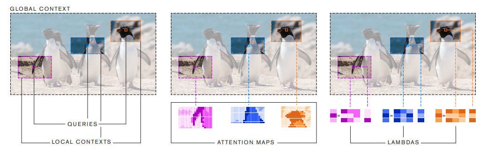
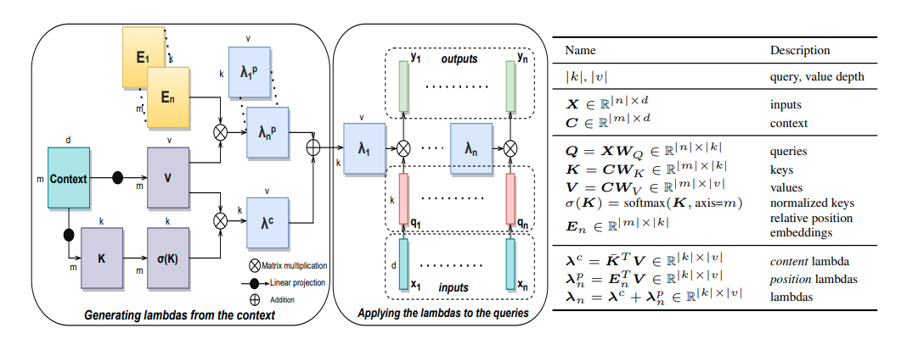
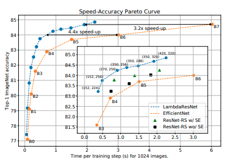
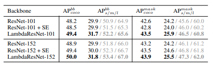

* What is the core idea?\
Authors introduce Lambda Networks, which are composed of lambda layers.\
A lambda layer is a class of layer that models content and position based interactions, without using expensive memory maps.\
Figure 1 displays a lambda layer vs. a self-attention map. It is clear lambda layers are much cheaper computationally.\

In the words of the author: "Whereas self-attention defines a similarity kernel between the query and the context elements, a lambda layer instead summarizes contextual information into a fixed-size linear function". The fact that it becomes a linear function is what makes is less expensive.\
At the first line, I mention position-based interactions. These are interactions which take into account the relative distance between between the context and the query (e.g. a pixel and surrounding pixels).

* How is it realized (technically)?\
Generally, we have an query input $$(q_n, n)$$, which gets mapped to an output vector $$y_n$$ given the context $$C$$ as:\
$$((q_n, n),C)\leftarrow y_n$$ \
The problem here is that this function ignores the position based interaction $$(q_n, (n,m))$$. Lambda layers take into account these relation (n, m) between the query and context element positions.\
Figure 2 shows the computational graph of the lambda layer.\

The author also provides pseudocode to create a lambda layer.

* How well does the paper perform?\
The LambdaNetworks were tested against self-attention models, and resulted in better performance, as well as being more computationally efficient, and faster than the other models, which were sometimes slowed down and hindered by large memory costs, impractical implementations, or the requirement of huge amounts of data.\
In terms of complexity, transformers using self-attention have $\Theta (blhn^2)$ memory footprint, where b = batch size, l = number of layers, h = number of heads/queries, n = input length). On the other hand, LambdaNetworks have a  $\Theta (lkn^2)$ of memory footprint, where l = number of layers, k = query length/depth, and n =  input length.\
For reference, when tested on ImageNet, a global self attention layer utilized 120GB of memory, while a Lambda Layer utilized 1.9 GB (a Lambda Layer with shared embeddings used even less, 0.63 GB of memory).\
The most impressive results are shown below in the figure below:\
LambdaResNets achieve a 4.4x speedup over EfficientNets on ImageNet, and they are still more energy efficient.\
In a semi-supervised learning environment, LambdaResNets achieve up to a 9.5x speedup over EfficientNet NoisyStudent checkpoints (a kind of semi-supervised learning approach).\

The authors evaluated LambdaResNets as a backbone in Mask-RCNN for COCO object detection. Lambda layers resulted in gains across all object sizes. Shown below in the table:\

* What interesting variants are explored?\
The authors explore with hybrid architectures. They do this because even with the time and memory saving compared to self-attention, the lambda layer still incurs a quadratic time complexity. The authors study a convolution-lambda hybrid, which increases representational power at no throughput cost.\
The authors also test on larger datasets with pseudo-labels. They trained LambdaResNets in a semi-supervised learning setting using 130 million pseudo-labeled images from the JFT dataset. Similarly, they trained EfficientNet. LambdaNets achieved the same accuracy of 86.7%, but were 9.5x faster than Efficient Nets.

## TL;DR
* LambdaNetworks use lambda layers, and outperformed other SOTA networks at multiple tasks, while being faster and less computationally expensive.
* A lambda layer is a class of layer that models content and position based interactions, without using expensive memory maps.
* Paper is very new, but seems to have potential for becoming the new standard.
