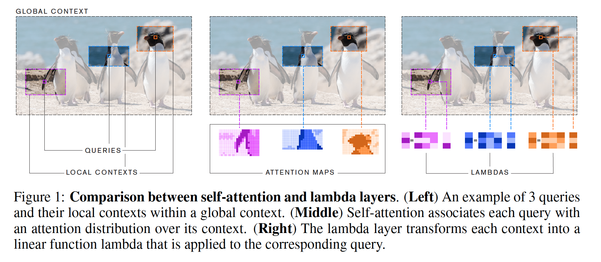
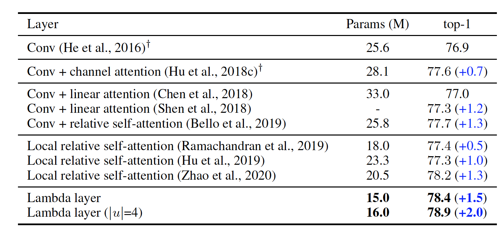
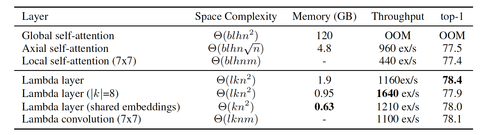
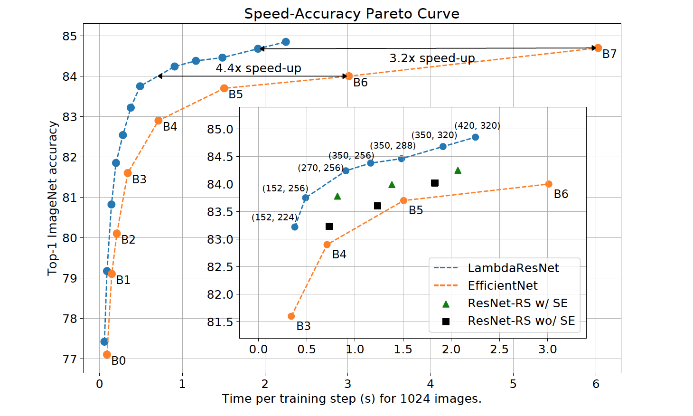
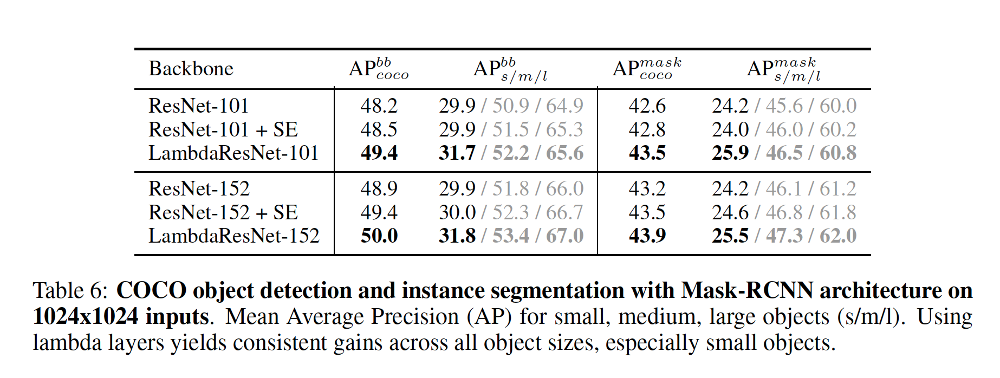

#### What is the core idea? ####
This paper introduces lambda layers, an alternative to self-attention, when dealing with images. The overall goal with attention is to capture "long-range interactions" between inputs and contextual information. This can be computationaly expensive when dealing with images, in which attention maps can take up a lot memory and time. Hence, lambda layers capture content and position-based interactions with less memory and without the need to produce computationaly expensive attention maps. 

In addition, LambdaResNets are introduced, which are essentially variations of the ResNets architecture. This hybrid archicture ended up producing high accuracies while being faster than EfficientNets.

#### How is it realized (technically)? ####
Lambda layers summarize contextual information into linear functions, such as matrices, which eliminates the need for attention maps. The technical math deals with "queries" and "context" vectors, which form content-based and position-based interactions.

A lambda layer takes as input: $$X \in \mathbb{R}^{|n| \times d_{in}}$$
and context $$C \in \mathbb{R}^{|n|\times d_{c}}$$ and generates lambdas, which are then applied to queries. The lambdas are thus:
$$Y \in \mathbb{R}^{|n| \times d_{out}}$$.

To go further into details, a lambda layer first computes keys $K$ and values $V$ via linear projection of the context. The $\lambda_n$ matrix is calculated with using the normalized keys $\overline{K}$ and position embeddings $E_n$ to yield 
$$\lambda_n = \overline{K}^{T} V + E_{n}^{T} V$$.

Finally, applying lambda to the query yields $y_n = \lambda_{n}^{T} q_n$.

The paper also argues that using multiple queries in the lambda layers decreases complexity. Attention mechanism usually have to produce per-example attention maps, and sometimes, attention lags behind with handling large batches with large inputs. 

Given a batch of $|b|$ examples, with $|n|$ inputs each, the number of operations is $O(bnmkv)$ while the memory complexity is $O(knm + bnkv)$. Here, $|k|$ is is a fixed-size set of contextual features and $|m|$ is, derived from the paper's explanation, the number of position in the context.

Lambda layers thus replace the attention mechanism in typical ResNet architecture, leading LambdaResNets.

#### How well does the paper perform? #### 
Lambda layers outperform convolutions and attention layers. Replacing the 3x3 convolutions in the bottleneck areas of the ResNet-50 architecture, for example, with the lambda layers instead led to a 1.5% ImageNet accuracy improvement. At the same time, parameters were reduced by 40%.

What these results show in the end is the weakness of self-attention: self-attention has trouble modeling global interactions due to memory costs. Lambda layers didn't seem to suffer from this problem.

Lambda layers also reached higher accuracies while using less memory and less time than self-attention.

LambdaResNets ended up being 3.2 - 4.4x faster than EfficientNets.

And finally, LambdaResNets achieved higher Mean Average Precision (AP) during COCO object detection and instance segmentation tasks. In these experiments, LambdaResNets were the "backbone" in the Mask-RCNN.

#### What interesting variants are explored? #### 

Larger LambdaResNets were created, such as the LambdaResNet-420 which trained on image sizes of 320. These achieved 84.9% accuracy in what appeared to be ImageNet. 

## TL;DR
* Lambda layers are a less memory and computationaly expensive alternative to self-attention.
* Lambda layers capture content-based and position-based interations within images.
* LambdaResNets are hybrid architectures that perform very well in comparison to EfficientNets.
