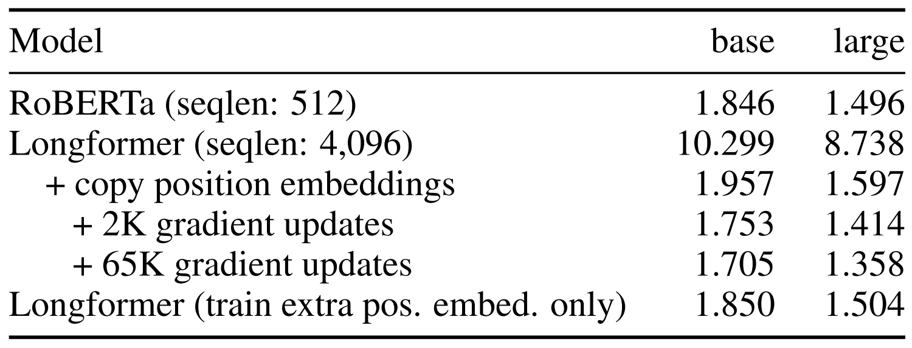
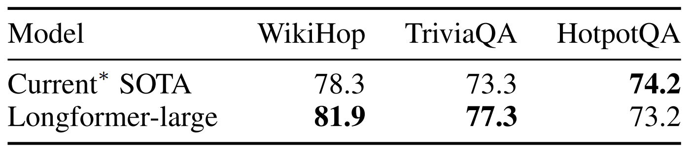
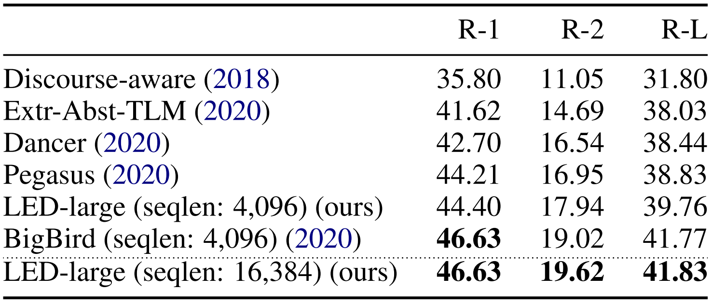

* What is the core idea?

    Transformers have achieved SoTA results in a wide range of NLP tasks due to the self-attention component allowing the network to capture contextual information from the entire sequence. However, self-attention grows quadratically in sequence length for memory and computational requirements, making it infeasible to process long sequences. Typical BERT-style pre-trained models have a sequence length limit of 512 tokens.

    Longformer aims to overcome this disadvantage by using a combination of sliding window attention with global attention instead of self-attention. Using multiple layers of such attention can build contextual representations of the entire context, allowing Longformer to tackle long document without chunking the content. This attention also grows linearly in sequence length for requirements. Experiments of this paper showed that Longformer achieved SoTA on almost all long document natural language tasks.

* How is it realized (technically)?

    Recall the dot-product attention in the original Transformer model ([Vaswani et al., 2017](https://arxiv.org/abs/1706.03762)):

    $$
    \text{Attention}(Q, K, V) = \text{softmax}\left(\frac{QK^T}{\sqrt{d_k}}\right)V
    $$

    Where $$Q, K, V$$ are query, key, and value, respectively. $$Q$$ is a matrix of size $$[n^q, d]$$ and $$K$$ is a matrix of size $$[n^k, d]$$. $$n^q$$ and $$n^k$$ is the sequence length of $$Q$$ and $$K$$, respectively, and $$d$$ is the hidden size of attention. The matrix multiplication of $$QK^T$$ is quadratic due to the upper bound $$\mathcal{O}(n^q n^k d)$$, which is $$\mathcal{O}(n^2 d)$$ if $$n = n^q = n^k$$. In the case of self-attention, query and key have the same sequence length because query and key are the same matrix, which creates a stronger representation of the sequence by attending it to itself.

    The dot-product attention computes a powerful representation of value with respect to query and key, but it's expensive in the matrix multiplication, which has a pattern of multiplication like the following:

    

        
    

    **Sliding Window**: Instead of having a query token attend to every query token, the query token can attend to a fixed window size $$w$$ of tokens near itself, which computes some attention in $$\mathcal{O}(n w d)$$. Each token attends to $$\frac{1}{2}w$$ tokens on each side, like the following multiplication pattern:

    

        
    

    Using multiple stacked layers of such windowed attention can result in a large receptive field. Thus, for a transformer with $$l$$ layers, the receptive field at the top layer would be $$l \times w$$.

    **Dilated Sliding Window**: Sliding windows can be "dilated" to increase the receptive field without increasing computation like the following multiplication pattern:

    

        
    

    If $$d$$ is the dilation size, then the receptive field is $$l \times d \times w$$. In a multi-headed attention setting, different heads can have different dilation sizes for heads to focus on different sizes of contexts.

    **Global Attention**: The window and dilated attention may not be flexible enough to learn task-specific representations. For example, in the case of a `[CLS]` token, it wouldn't make sense for it to attend to only the first few tokens of input. Thus, some pre-selected input locations will still compute "global attention". That is, a token with a global attention attends to all tokens across the sequence, and all tokens in the sequence attend to it. This looks like the following multiplication pattern:

    

        
    

    In the case of a QA task, global attention is provided on all question tokens. Because the number of tokens with global attention is small relative to sequence length, the combined local and global attention is still bounded by $$\mathcal{O}(n)$$.

    In implementation, there's a linear projection for sliding window attention and a separate linear projection for global attention per token. This method avoids the global and sliding window attentions from convoluting each other.

    **Implementation Detail**: Modern PyTorch/Tensorflow libraries do not support the form of banded matrix multiplication required for the sliding window attention, so the authors implemented 3 ways of doing it: `loop`, `chunks`, and `cuda`. `loop` is used for testing, `chunks` is used for pre-training/fine-tuning, `cuda` is a highly optimized custom CUDA kernel that is used for the language modeling experiments.

* What interesting variants are explored?

    * Longformer for **Autoregressive Language Modeling**
        * Task: Predict the best token/character that should come after previous tokens/characters in an input sequence.
        * Model: Built upon the original Transformer of Vaswani et al., 2017.
            * Attended sequences of length 32256.
        * Attention Pattern:
            * Smaller window sizes for lower layers and bigger window sizes for higher layers. This is so that lower layers can capture local information and higher layers can capture a representation of the entire sequence.
            * Some heads on the higher layers used small amounts of increasing dilation in sliding window in order to attend to more distant tokens.
            * In training, models are found to need a large number of gradient updates to learn the local context first, before learning to utilize longer context. Thus, training is done by increasing window sizes and sequence length across multiple training phases.

    * **Fine-tune a Pre-trained** Longformer
        * Tasks:
            * Pre-training: Masked Language Modeling (MLM) objective, which predicts the most likely token of multiple `[MASK]`ed tokens in a sequence.
            * Fine-tuning:
                * Question Answering: Do reading comprehension, which answer questions when given some information as context.
                * Coreference Resolution: Find all expressions that refer to the same entity in a text.
                * Document Classification: Do sentiment classification and hyperpartisan news detection on long documents.
        * Model: Built upon a pre-trained RoBERTa ([Liu et al., 2019](https://arxiv.org/abs/1907.11692)).
            * Copy RoBERTa's 512 absolute position embeddings multiple times to make 4096 position embeddings. This allows the Longformer to process sequences up to 4096 tokens long.
            * Replace the self-attention of a pre-trained RoBERTa checkpoint with Longformer's sliding window attention, then pre-train the attention heads and the position embeddings on the MLM objective.
        * Attention Pattern:
            * Use a window size of 512, which is originally the maximum sequence length of BERT and RoBERTa.
            * Same amount of computation as RoBERTa for comparable model.
            * Coreference resolution Longformer did not use global attention. Document classification Longformer used global attention for the `[CLS]` token.

    * **Longformer-Encoder-Decoder (LED)**
        * Task: Long document summarization.
        * Model: Built upon a pre-trained BART ([Lewis et al., 2020](https://arxiv.org/abs/1910.13461)).
            * Extend position embeddings to 16K tokens (up from BART's 1K tokens) by repeatedly copying BART's 1K position embeddings 16 times.
            * Initialized from BART with no additional pre-training.
        * Attention Pattern:
            * Encoder longformer uses a window size of 1024. Global attention on the first `<s>` token.
            * Decoder longformer uses the full attention to the entire encoder and previously decoded locations.

     

* How well does the paper perform?

    * **Autoregressive LM**
        * Dataset: `text8` and `enwik8` ([Mahoney, 2009](http://www.mattmahoney.net/dc/text.html)) for character level LMs.
        * Evaluation:
            * Evaluate on the last 512 characters output of a character sequence of length 32256.
            * Used bits-per-character (BPC), which is the entropy of the ground-truth sequence, for evaluation metric.
        * Results: State-of-the-art. Small model results on the left and large model results on right.

    

        
        
    

    * **Masked LM for Pre-training**
        * Dataset: Corpus of long documents from sources such as Books corpus ([Zhu et al., 2015](https://arxiv.org/abs/1506.06724)) and English Wikipedia. Refer to Appendix C in the paper.
        * Evaluation: BPC.
        * Results: Better than RoBERTa for both small and large models, which possibly benefitted from the longer context.

    

        
    

    * **Fine-tuned Tasks**
        * Datasets:
            * Question Answering: WikiHop ([Welbl et al., 2018](https://arxiv.org/abs/1710.06481)), Wikipedia setting in TriviaQA ([Joshi et al., 2017](https://arxiv.org/abs/1705.03551)), distractor setting in HotpotQA ([Yang et al., 2018](https://arxiv.org/abs/1809.09600)).
            * Coreference Resolution: OntoNotes ([Pradhan et al., 2012](https://aclanthology.org/W12-4501/)).
            * Document Classification: IMDB sentiment classification ([Maas et al., 2011](https://aclanthology.org/P11-1015/)), Hyperpartisan news detection ([Kiesel et al., 2019](https://aclanthology.org/S19-2145/)).
        * Evaluation: TriviaQA, Hyperpartisan metrics are F1. WikiHop and IMDB use accuracy. HotpotQA is join F1. OntoNotes is average F1.
        * Results: The base models did better than RoBERTa's base model. Large models outperforms SoTA for WikiHop and TriviaQA at time of submission, and is off by 1 point from SoTA in HotpotQA at time of submission. Small model results in the top table and large model results in the bottom table.

    

        
         
        
    

    * **LED**
        * Dataset: arXiv summarization dataset ([Cohan et al., 2018](https://aclanthology.org/N18-2097/)), which has 14.5K tokens at the 90th percentile of document lengths.
        * Evaluation: ROUGE-1 (R-1), ROUGE-2 (R-2), and ROUGE-L (R-L) ([Lin, 2004](https://aclanthology.org/W04-1013/)).
        * Results: State-of-the-art. Outperforms BigBird ([Zaheer et al., 2020](https://papers.nips.cc/paper/2020/hash/c8512d142a2d849725f31a9a7a361ab9-Abstract.html)).

    

        
    

## TL;DR
* Longformer is a transformer that use a combination of sliding window and global attention for attention instead of self-attention. 
* Sliding window and some global attention grows linearly in computation and memory requirements, which is better than self-attention's quadratic requirements. 
* Longformer achieves SoTA on almost all long document natural language tasks.
