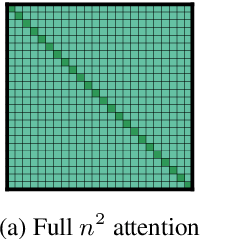
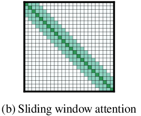
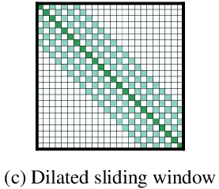
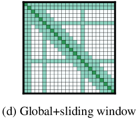

* What is the core idea?
* How is it realized (technically)?

    Recall the dot-product attention in the original Transformer model ([Vaswani et al., 2017](https://arxiv.org/abs/1706.03762)):

    $$
    \text{Attention}(Q, K, V) = \text{softmax}\left(\frac{QK^T}{\sqrt{d_k}}\right)V
    $$

    Where $$Q, K, V$$ are query, key, and value, respectively. $$Q$$ is a matrix of size $$[n^q, d]$$ and $$K$$ is a matrix of size $$[n^k, d]$$. $$n^q$$ and $$n^k$$ is the sequence length of $$Q$$ and $$K$$, respectively, and $$d$$ is the hidden size for attention. The matrix multiplication of $$QK^T$$ is quadratic due to the upper bound $$\mathcal{O}(n^q n^k d)$$, which is $$\mathcal{O}(n^2 d)$$ if $$n = n^q = n^k$$. The case for query and key to have the same sequence length is when query and key are the same matrix, which is the case of self-attention, creating a stronger representation of the sequence by attending it to itself.

    The dot-product attention computes a powerful representation of value with respect to query and key, but it's expensive in the matrix multiplication, which has a pattern of multiplication like the following:

    

        
    

    **Sliding Window**: Instead of having a query token attend to every query token, the query token can attend to a fixed window size $$w$$ of tokens near itself, which computes some attention in $$\mathcal{O}(n w d)$$. Each token attends to $$\frac{1}{2}w$$ tokens on each side, like the following multiplication pattern:

    

        
    

    Using multiple stacked layers of such windowed attention can result in a large receptive field. Thus, for a transformer with $$l$$ layers, the receptive field at the top layer would be $$l \times w$$.

    **Dilated Sliding Window**: Sliding windows can be "dilated" to increase the receptive field without increasing computation like the following multiplication pattern:

    

        
    

    If $$d$$ is the dilation size, then the receptive field is $$l \times d \times w$$. In a multi-headed attention setting, different heads can have different dilation sizes for heads to focus on different sizes of contexts.

    **Global Attention**: The window and dilated attention may not be flexible enough to learn task-specific representations. For example, in the case of a `[CLS]` token, it wouldn't make sense for it to attend to only the first few tokens of input. Thus, some pre-selected input locations will still compute "global attention". That is, a token with a global attention attends to all tokens across the sequence, and all tokens in the sequence attend to it. This looks like the following multiplication pattern:

    

        
    

    In the case of a QA task, global attention is provided on all question tokens. Because the number of tokens with global attention is small relative to sequence length, the combined local and global attention is still bounded by $$\mathcal{O}(n)$$.

    In implementation, there's a linear projection for sliding window attention and a separate linear projection for global attention per token. This method avoids the global and sliding window attentions from convoluting each other.

    **Implementation**: Modern PyTorch/Tensorflow libraries do not support the form of banded matrix multiplication required for the sliding window attention, so the authors implemented 3 ways of doing it: `loop`, `chunks`, and `cuda`. `cuda` is the highly optimized custom CUDA kernel which the authors use to do the banded matrix multiplication.

* What interesting variants are explored?

    Will put different tasks here and how Longformer is used differently each time.

* How well does the paper perform?

    Add the 4 different experiments here.

## TL;DR
* Hi
* This summary
* Is too hard to complete lol
