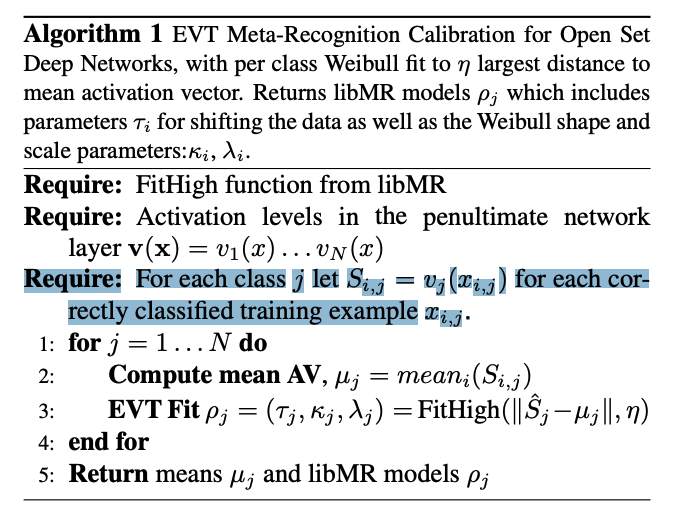
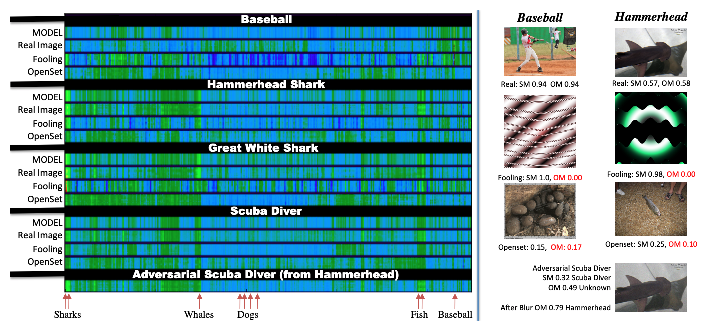
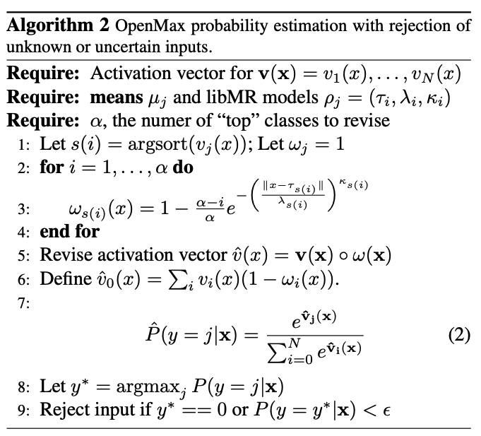
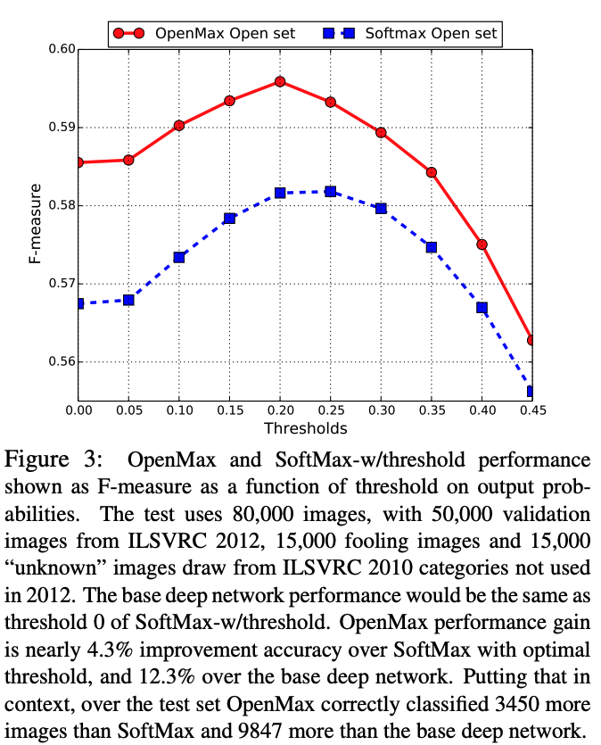

## Motivation

**Problem** It is easy to generate images that humans would never classify as a particular object class, yet networks classify such images high confidence as that given class. The closed set nature of deep networks forces them to choose from one of the known classes leading to such artifacts. However, recognition in the real world is open set, i.e. the recognition system should reject unknown/unseen classes at test time.

The SoftMax layer is a significant component of the problem because of its closed nature. The authors propose an alternative, OpenMax, which extends SoftMax layer by enabling it to predict an unknown class.

## OpenMax
  

**Design**: “open space risk” should be measured in feature space, rather than in pixel space. The key question: is there a feature space, ideally a layer in the deep network, where these adversarial images are far away from training examples?

  

* Multi-class Meta-Recognition
  * Each class is represented as a point, a mean activation vector (MAV) with the mean computed over only the correctly classified training examples
  * Given the MAV and an input image, the authors measure distance between them. They directly threshold distance to determine an overall maximum distance threshold.
  * In particular, on line 3 of Alg. 1 we use the libMR FitHigh function to do Weibull fitting on the largest of the distances between all correct positive training instances and the associated $$µ_j$$. This results in a parameter $$\rho_j$$ , which is used to estimate the probability of an input being an outlier with respect to class i.
* Interpretation of Activation Vectors
  * Closed Set: The authors hypothesize that for most categories, there is a relatively consistent pattern of related activations. The MAV captures that distribution as a single point. The AVs present a space where we measure the distance from an input image in terms of the activation of each class.
  * Open Set: The activation vectors of the input with the MAV for a class for which the input produced maximum response, we observe it is often far from the mean. However, for some open set images the response provided is close to the AV but still has an overall low activation level.
  * Fooling Set: Consider a fooling input image, which was artificially constructed to make a particular class have high activation score and, hence, to be detected with high confidence. While the artificial construction increases the class of interest’s probability, the image generation process did not simultaneously adjust the scores of all related classes, resulting in an AV that is “far” from the model AV.
  * Adversarial Set: Consider an adversarial input image, which is constructed to be close to one class but is mislabeled as another. The adversarial image will have a significant difference in activation score and hence can be rejected.

* OpenMax Layer
  * In open set prediction, it is not appropriate to require the probabilities to sum to 1.
  * Let $$\rho$$ be a vector of metarecognition models for each class estimated by Alg. 1. Alg. 2 summarize the steps for OpenMax computation.
  * The unknown unknown class (open set images) to be at index 0.j
  * Use the Weibull CDF probability (line 3 of Alg. 2) on the distance between x and µi for the core of the rejection estimation. The model $$\mu_j$$ is computed using the images associated with category j, images that were classified correctly (top-1) during training process.

  

## Experiments

The authors evaluate their models on ImageNet 2012.  During the testing phase, we test the system with all the 1000 categories from ILSVRC 2012 validation set, fooling categories and previously unseen categories. The previously unseen categories are selected from ILSVRC 2010. It has been noted that approximately 360 categories from ILSVRC 2010 were discarded and not used in ILSVRC 2012.  The final test set consists of 50K closed set images from ILSVRC 2012, 15K open set images (from the 360 distinct categories from ILSVRC 2010) and 15K fooling images (with 15 images each per ILSVRC 2012 categories). 

  