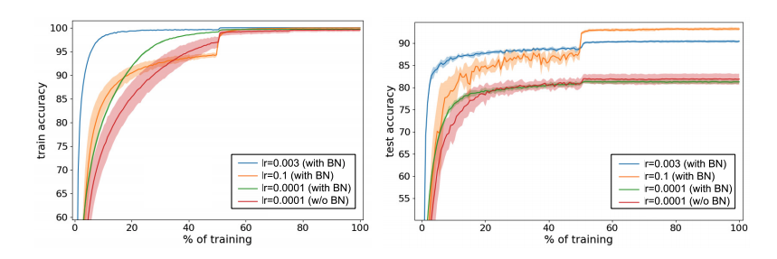
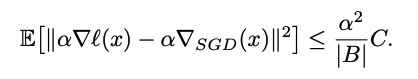
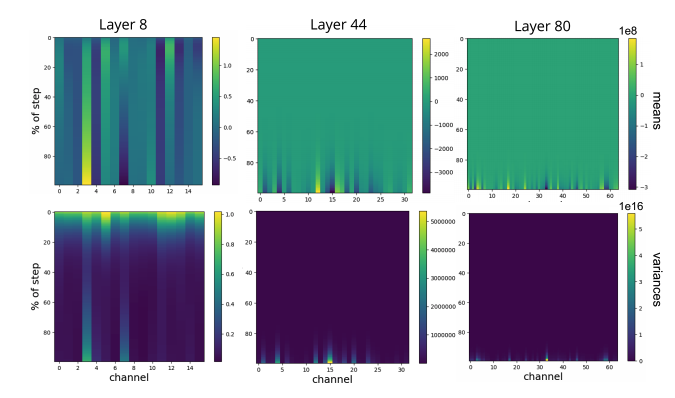
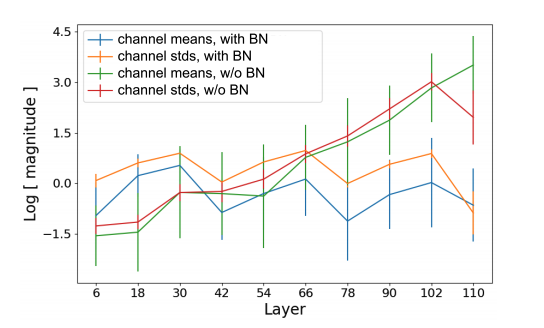
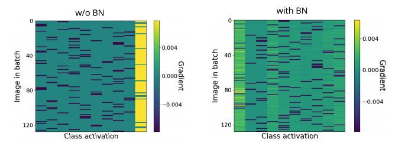

## Background
Normalizing the input data to zero-mean and constant standard deviation has long been recognized as good practice in training neural networks. 

Batch normalization (BN) extend this idea to the input of each layer and achieve immense success in various areas.

It enables faster training, larger learning rates, and higher testing accuracy (and better generalizability). 

However, the reason for the improvement is to be debated. 

(e.g. the paper that propose BN said it was solving "internal covariate shift", but some suggested otherwise)

## Core idea 
The paper pointed out that BN is beneficial to training neural networks mainly because it allow for larger learning rates, which encourages updates along flat regions and prevents the network from being trapped in a local minima. 

It also showed empirically that we cannot use large learning rates in networks without BN, since they could lead to  diverging loss. 

The same cannot be observed for neural networks with batch normalization.

## Experimental Results

### What makes BN beneficial? Large Learning Rates!
As in the above figure, training with or without BN but with a small learning rate (lr=0.0001) yield similar performance. However, networks with BN has clear advantage when the learning rates are large. They conclude that enabling high learning rates is what makes BN beneficial.

#### Why Large Learning Rates Are Good?
- They enable faster updates along flat regions -> faster training 
- Would not stuck in local minima -> better generalization
- Theoretical Viewpoint: 

The upper-bound of estimated error of gradient step positively correlates to the learning rate $$\alpha$$.
Higher learning rate -> larger estimated error (or noise) -> better generalization. 
(Will not follow the gradient completely and will not overfit the training loss landscape)

(Here $$\nabla l(x)$$ means the true gradient, and $$\nabla_{SGD}(x)$$ means the step size taken by SGD.)

### Divergence of NN Without BN
They basically showed that you cannot use large learning rate for networks without NN since it will lead to divergence.

Here they define 
- relative loss (step-size) = new_loss/old_loss. 
- divergence: when relative loss > $$10^3$$.

At first few updates, network without BN exhibit great relative loss (divergence) when the step size is greater than  $$10^{-3}$$. 
Same does not happen to network with BN.

Other than training loss, they look at the output of activations without BN. 

Activations of upper layers are extremely large, several orders of magnitude larger than lower ones. (Notice the scale)
The authors claim that this implies divergence is caused by exploding activations.
And BN fixes this problem by normalizing the input, preventing the large activations from propagating.

As seen in the figure below, when BN is applied, the activations are indeed contained within a roughly constant value across layers. While the mean and standard deviation of channels grow exponentially with depth.

### Gradients With and Without BN
Below is the gradient of the final output layer, and larger gradients are in yellow. 
The authors showed with this plot that gradient updates in the same batch (the same row in the plot) are roughly towards the same direction, adding up to a greater absolute value. 
This result in same and mostly wrong predictions in the first few steps and larger gradients to correct them later. (see the yellow ones in the left figure)

## What interesting variants are explored?

### Random Initialization
They conducted experiments that showed the phenomenon of exploding gradients in networks without BN are caused by random initialization. 

## TL;DR
* Batch Normalization is beneficial because it allows for higher learning rates, which result in better generalization and superior performance.
* Trainig networks without BN using large learning rates can lead to divergence.
* BN alleviates this problem by limiting the inputs of each layer to zero-mean and unit standard deviation, which prevents activations from getting too large.
