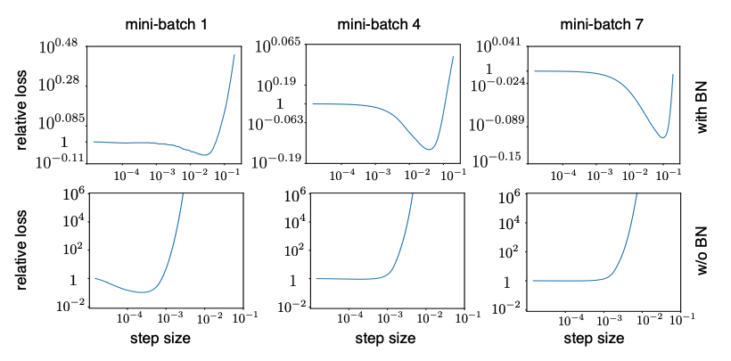

TODO: Summarize the paper:
## Background
Normalizing the input data to zero-mean and constant standard deviation has long been recognized as good practice in training neural networks. 
Batch normalization (BN) extend this idea to the input of each layer and achieve immense success in various areas. 
It enables faster training, larger learning rates, and higher testing accuracy (and better generalizability). 
However, the reason for the improvement is to be debated. 
(e.g. the paper that propose BN said it was solving "internal covariate shift", but some suggested otherwise)

## Core idea 
The paper pointed out that BN is beneficial to training neural networks mainly because it allow for larger learning rates. 
It also showed empirically that larger learning rates in networks without BN could lead to strong gradient updates, exploding activations and diverging loss . The same cannot be observed for neural networks with batch normalization, since the activation will be contained within a certain range, hence the stable loss and gradient. 

## Experimental Results

### Why is BN beneficial?
As in the above figure, training with BN but with a small learning rate (lr=0.0001) does not improve testing accuracy. 
Additionally, testing accuracy is higher when they chose large learning rate (0.1), displaying better generalization. 

### Divergence of NN Without BN
Here they define 
- relative loss (step-size) = new_loss/old_loss. 
- divergence: when relative loss > $$10^3$$.
At first few updates, network without BN exhibit great relative loss.

Activation of upper layers are extremely large, several orders of magnitude larger than lower ones. (Notice the scale)
The authors claim that this implies divergence is caused by exploding activations.
And BN fixes this problem by normalizing the input, preventing the large activations from propagating.

### Gradients With and Without BN
The authors also showed that gradient updates in the same batch are roughly towards the same direction, adding up to a greater absolute value. 
This result in same (and mostly wrong) predictions in the first few steps and larger gradients to correct them later.

<!-- Also, similar phenomenon is found in convolutional kernels. There's this 'input-independent' 
 -->

<!-- * How well does the paper perform? -->

## What interesting variants are explored?
### Better Generalization with Larger Learning Rates
the figure of noise upperbound
for SGD, when this upperbound small -> local minimum -> poor generalization
large learning rates can prevent this from happening.

### Random Initialization

## TL;DR
* Batch Normalization is beneficial because it allows for higher learning rates.
* Trainig networks without BN using large learning rates can lead to divergence.
* BN alleviates this problem by limiting the inputs of each layer to zero-mean and unit standard deviation, which prevents activations from getting too large.
