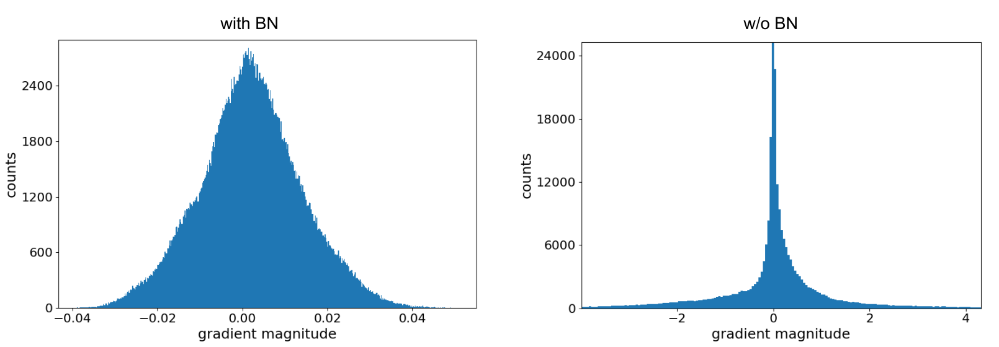
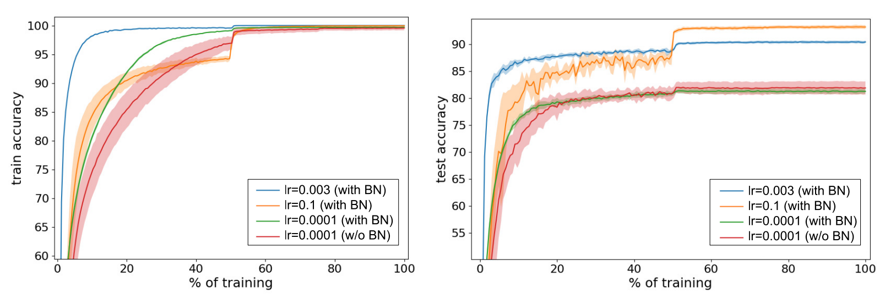
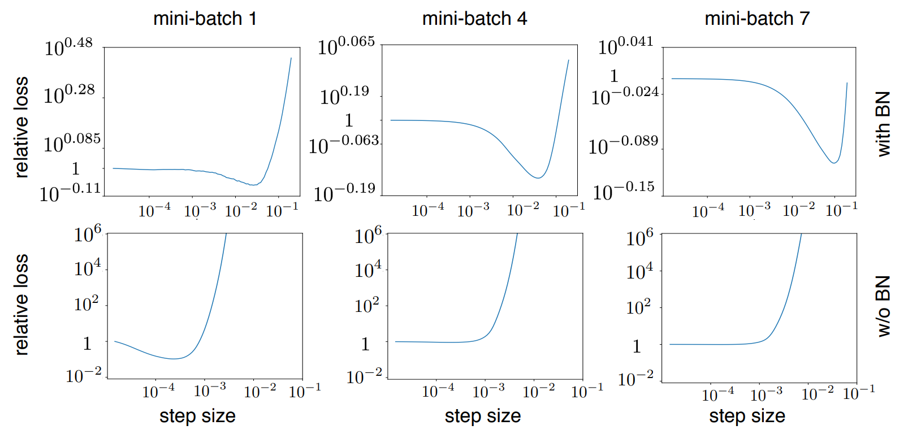
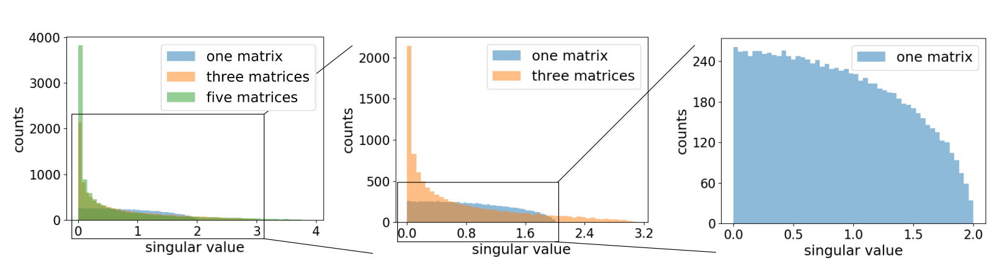

TODO: Summarize the paper:
* What is the core idea?
* How is it realized (technically)?
* How well does the paper perform?
* What interesting variants are explored?

## Goal:
Clarify vague intuitions about batch normalization through experimentation.

## Background
Normalizing input data is good and batch normalization extends this concept to intermediate layers. Doing this on batches allows for segnificant speed ups, however no one understands fully why this works.

## Batch Norm and Learning Rate
Activation and gradients in deep networks without batch normalization are heavy tailed which causes exploding gradients. The solution to this is using small LRs, however using small learning rates causes the issues of:
* Training makes slow progress with flat gradients
* Model is more likely to converge in sharp local minima

Batch norm does not have a need to use small learning rates since it "corrects" values and thus avoids the issues of small learning rates.

This was visualized through the following plot which shows the magnitude of gradients when first starting to train a model:

  

This theory was further tested with several models that varied with batch norm and no batch norm.

Test details:
* Data: CIFAR 10 with augmentation and preprocessing
* Model: 110 layer Resnet
* Optimizer: SGD with momentum and weight decay
* Learning rate: Decrease when learning slows

  

The model achieves the same accuracy with and without batch normalization in low learning rates, however since we can use high learning rates with batch normalization, we are able to get better results. Thus, the paper argues that batch normalization's reason for success is due to the power of being able to use bigger learning rates.

As we look at gradients we also see that changes in step size causes divergences (indicated by the increase of loss) more aggressively without batch norm.

  

## Random intialization's Effect on Gradient Explosions

The paper also explores that weaknesses in models that are fixed by batch normalization is initialization. If we multiply M, N*N gaussian matrices, we get a "blown up" singular value distribution as we reach the origin, which only become more aggressive as we increase M. This can be seen as emulating a neural networks weight matrices, and can show how this causes gradient explosion as networks become deeper:

  

Since the proportion between large and singular values increases drastically with  depth, this strongly encourages models to undergo gradient  explosion if there is no batch normalization. batch normalization fixes this issues by resetting the scale of values as matrix multiplications are  looped.  This is supported by the correlation that smaller Resnet models can use larger learning rates.

## TL;DR
* Small learning rates cause issues due to converging in sharp minima and slow progress with flat gradients
* Large learning rates causes divergence due to exploding gradients but batch norm eliminates this problem
* Random initialization naturally causes gradient explosion (if no batch normalization is used)
