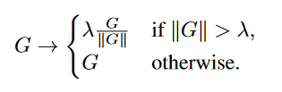
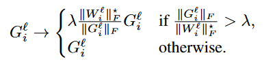
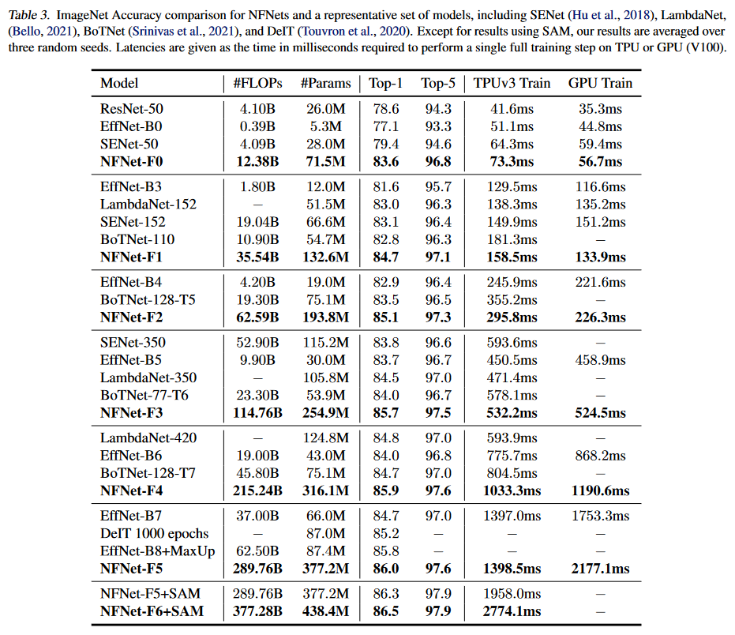
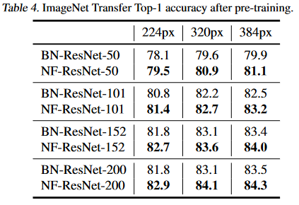

# Core Idea
The paper aims to create a class of Normalizer Free (NF) ResNets that are competative with the current state-of-the-art.
An Adaptive Gradient Clipping (AGC) method is introduced to achieve these goals with NF ResNets.  

# Motivation
While batch normalization has been shown to be effective in practice, it is difficult to explain why it works and has some practical drawbacks.

The authors outline three of these drawbakcs which are summarized below: 
1. Batch Normalization is computationally expensive: requires signifcant memory overhead and can be slow due to gradient evaluations.
2. Models behave differently during training and testing.
3. Batch normalization violates the assumption that training examples are indepenent of each other within the same minibatch.

The goal of this paper is to address these issues and create normalizer free ResNets with comperable accuracies as the current state-of-the-art, many of which use normalization.

 
# Technical Details
Traditional gradient clipping methods are defined:

Adaptive Gradient Clipping (AGC):

# Results

# Normalizer Free Networks with Transfer Learning

## TL;DR
* Introduces an adaptive gradient clipping technique that is effective without any batch normalization present in network
* Decreased training time without losing accuracy in smaller models, set new top-1 state-of-the-art accuracy for ImageNet with large ResNet model 
* Out performed ResNet models with batch normalization on transfer learning tasks
