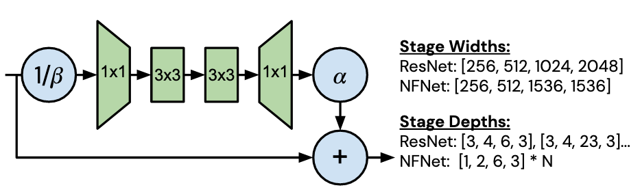
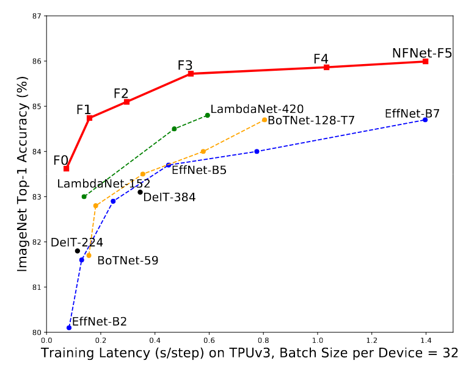

## What is the core idea?

Batch normalization is used in state of the art ResNets to achieve high accuracies in image classification tasks.

It has multiple benefits that cause an improvement in training:
* It downscales the residual branch, thereby putting more weight on skip connections which helps form gradients through deep networks
* Non-symmetric activations like ReLU cause a "mean-shift": shifting mean of activations to positive, normalization moves the mean back to 0
* Normalization might also have a regularizing effect
* Normalization allows for training with larger training rates on large batch sizes since it smoothens the loss landscape

However, normalization also has multiple negative side effects:
* It is expensive to compute
* The model behaves differently during training/inference
* It breaks the independence of samples in one batch (This can lead to information leakage/cheating)
* Batch normalization works poorly when batches are too small, limiting the model size in terms of memory requirements

That is why the paper introduces **"Normalizer-Free ResNets" ("NF-ResNets")**, which perform very well without normalization while also being more efficient to train.

**Main ideas:**
* The activations of the residual blocks are supressed using scaling
* The models employ "Scaled Weight Standardization" to prevent mean-shift
* The authors propose "Adaptive Gradient Clipping" to allow for training with large batch sizes
 
 
## How is it realized (technically)?

Residual blocks have the form

$$
h_{i+1}=h_i+\alpha f_i (h_i/\beta_i)\\
\textrm{where } 
h_i=\textrm{inputs to the residual block i}\\
f_i=\textrm{function computed by residual block i, parameterized to be variance-preserving}\\
\alpha=\textrm{scalar specifying variance increase rate per block; usually small value like 0.2}\\
\beta_i=\textrm{scalar predicting the standard deviation of the inputs to block i}
$$

**Scaled weight standardization**
This prevents a mean-shift and combined with scaled activation functions leads to a variance preserving function.

Reparameterization of convolutional layers:

$$
\hat{W_{ij}}=\frac{W_{ij}-\mu_i}{\sqrt{N}\sigma_i}\\
\textrm{where } 
\mu_i=(1/N)\sum_j{W_{ij}}\\
\sigma_i^2=(1/N)\sum_j{(W_{ij}-\mu_i)^2}\\
N=\textrm{fan-in}
$$

Scaling the activation function (for ReLU):

$$
\textrm{with scaling factor }\gamma=\sqrt{2/(1-(1/\pi))}
$$

**Adaptive Gradient Clipping**

The gradients are clipped unit-wise based on the ratio of the norm of the gradient to the corresponding weight for each layer:

$$
G_i\rightarrow\left\{\begin{array}{ll} \lambda\frac{\lVert W_i \rVert_F}{\lVert G_i \rVert_F} , & if  \frac{\lVert G_i \rVert_F}{\lVert W_i \rVert_F} > \lambda\\
         G_i, & otherwise\end{array}\right.\\
         \textrm{where } \lambda=\textrm{scalar hyperparameter}\\
         G_i=\textrm{unit i of the gradient}\\
         W_i=\textrm{unit i of the weight matrix}\\
         \lVert  \rVert_F=\textrm{Frobenius  norm,}
$$

Clipping is performed on all but the last layer.

The model architecture is a modified version of the SE-ResNeXt-D model:

Figure 1: Residual block

## How well does the paper perform?

Smaller Normalization-Free ResNets are able to match the accuracy of the batch-normalized EfficientNet-B7 on ImageNet while being a lot (up to 8.7 times) faster to train (See Figure 2). The larger architectures were able to achieve a new state-of-the-art top-1 accuracy of 86.5%.

Figure 2: Accuracy compared to training speed

## What interesting variants are explored?

Since this architecture cannot take advantage of the regularizing effect of normalization, it tends to overfit on datasets like ImageNet.
The authors show however, that Normalizer-Free networks perform better than networks with normalization when pretrained using a large dataset and then fine-tuning on ImageNet.

## TL;DR
* The authors introduce techniques to achieve the benefits of batch normalization without normalization, since it carries multiple negative effects
* They do so by applying scaled weight standardization and adaptive gradient clipping
* This leads to models that are more efficient to train and perform as well on ImageNet as models using  batch normalization
