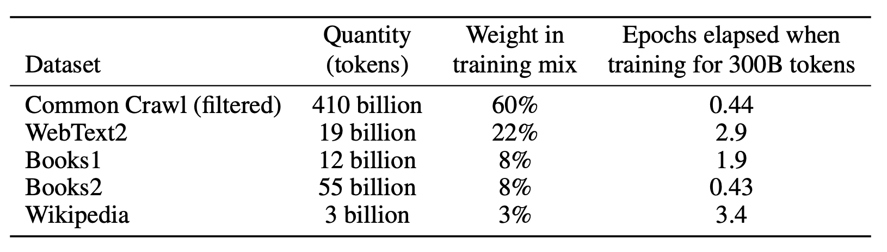
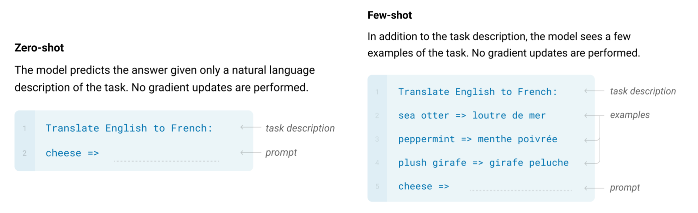
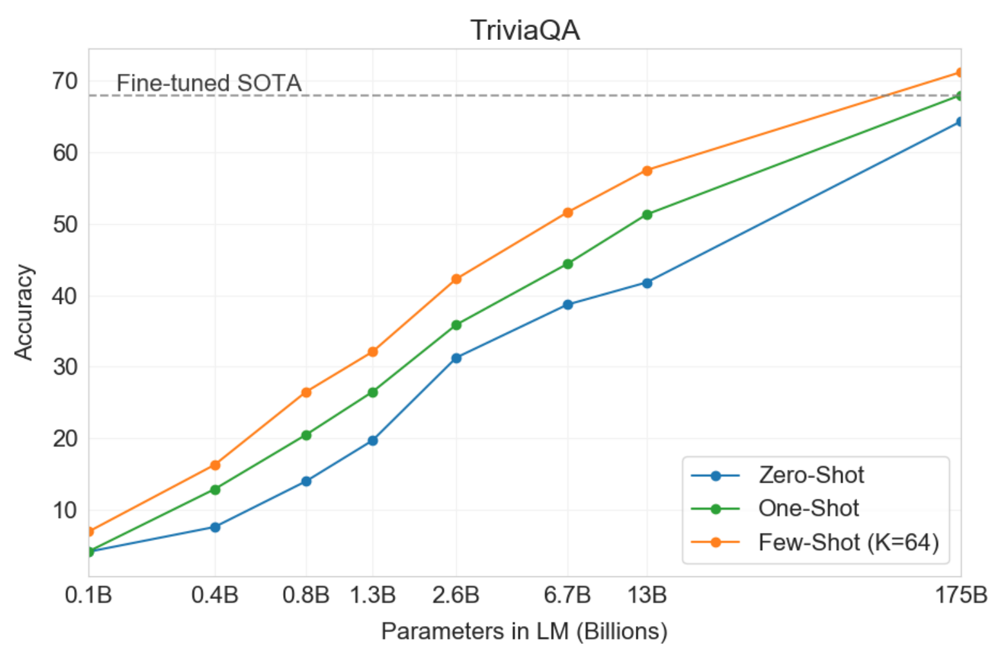
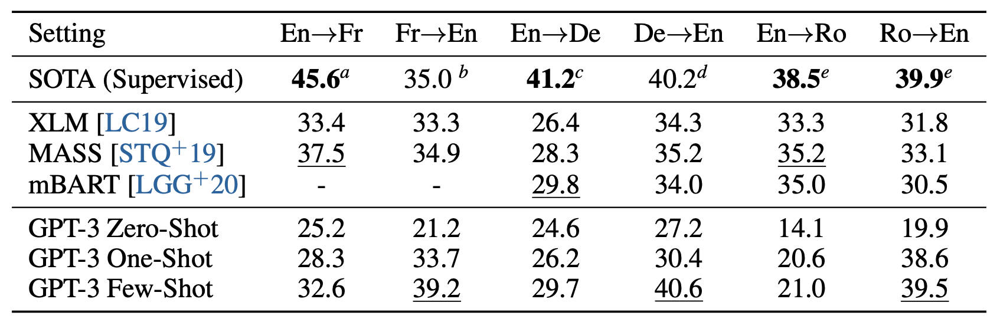
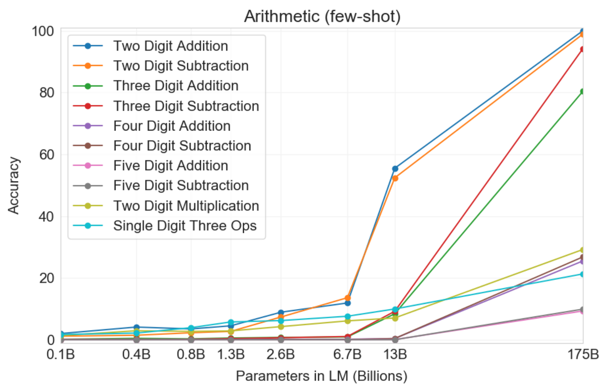

## Core Idea

Builds upon their previous work, this paper introduces GPT-3, a 175B-parameter autoregressive language model.
The main discovery of this paper is the model's ability to perform few-shot learning **without gradient steps or fine-tuning**.
This paper presents an extremely thorough large-scale study of GPT-3's performance on a wide range of NLP tasks.
Their experiments also test GPT-3 on a few non-standard tasks that further push the limits of of the pre-trained language model.

## Technical Description

### Training Details

GPT-3 largely follows the architecture of GPT-2, with a minor difference of having alternating dense and sparse (locally-banded) attention.
In order to train such a large model, the authors also created a custom text corpus.
Specifically, they combined five different datasets with custom preprocessing to ensure the quality of examples.
The exact weight and size the number of tokens (after Byte-Pair Encoding) is shown in **Table 1**.

 

<b>Table 1: List of datasets and their corresponding weights used to train GPT-3.  The weights are intentionally not proportional to their size to ensure higher-quality datasets such as Wikipedia is shown more than Common Crawl. Consequently, the tokens in Common Crawl are seen less than once on average, whereas tokens in Wikipedia are seen 3.4 times.</b>
 

Due to the size of their model, they determined the learning rate and batch size based on the level of gradient noise.
Lastly, to accomodate such a large model with extremely large batch size (~3.2M), they employed model parallelism across V100 GPUs.

### Evaluation Details

To test the model's few-shot learning capability, they sampled examples from the training data for each task and fed that as conditioning input, followed by 1-2 blank lines.
Notably, the authors intentionally avoid any sort of fine-tuning or gradient updates, and **rely entirely on forward-pass** of the model.
Below, **Figure 1** demonstrates example zero-shot and few-shot queries (one-shot learning identical to a few-shot except only a single example is provided).
One can clearly see that with this formulation, it is easy to apply GPT-3 on essentially limitless applicdations, as long as the task can be described in text.

 

<b>Figure 1: Examples of how the authors transformed a machine translation task into zero- and few-shot tasks. Notice that this method keeps the parameters of the model frozen; there is no backpropgatation or fine-tuning.</b>
 

## Experimental Results

The majority of this paper consists of discussion and analysis of the experimental results.
For starters, GPT-3 somewhat expectedly achieves a significantly improved performance over previous SOTA model on zero-shot Penn Tree Bank language modeling.

Then the authors evaluate GPT-3 on several Q&A tasks.
One very interesting trend we observe is in **Figure 2**.
As shown in the plot, the performance of GPT-3 variants continue to improve **linearly** with respect to the parameter count without diminishing returns.
This shows that the language model continues to absorb knowledge as its capacity increases.

 

<b>Figure 2: Performance comparison on the Q&A task on TriviaQA.  Notice that GPT-3's performance grows linearly with model size.  Also, few-shot performance is much higher than the zero-shot performance, sometimes even exceeding the previous state-of-the-art model.</b>
 

Another interesting result is on machine translation, where GPT-3 improves upon previous **supervised** methods in a few-shot setting for certain language pairs.
The authors point out that GPT-3, a model primarily trained on Engish (93% of the training corpus), achieves a large improvement of 5 BLEU score compared to previous unsupervised methods.
This further speaks for GPT-3's capability as an English language model.
**Table 2** shows GPT-3's machine translation performance relative to previous supervised and unsupervised approaches.
Though still impressive, the relatively lackluster translation performance for non-English target languages leads the reader to question how _cross-lingual_ a language model can be, which would be an interesting extension to this paper.

 

<b>Table 2: GPT-3's performance on the neural machine translation task, in comparison to existing unsupervised and finge-tuned translation models.</b>
 

Lastly, the authors perform a few non-standard NLP experiments.
For example, they ask GPT-3 to solve simple two/three-digit arithmetic problems by feeding questions such as "Q: What is 34 minus 53?".
Surprisingly, as shown in **Figure 3**, the two largest models achieve a significant performance boost for these tasks.
Overall, the authors show that GPT-3 is able to perform two- and three-digit arithmetic problems somewhat reliably.
I found it remarkable that a language model trained without any notion of arithmetic learned to perform two-digit arithmatic with perfect accuracy.

 

<b>Figure 3: GPT-3's few-shot results on basic arithmetic problems.  Notice the explosive jump in performance for the two largest models, especially the largest one.</b>
 

## Limitations and Societal Impacts

Thankfully, the authors also discuss the limitations got GPT-3, along with the broader impact such a large language model may have on the society.

They mention that the biggest weakness of GPT-3 is in its text synthesis ability.
Even though it essentially achieved SOTA results on most tasks, it still possesses the known issues of autoregressive language models.
Such issues include losing coherence over long passages, repetition in samples, self-contradictions, and generating non-sequitur text.
As a general-purpose conversation model, it still lacks common sense that most human speakers have, such as basic understanding of physics.

There are some algorithmic weaknesses too.
Because GPT-3 is an **autoregressive** model, it cannot be directly used to perform tasks that require filling in blanks, re-reading passages, and comparing two pieces of content.
As expected, the authors note that making a bi-directional analogue of GPT-3 is a promising direction to explore.

Lastly, the authors argue that GPT-3 still has extremely poor sample efficiency compared to humans.
The training data is way larger than the amount of text people typically see in their lifetime.
Yet, the model is still unable to come close to human performance for many NLP tasks.

## Conclusion & My Comments

GPT-3 certainly marks a meaningful milestone among NLP models, in terms of the sheer size of the model as well as the number of tasks it could perform without any fine-tuning.
While the previous iterations (e.g. GPT-2) of this model hinted at the possibility of a "general-purpose" language model, GPT-3 demonstrated an impressive ability to perform a much wider range of tasks.
That said, I feel rather ambivalent about the model.
While its few-shot learning abilities are amazing,  the fact that a 175B-parameter model can barely perform 3-digit arithmetic is rather perplexing.

A core question one might ask is rather ironic: how specific is the model's ability to "generalize"?
In other words, why is the model able to handle complex NLP tasks in a few-shot manner, but fails at seemingly much easier tasks such as 3-digit addition?
We do not understand what the model really is "learning", and it definitely does not seem to be anything we could call "general reasoning."
I am curious how autoregressive models could be extended with the right inductive bias to improve upon their poor sample complexity.

## TL;DR
* This paper introduced GPT-3, the largest Transformer-based language model produced at the time with 175 billion parameters.
* GPT-3 exhibits phenomenal zero- and few-shot learning performance and outperforms previous models (even some supervised or fine-tuned ones) on a wide variety of NLP tasks.
* While the performance is impressive, GPT-3 still comes with many restrictions and very subpar learning capabilities compared to humans.
