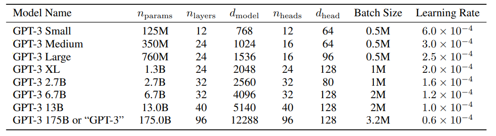
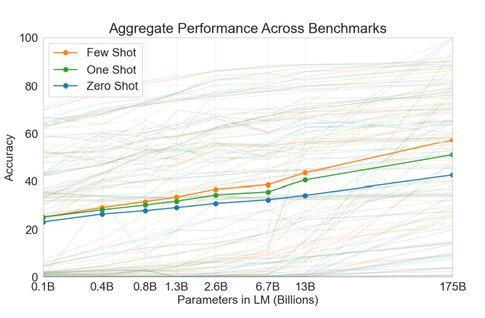

# Core Idea
By increasing their size it is possible to build language models that are task agnostic and are able to perform tasks well with zero-shot, one-shot, and few-shot learning.

# Context

**Fine-Tuning:** Traditional learning. Start with pre-trained model and update weights by training for a specific task.
Requires a labeled dataset for each new task to be learned.

**Zero-Shot:** Start with general model. Model is only given a description of the desired task in natural language. 
No examples or demonstrations. 

Network is given:

- task description
- a context (input) (to complete task on)
// example: translation, you would expect a person the understand to do without an example.
  
**One-Shot:** Similar to Zero-Shot except the model is given a single demonstration of the task.
The network uses the example at inference time to 'see' the task and will use this information along with the natural language description of the task provided. 
Note that NO weights will be updated.

Network is given:

- task description in natural language
- 1 context-output pair 
- a context (to complete task on)   

**Few-Shot:** Similar to One-Shot with the addition of more demonstrations of the desired task. Note that while this does require making a dataset for each task, this dataset is much easier to make as it usually consists of 10-100 examples as opposed to the thousands or millions of examples needed to create a dataset for fine tuning for most tasks.

Network is given:

- task description in natural language
- a few (usually 10-100) context-output pairs
- a context (to complete task on)

# Technical Details

Models are trained on on the Common Crawl dataset (slightly under 1 trillion words). 
This was sufficeintly large so that the large model, GPT-3, was trained without looking at the same sentence twice. 
Model is an expanded version of the model proposed by Radford et al 2019. 
For one- and few-shot learning the demonstration examples are randomly selected from the dataset without replacement

# Results 

Language tasks explored included language modeling, cloze, completion tasks, question answering, translation, Winograd Schemas Challenges, common sense reasoning, reading comprehension,  natural language infrence, word scrambling, SAT questons, news article generation as well as the SuperGLU benchmark. 

GPT-3 struggles with summarizing text especially when the passage to be summarized is long. 
While GPT-3 is an improvement on GPT-2 accross the board and out performs fine-tuned BERT models in some tasks it is significantly worse than both human level performance as well as state-of-the-art fine tuned models for the specific tasks. 

# Data Contamination

Because the model is initially trained on Crawl which consists of data gathered from crawling the interenet, naturally crawl contains a lot of the data that is used to in testing datasets for some of the tasks tested on. 
This violates the assumption that at testing time the network has never seen any of the testing data and is especailly worrysome with large models like GPT-3 as it has the capacity to memorize a lot of information.
The authors investigated tasks where there was significant amounts of data contamination and attempted to remove as much as possible from their modified common crawl dataset used to train the model. 
They acknowledge that while they were able to remove most of the contaimination, there was a bug in their filter that was discovered after the model had been trained and it was infeasible to retrain. 
Experiments with too much contaimination were omitted from the paper and any experiments included that had contamination noted this.

## TL;DR
* Author's scale up GTP-2 (Radford 2019) to up to 175 billion parameters to create GPT-3
* GPT-3 is tested under zero- one- and few-shot learning all of which involve no gradient updates. 
* Model performance scales with number of parameters for all learning types however it scales better with few-shot learning 
