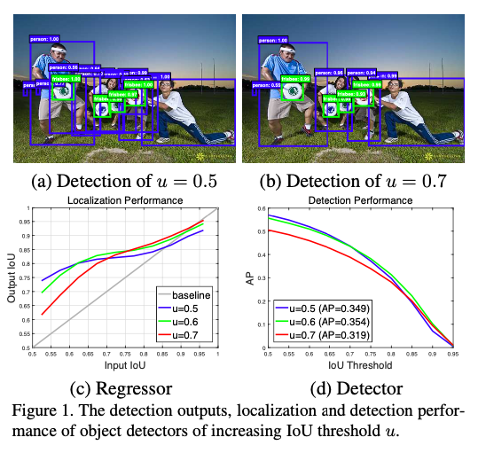
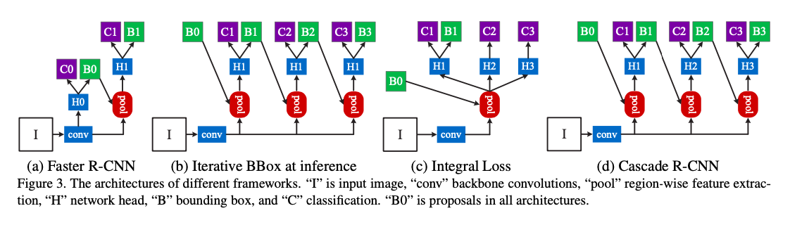
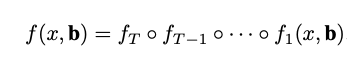
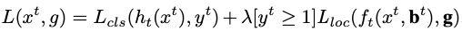
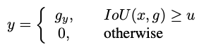
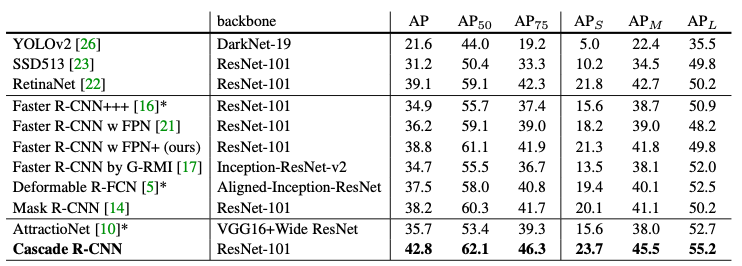

**What is the core idea?**

The central idea of the paper is to train multiple detection heads with multiple intersection over union (IoU) thresholds. The cascade R-CNN architecture solves two problems, overfitting during training and inference-time mismatch between the IoU for which the detector is optimal versus IoU of the input hypothesis.

**How is it realized (technically)?**

The model consists of sequence of detectors trained with increasing IoU thresholds with the output of the previous detector fed into the next as a resampling mechanism with no discrepancy between training and inference.

* Cascade-RCNN extends the two-stage architecture of faster-RCNN relying on a cascade of specialized regressors where _T_ is the total number of cascade stages. Each regressor $$f_{t}$$ in the cascade is optimized with respect to the sample distribution {$$b^{t}$$} arriving at the _t_ stage, instead of initial distribution $$b^{t}$$ . 

  

* At each stage _t_, the RCNN has a classifier $$h_{t}$$ and regressor $$f_{t}$$ which is optimized for IoU threshold $$u^{t}$$, where $$u^{t}>u^{t-1}$$ .

  

* This is achieved by minimizing the above loss where $$b^{t} = f_{t-1}(x^{t-1}, b^{t-1})$$, _g_ is the ground truth object for $$x^{t}$$, λ = 1 is the trade-off coefficient and  $$y^{t}$$ is the label of $$x^{t}$$ given by

  

* Cascade R-CNN has four stages, one region proposal network (RPN) and three stages for detection with U = {0.5, 0.6, 0.7}. (These were the most common IoU thresholds used by the authors unless specified.)

**How well does the paper perform?**

* The Cascade R-CNN, based on FPN+ and ResNet-101 outperforms all the earlier state of the art single model detectors like Faster-RCNN, YOLO, Mask-RCNN etc on the COCO dataset. It also outperforms Iterative BBox and Integral Loss models. The difference in result is more visible with higher IoU. 
* As the computational cost of adding more detection head in the architecture is usually small, when compared to RPN, the computational overhead of RCNN is small for both training and testing. 

**What interesting variants are explored?**

Various architectures like Faster-RCNN, R-FCN with ResNet-50 and ResNet-101 backbone, FPN+ with ResNet-50 and ResNet-101 backbone are trained with and without cascading. The cascade variants of all these models outperforms the corresponding non-cascade models. Other ablation experiments were performed on :
* IoU thresholds with the result that the detector can be more selective against close false positives and specialize for more precise hypothesis. 
* stagewise comparison with the result that the ensemble of all classifiers is the best generally.
* regression statistics with the result that it helps the effective multi-task learning of classification and regression.
* number of stages with the result that the three stage cascade (the cascade-RCNN model ) achieves the best tradeoff. 

## TL;DR
* The cascade-RCNN model which extends Faster-RCNN consists of sequence of detectors trained with increasing IoU thresholds. 
* The model aims to reduce overfitting, match inference and training architecture, and detect true positives while supressing close false positives.
* The Cascade-RCNN model outperforms all the previous state of the art models like Fast RCNN, YOLO, Mask-RCNN, etc on COCO dataset. 
