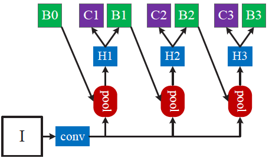
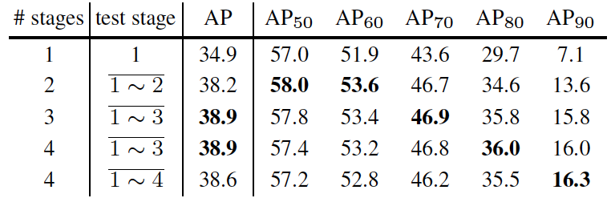
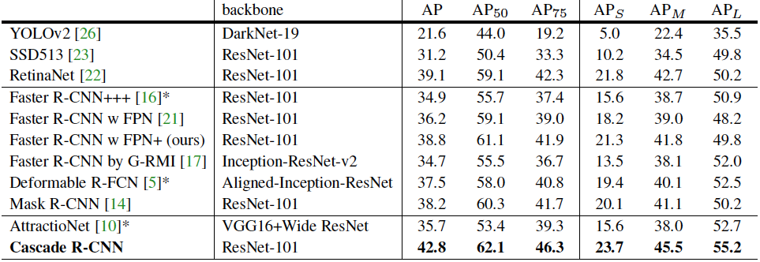
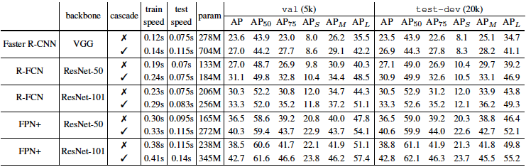

## Core Idea  
* In object detection, an intersection over union (IoU) threshold is used to define the percentage of overlap of a predicted bounding box over the ground truth bounding box in order to be considered a positive sample.  
* Cascade R-CNN uses a sequence of detectors with increasing IoU thresholds, leading to higher selectivity against false positives. The output distribution of a lower quality detector at the previous stage is used as input for a higher quality detector at the successive stage.    
* The cascade procedure helps reduce overfitting during training, and leads to closer matches between the hypothesis and detector quality at each stage during inference.  

## Technical Implementation  
* The architecture is framed as a cascaded regression problem:  
	* $$f(x,\textbf{b}) = f_T\circ f_{T-1}\circ...\circ f_1(x,\textbf{b})$$  
		* Here, $$T$$ is the total number of cascade stages.  
	* Each regressor $$f_t$$ is optimized w.r.t. the sample distribution $$\textbf{b}^t$$ which arrives at stage $$t$$ instead of the initial distribution $$\textbf{b}^1$$  

  

* Each stage $$t\in T$$ includes a classifier $$h_t$$ and regressor $$f_t$$ which are optimized for an IoU threshold $$u^t$$ where $$u^t>u^{t-1}$$  
* The above is achieved by minimizing the following loss:  
	* $$L(x^t, g) = L_{cls}(h_t(x^t),y^t) + \lambda[y^t\geq 1]L_{loc}(f_t(x^t,\textbf{b}^t),\textbf{g})$$  
		* $$\textbf{b}^t = f_{t-1}(x^{t-1},\textbf{b}^{t-1})$$  
		* And where $$g$$ is the ground truth object for $$x^t$$, $$\lambda = 1$$ is the tradeoff coefficient, $$[\cdot]$$ is the indicator function, and $$y^t$$ is the label of $$x^t$$ given $$u^t$$  
	* The function is the sum of two terms related to seperate tasks in object detection.  
	* The first term in the loss is related to the classification task, while the second term is related to the bounding box regression task  
	* The tradeoff coefficient helps manage the contribution of the two tasks to the overall loss  

## Variants  
* Experiments were performed implementing the architecture while varying the number of cascade stages. The results are summarized below.  
	* 1~n denotes an emsemble of n classifiers  on proposals at a stage  

## Results  
* The first table compares results of multiple state of the art single model object detectors.  
	* The first block are one-stage, the second block are two-stage, and the third block multi-stage  
	* Cascade R-CNN outperformed all other detectors in this comparison  

  

* The second table summarizes the cascade procedure applied to different detection architectures. The consistent improvement in detection performance led the authors to suggest that Cascade R-CNN had strong generalization capacity.  
* The authors note that since the computational cost of a detection head is usually small compared to the Region Proposal Network, the computational overhead of the cascade procedure is thus small both during training and testing.  

## TL;DR
* Cascade R-CNN uses a series of connected stages with increasing IoU thresholds to achieve state of the art detection performance  
* Experiments demonstrate the detection performance comes as a small increase in computational cost  
* Experiments also demonstrate the architecture to be effective across a number of different backbones
