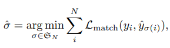
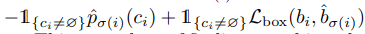
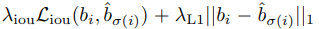
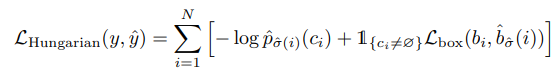
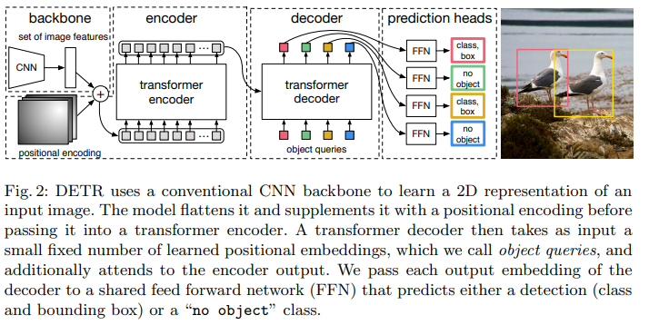
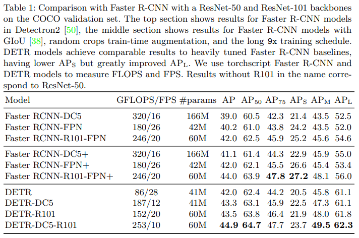
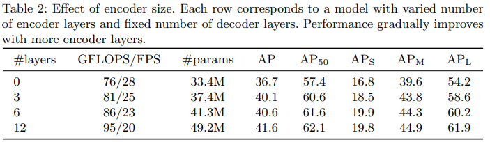
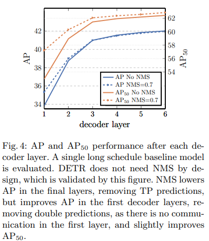
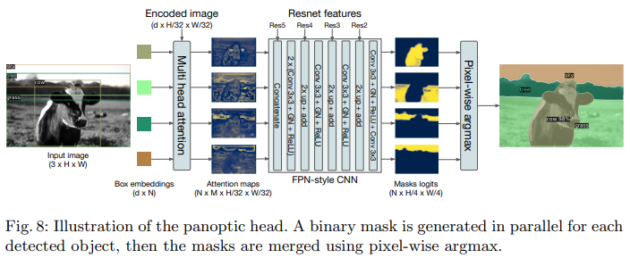
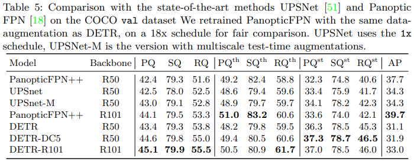

## Overview
The authors propose DEtection TRansformer (DETR), an end-to-end object detection framework that achieves performance on par with established baselines on the COCO object detection dataset by using a set-based global loss function and a transformer encoder-decoder architecture.

## Motivation
Traditional object detection models rely heavily on multiple tasks and postprocessing steps to arrive at a final set of bounding boxes and object classifications. The authors aim to simplify this pipeline through a single end-to-end process solving a set prediction problem. 

## DETR Model

### Set Prediction Loss
DETR predicts a fixed-size set of N predictions where N is much greater than the usual number of objects in an image. The authors search for a permutation of the N predictions with the lowest cost:

where L_match(y_i, y_simga(i)) is a pair-wise matching cost between a ground truth object y_i and a prediction sigma(i), that takes into account the class prediction as well as the similarity of the predicted and ground truth bounding boxes. L_match is as follows:

L_box is defined as a linear combination of L_1 loss and the generalized IoU loss:

The overall loss for all pairs matched from the permutations of N with lowest cost is described as:

### Architecture

The authors use a CNN to first construct a feature activation map for an input image and then further apply a 1x1 convolution to reduce the number of channels as well as collapse spatial dimensions (H and W) into a single dimension to get a d x HW input vector. Fixed positional embeddings are added (and continue to be added at each attention layer) and passed into a traditional transformer encoder. The decoder takes N inputs which the authors call object queries, and can decode these in parallel. These object queries also use learned positions embeddings and are passed to each attention layer. Each of the N output embeddings are finally passed through a shared feed forward network to get class preditions and bounding boxes. The FFN can be characterized as a 3-layer MLP to compute bounding boxes and a separate linear projection layer to compute class prediction. Since the number of predictions N is much greater than the total number of objects, a special class token (null set) is used to denote no object being detected.

## Experiments
The authors perform experiments on the COCO 2017 detection and panoptic segmentation datasets (~118k training images). The authors test different variants of DETR, testing both the ResNet-50 and ResNet-101 models as backbones, and trying to increase resolution of the backbone model by dilating the C5 stage.

### Ablations

#### FFN within Transformer
The FFN component within each transformer block acts similar to a 1x1 convolution layer. The authors tried removing this to see if attention only transformer layers can still be effective but found a 2.3 point drop in AP, thus determining the FFNs necessary for good performance. Despite the performance decrease, removing the FFNs dropped the number of network parameters from 41.3M to 28.7M.

#### Number of Encoder/Decoder Layers

<!-- #### Positional Encodings

#### Loss Ablations -->

### Panoptic Segmentation

## TL;DR
* DETR allows for end-to-end object detection using a transformer architecture and a bipartite matching loss
* DETR reaches similar performance to the enhanced Faster-RCNN Baseline and performs better on larger objects
* DETR can easily generalize to other detection tasks like panoptic segmentation
