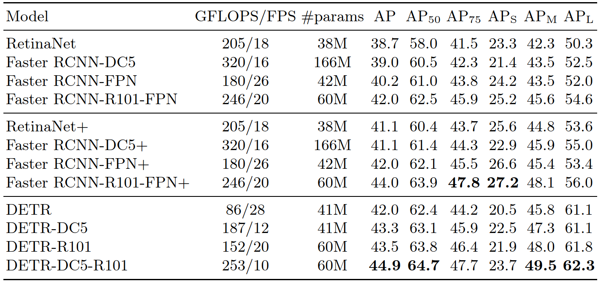

## What is the core idea?

<u>Core idea</u>: transform object detection problem as a direct set prediction problem

<u>Motivation</u>: avoid hand-designed components in modern object detectors

- E.g., NMS and anchor generation

<u>Solution</u>: DEtection TRansformer (DETR)

- a set-based global loss that forces unique predictions via bipartite matching
- a transformer encoder-decoder architecture

## How is it realized (technically)?

Key component:

- a set prediction loss that forces unique matching between predicted and ground truth boxes
- an architecture that predicts (in a single pass) a set of objects and models their relation

**<u>Set prediction loss</u>**

DETR infers a fixed-size set of N predictions

<u>Goal</u>: score predicted objects (class, position, size) with respect to the ground truth

<u>How</u>:

- Our loss produces an optimal bipartite matching between predicted and ground truth objects
- After that, we optimize object-specific (bounding box) losses

Match loss:

Hungarian loss:

Bounding box prediction loss:

**<u>Transformer architecture</u>**

- CNN backbone
  - Generate a low-resolution feature map with 32x downsampling and 2048 channels
- Encoder-decoder transformer
  - Encoder input: a flatten feature map with + positional encoding
  - Decoder output: object queries
- Feed forward network (FFN)
  - *Independently* decode the object queries into box coordinates and class labels

## How well does the paper perform?

<u>Performance on COCO</u>

Discussion: how does DETR perform comparing to other object detection method, e.g., RetinaNet and Faster R-CNN?

<u>Ablation studies</u>

Discussion #1: what is the importance of each decoder layer?

</u>

Discussion #2: what is the FFN?

Network parameters: 41.3M → 28.7M

Performance: 62.4 → 60.1 (mAP @ 0.5)

<u>Generalization to unseen numbers of instances

Discussion: does DETR generalize to unseen numbers of instances?

- Some classes in COCO are not well represented with many instances of the same class in the same
  image
- E.g., there is no image with more than 13 giraffes in the training set.

## TL;DR
* Transform object detection as a direct set prediction problem
* Propose a set-based global loss that forces unique predictions via bipartite matching
* Demonstrate DETR achieves accuracy and run-time performance on par with existed method via a transformer encoder-decoder architecture
