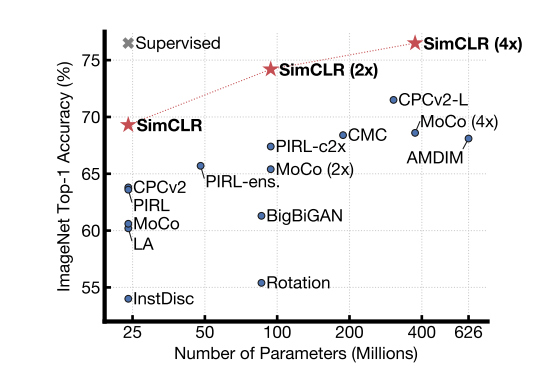
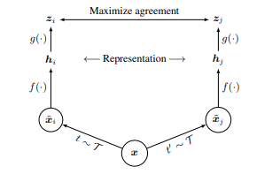
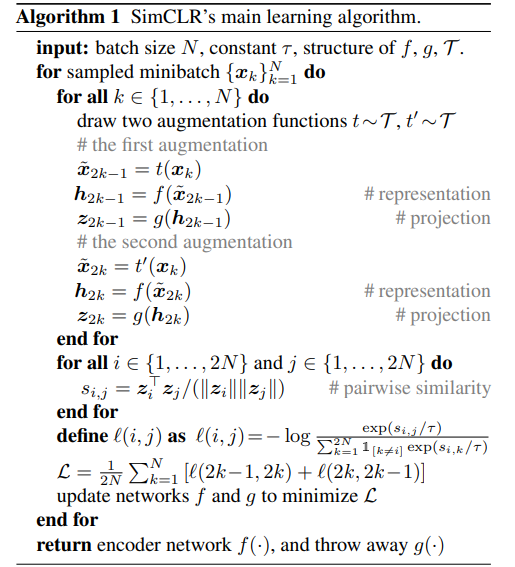
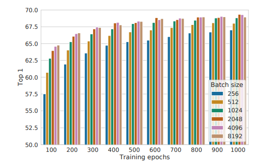
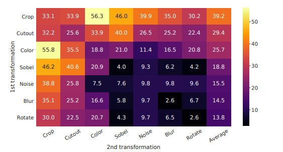
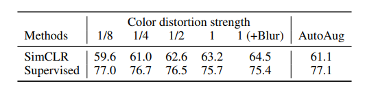
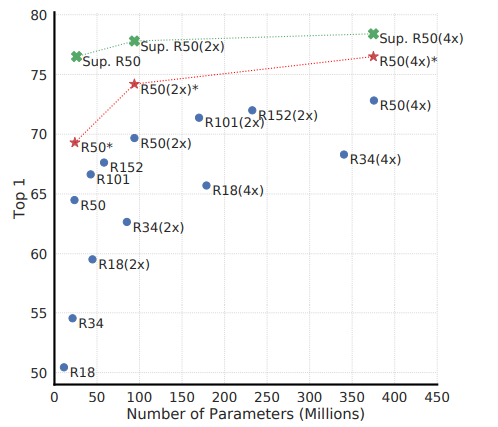
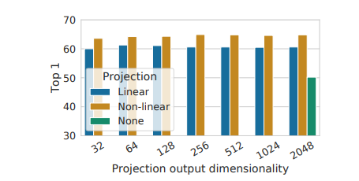
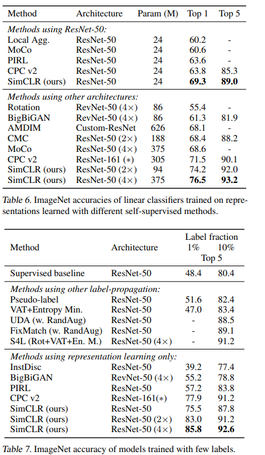
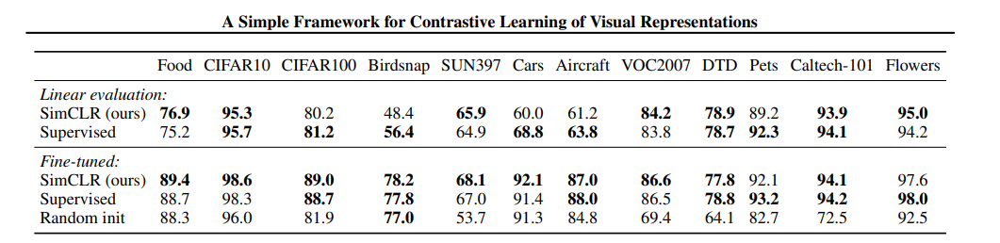

TODO: Summarize the paper:
* What is the core idea?  
This paper comes up with a simple framework for contrasive learning of visual representation, which not only archieves state of the art accuracy, but also has simplier structure. The result of SimCLR is shown in the following picture  

* How is it realized (technically)?  
The architecture of the SimCLR is shown as the following picture  

As you can see from the picture. First, for each data sample, x, the model generates two views of of the data sample by sequentially applying three data augmentation methods -- random cropping, random color distortions, and random Gauessian blur. Then the model applies encoder $$f(-)$$. There are various choices of the encoder, but in this paper, the authors use ResNet. Projection head $$g(-)$$ is MLP with one hidden layer, and it uses ReLU as activation function. The reason we need projection head $$g(-)$$ is that it maps representations to the space where contrasive loss can be applied.  

The training process is shown as following.  

* How well does the paper perform?
1. Larger batch size has more advantage than smaller batch size when the number of training epochs is small, but this advantage disappears when the number of epochs increases, as shown in the following picture  

2. Data agumentation methods are crucial for SimCLR.  

3. Contrasive learning needs stronger data augmentation than supervised learning  

4. deeper and wider model provides better performance of contrasive learning  

5. Choice of projection heads is very important 

6. SimCLR achieves state of the art results on ImageNet classification

8. SimCLR achieves competitive results on 12 natural image classification datasets by linear evaluation and fine tuning. 

