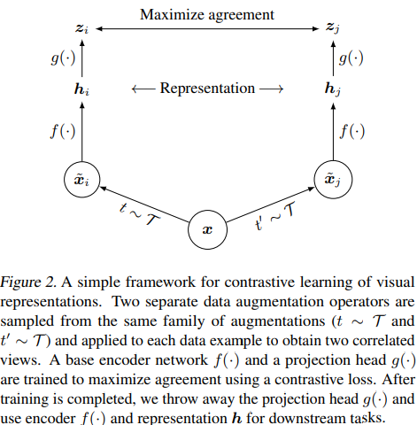

## Overview
The authors introduce SimCLR as a framework to leverage contrastive learning for visual representations. By utilizing combined data augmentations, a learnable nonlinear transformation between the representation and the contrastive loss, and specific training parameters (larger batch size and more training steps) the authors show strong performance on self and semi supervised learning on ImageNet.

## SimCLR

In general, the framework trys to process two different versions of a data sample and try to maximize a contrastive loss between the parallel outputs. This begins with some series of data augmentation operations to construct to variations of the input data sample x. Representation vectors of x are then retrieved by putting xi and xj through a ResNet, and finally a projection head (MLP) is used to map hi/hj to a space where the contrastive loss function is applied on the parallel outputs.

The authors train by performing a contrastive prediction task over N data points where given one of the two augmentations as specified above, the model must determine the other augmentation from the same initial example across 2N-2 negative examples. The authors use NT-Xent (normalized temperature-scaled cross entropy loss) as follows: 

<!-- Temperature -  -->

The authors opt to train using a large batch size to avoid incorporating a memory component to the model. Since their batch sizes vary from 256 to 8192, the authors need to use the LARS optimizer since large batch sizes are unstable with SGD/Momentum optimizers.

### Data Augmentation

The authors opt to frame the contrastive prediction task through the use of various data augmentations. The authors tested a number of different data augmentation strategies as in the above image, both in individual settings and as compositions of multiple augmentations. One composition the authors found worked particularly well included random cropping followed by random color distortion. They suppose that the added color distortion helps the model generalize better since just applying random cropping still retains more or less the same color distribution across an image and these distributions may be sufficient to distinguish images.

### Encoder/Head Architectures

One result the authors arrive at is the fact that unsupervised models benefit more from larger models than supervised models. The authors also found that using non-linear projection heads outperform linear projection heads (or no projection heads), and furthermore the hidden layer before the final projection in a non-linear projection often provides an even better representation. The authors suppose this loss of information between the last hidden layer and the final projection output might be due to the contrastive loss function. 

### Loss Function and Batch Size

## Results

The authors show SOTA results in both the self supervised and semi supervised settings and continue to show strong performance in the transfer learning setting.

## TL;DR
* SimCLR provides a simple framework to perform contrastive visual representation learning
* Combined improvements across data augmentation, network, and training setup (namely the loss function) drive strong results compared to supervised approaches
* Fine-tuning with a small sample of labeled data improves performance over state of the art
