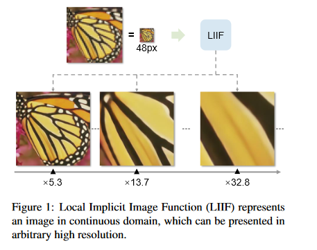
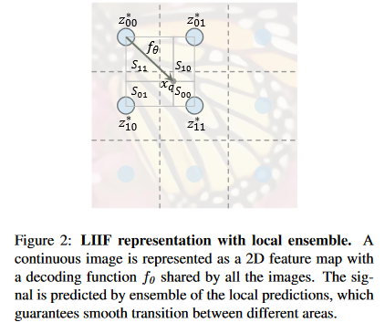
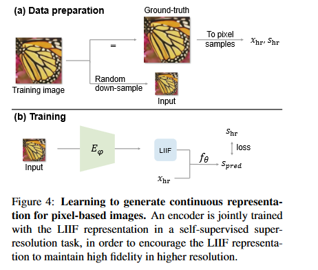
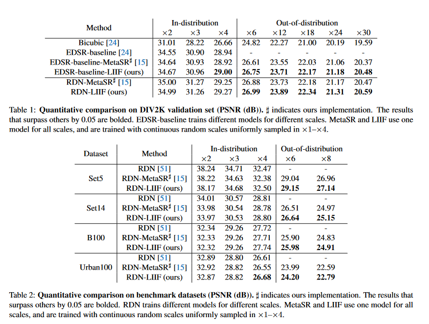

### What is the core idea?

**Implicit Neural Representations** attempt to model discrete signals as a
continuous function. This function maps some domain value (like a coordinate to
an image) to desired output (such as an rbg value). Local Implicit Image
Function (LIIF) attempts to apply this idea to represent images, which are
normally represented with rgb values at discrete coordinates, as a continuous
object. LIIF then can then scale images to arbitrarily high resolutions.

### How is it realized (technically)?

The idea is to create a decoding function $$f_\theta$$

$$s = f_\theta(z, x)$$

where $$s$$ is the rgb value, $$z$$ is a vector of latent codes, and $$x$$ is a
2D coordinate. $$f_\theta$$ uses the closest latent code in $$z$$ to $$x$$ to
output a rbg value. However, in practice, this leads to discontinous predictions
on the boundaries when latent codes change. So the following function is used:

$$I^{(i)}(x_q) = \sum_{t \in \{00,01,10,11\}}
\frac{S_t}{S}\cdot f_{\theta}(z_t^*, x_q-v_t^*)$$

where $$z_t^*$$ is the nearest latent code in the top-left, top-right,
bottom-left, bottom-right subspaces, $$x_q$$ is the inputted coordinate, and
$$v_t^*$$ is the coordinate location of the latent code. $$S_t$$ is the area of
the rectangle diagonal to $$v_t^*$$ and $$S=\sum_t S_t$$. This equation weights
the outputs of $$f_\theta$$ by how close the corresponding latent code is.
Notably, the authors also experimented with a variant decoder function

$$s = f_{cell}(z, [x, c])$$

where $$c=[c_w, c_h]$$ and contains the height and width of the pixel and
$$[x, c]$$ means that $$x$$ and $$c$$ are concatenated. 

When implementing LIFF, an encoder-decoder structure is used. An encoder,
$$E_\varphi$$, is trained to take an image and output a 2D feature map, a matrix
of latent codes, to be used in the decoder function. The decoder function is 
then trained to predict pixel values of various coordinates using the inputted
feature map.

The training images are obtained by down-sampling some higher resolution input.
This higher resolution image is then used as the ground samples as the LIFF
function attempts to predict the pixel values of the original image.

### How well does the paper perform?

The experimenters used the DIV2K dataset, a set of 1000 images in 2K resolution
with low-resolution counterparts that have downsampling scales of x2, x3, and
x4. The authors also attempted to generalize results beyond the downsampling
scales provided, generating downsampling scales of x6, x12, x18, x24, and x30
independently. They used the EDSR-baseline and RDN models as the encoders
($$E_\varphi$$) and used a 5-layer MLP with RELU activation and hidden layer
sizes of 256 as the decoder function.

On the standard, in-distribution images, LIFF has competitive results. It does
not noticeably outperform the other models that are tested on the dataset.
However, on the models that were downsampled beyond the standard dataset, LIFF
did have noticeably higher performance.

### What interesting variants are explored?

As mentioned above, the authors experimented with cell decoding. The heigh and
width of the pixel were included as inputs to the decoder function to allow the
decoder function to predict different values based on the size of the pixel. The
authors found that the variant performed better on smaller scales of x2, x3, and
x4, but suffered as the scale increased. However, while the quantitative results
show that the larger scales performed worse, a qualitative inspection by the
authors reveal the opposite. The authors conclude that adding cell information
improves results, but this might not be reflected in the PSNR results.

The authors also trained with a fixed downsample scale and found that resulted
in LIFF performing better on that specific scale and slightly worse on other
scales. Also, reducing the size of the decoder from 5 layers to 3 hurt
performance.

## TL;DR
* Local Implicit Image Function (LIIF) attempts to provide a continuous
representation for images.
* LIFF has an encoder that maps images to a matrix of latent codes and a MLP
decoder function to map coordinates and latent codes to rgb values
* LIFF outperformed other models for generalizing to arbitrary pixel
resolutions.
