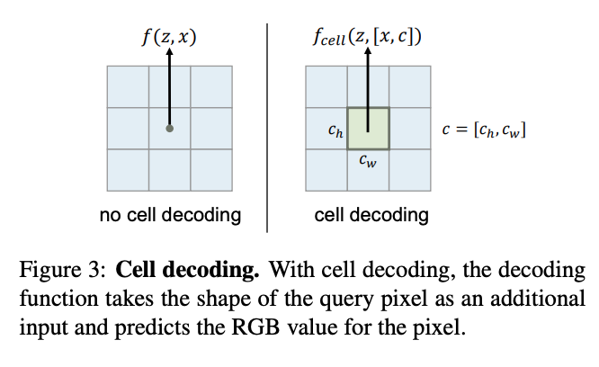

What is the core idea?

Real world visual input is continuous in nature, however images are represented as 2D arrays of pixels. Precision and complexity is controlled by the resolution of the image. However, for image models, images have to be resized to the same size (thus losing information about the resolution and losing fidelity to the original image). By modeling the image with the function, Local Implicit Image Function (LIIF), the authors show that they can generate an image in an arbitrary resolution.

How is it realized (technically)?

The goal of the model is to take a 2D coordinate x, the vector z and return the signal, which is a RGB value. Unlike implicit neural representations, where the output function is learned for each instance, the LIIF model is learned and generalized to all instances.

This figure, shows how the model works intuitively. We divide the image into a grid and for each grid cell we calculate a latent vector representation z. We use the vector z, associated with the grid square closest to the coordinate.

The paper also makes certain optimizations to this original idea. For each of the latent vectors, they concatentate the neighboring cell latent vector to find the new latent vector. (Feature Unfolding)  This allows for a richer representation. Another optimization they make is that instead of using the closest latent vector they use the weighted average of latent vector (weighted by the distance from the coordinate x). (Local Ensemble)

Lastly, they alter the model, such that instead of just taking z and x, it also takes a vector c, which represents the size of the grid square. This gives the model information about the input resolution. (Cell Decoding)

They also train the LIIF using self supervised learning, where they randomly down sample the existing image and treat the original image as the ground truth. Then they use the encoder as well as the LIFF model to output the image. They take the loss with respect to the original image.

How well does the paper perform?

The paper shows that given a 48x48 path, they are able to make the best x30 resolution image.

They show outperformance to other methods across all datasets.

What interesting variants are explored?

The paper does some interesting ablation testing. They try to see the effect of each of the optimizations that were discussed earlier. It doesn't seem that any of the optimizations make a significant impact on performance. Removing cell encoding seems to be the most impactful.

## TL;DR
* For image models, images have to be resized to the same size (losing information in the process)
* Authors present a Implicit Image Function as a way to generate images given an input resolution
* Their model delivers SOTA performance on the task
