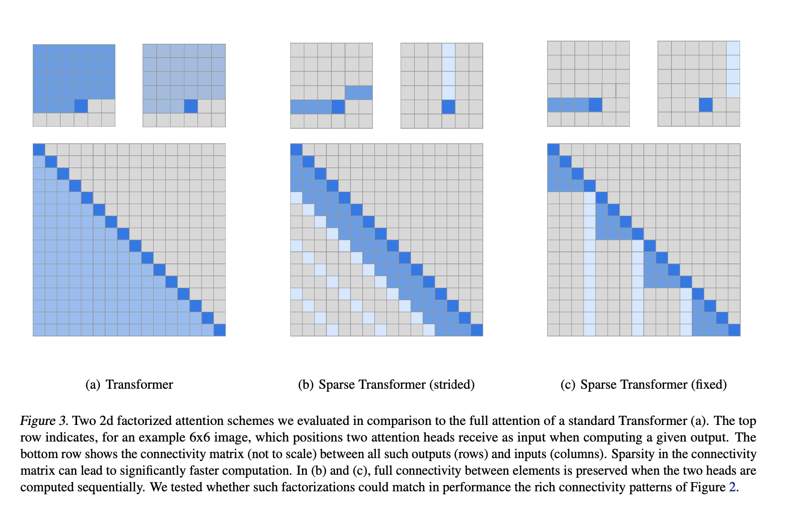
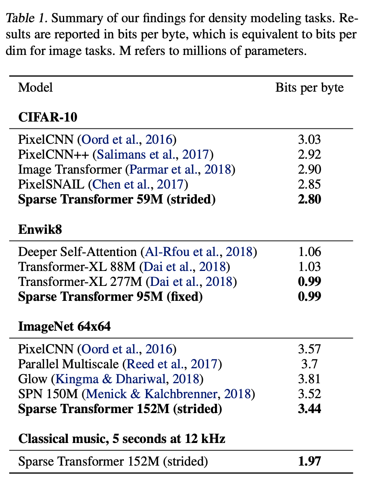
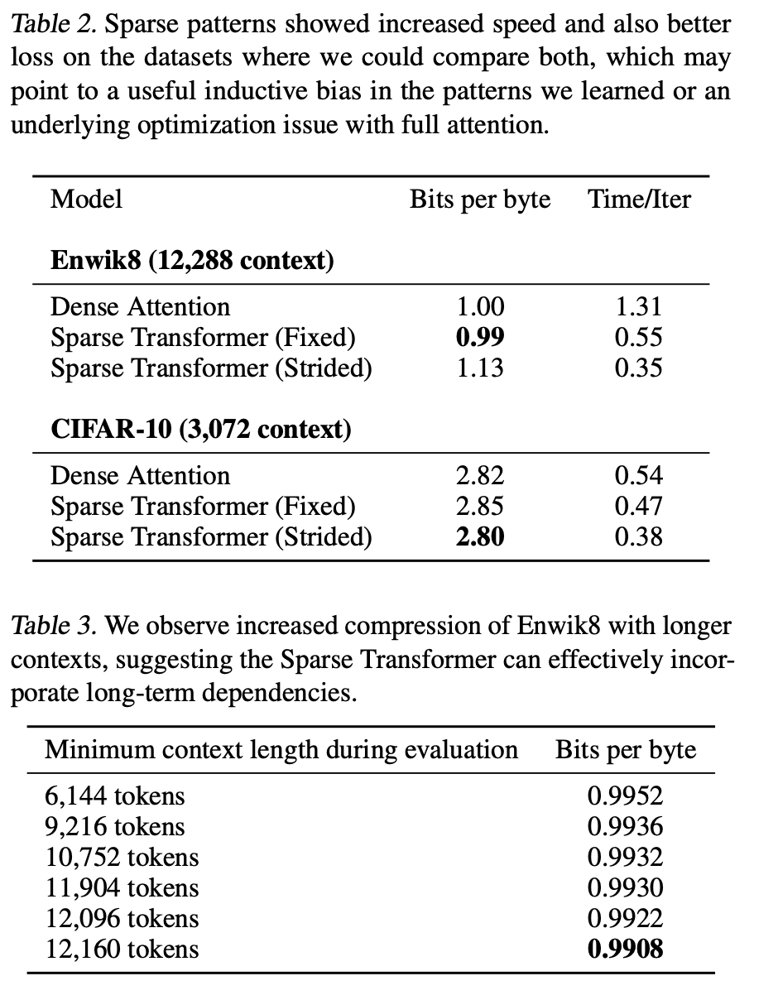

* What is the core idea?
  * This paper introduces Spare Transformers. 
  * Sparse transformers are a variation on Transformers
  * Sparse Transformers introduce sparse factorizations of the attention matrix which reduces the time and memory required by transformers from $$O(n^2)$$ to $$O(n\sqrt{n})$$.
  * The paper also introduces
    1. A variation of the Transformer architecture and initialisation for training Sparse Transformers on even deeper networks
    2. Recomputing attention matrices
    3. Fast attention kernels for training
* Background
  * Let's consider the task of autoregressive sequence generation
    * An autoregressive model predicts future behavour based on past behaviour
  * The joint probability of a sequence $$\mathbf{x} = \{x_1, x_2, x_3, ..., x_n\}$$ can be modeled as the product of conditional probability distributions and parameterized by a network $$\theta$$.
    * $$p(x) = \prod_{i=1}^{n} p(x_i \mid x_1, ..., x_{i-1};\theta)$$
    * The network $$\theta$$ takes in the sequence of tokens and outputs a categorical distrubition using softmax over a vocabulary of size $$v$$.
    * $$\theta$$ is typicall a Transformer in decode-only mode.
      * The self-attention portion computes $$n$$ weightings for each of the $$n$$ elements. 
      * This is intractable as the sequence length grows
* How is it realized (technically)?
  * Factorized Self-Attention
    * First, the authors visualised the attention patterns learned by a 128-layer self-attention network on CIFAR-10.
      * The authors noticed that most layers had sparse attention patterns in most data points 
      * 
      * This suggests that some form of sparsity can be introduced without significantly affecting performance.
      * This lead to Factorized Self Attention
    * Full self-attention for autoregressive models allows every element to attend to all previous positions and its own position
      * Factorized self-attention, on the other hand, has $$p$$ separate attention heads
        * The $$m$$th head defines a subset of the indices $$A_i^{(m)} \subset \{j : j \le i\}$$. This subset of indices is what the $$m$$th head attends to. 
        * $$A_i^{(m)}$$ is chosen effienctly i.e. $$ \text{cardinality}(A_i^{(m)}) \propto \sqrt[p]{n}$$
      * In this paper - $$p=2$$
        * One head attends to previous $$l$$ locations
        * The other head attends to every $$l$$th location, where $$l$$ is the stride and chosen to be close to $$\sqrt{n}$$
          * This is referred to as strided attention
          * Works well for data that has a structure which aligns with the stride - like images or some types of music
            * Does not work well for text
          * For text, the paper uses $$\textit{fixed}$$ attention. 
            * Here specific cells summarize previous locations and propogate that informatino to all future cells
    
  * Sparse Transformer
    * Modified version of the Transformer
    * Incorporates Factorized attention
      * Three ways to do so
        * One attention type per residual block, interleaved sequentially or at a ratio determined as a hyperparameter
        * Merged head - a single head attends to locations of the pixels that both factorized heads would attend to
        * Multi-head attention - attention produced are computed in parallel, then concatenated along the feature dimension
    * Scaling to hundreds of layers
      * Transformers hard to train with many layers
      * To tackle this, the following archtectural changes were adopted:
        * Pre-activation of residual block definition from (He et al. 2016)
    * Modeling diverse data types
      * Learned embeddings which either encoded the structure of the data or the factorized attention patterns important for model's success

    * Saving memory by recomputing attention weights
      * Gradient checkpointing is proven to be effective in reducing memory requirements (Chen et al. 2016) (Gruslys et al. 2016)
        * This technique can also be applied to self-attention layers when long sequences are processed
        * With recomputation alone, dense attention networks with hundreds of layers can be trained on sequence lengths of 16,384
          * Infeasible on modern hardware otherwise 
    * Efficient block-sparse attention kernels
      * Attention can be efficiently computed
        * The paper implemented a set of GPU kernels to do so
        * Halved number of operation to be performed	
    * Mixed precision Training
      * Network weights computed in single precision floating point
      * Network activations and gradients in half-precision 
      * Accelarates training
* How well does the paper perform?
  * Runs sigificantly faster than full attention
  
  * Converged to a lower error due to sparse patterns
  
    * May be due to an underlying optimisation issue with full attention
    * Or a useful inductive bias from introduced sparsity patterns
  
  * 
  
    

## TL;DR
* Attention in most layers has a sparse pattern - recognising this led to the insight that full attention may not need to be computed, and instead, introducing sparsity in computing attention may help - this led to factorised self-attention
* Reduces computation costs and thus allows for training of deeper networks with longer sequences
* Equivalent or better results in accuracy while reducing computation time and memory.
