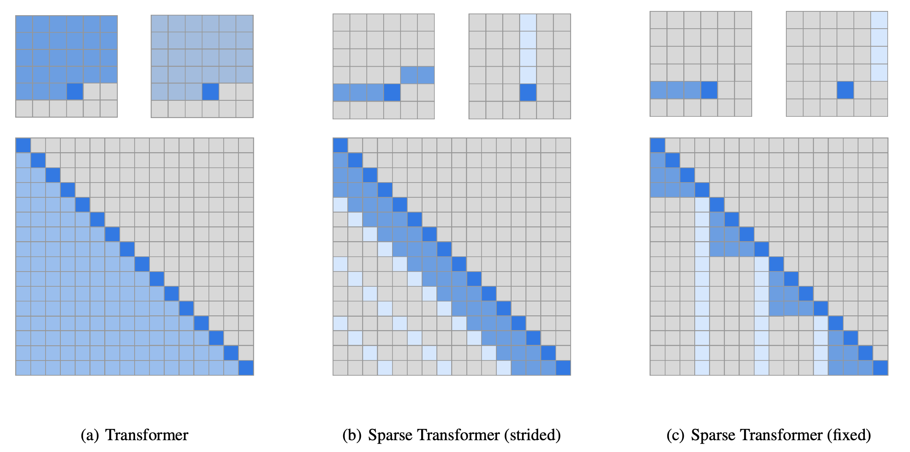

### Motivation

The pain point of transformers is the time and memory complexity grow quadractically with the sequence length, which quickly becomes untenable when processing long inputs. This paper reduces the complexity to $$O(n\sqrt{n})$$ by factorizing the attention matrix into a sparse form. 

This paper considers the task of autoregressive sequence generation, where the backbone model is the decoder only transformers. To find the reasonable factorization of the self-attention matrix, the authors first conducted a qualitative assessment of learned attention patterns, visualizing the attention patterns learned by a 128-layer self-attention network on CIFAR-10.

### Sparse attention

A self-attention layer maps a matrix of input embeddings $$X$$ to an output matrix and is parameterized by a connectivity pattern $$S = \{S_1, ..., S_n\}$$, where $$S_i$$ denotes the set of indices of the input vectors to which the i th output vector
attends. The output vector is a weighted sum of transformations of the input vectors:

$$\text{Attend}(X, S) = \Big( a(x_i, S_i) \Big)_{i\in\{1,\dots,n \}}$$
$$a(x_i, S_i)=\text{softmax}\bigg( \frac{(W_qx_i)K^T_{S_i}}{\sqrt{d}} V_{S_i}\bigg)$$
$$K^T_{S_i} = \big( W_k x_j \big)_{j\in S_i}$$
$$V_{S_i} = \big( W_v x_j \big)_{j\in S_i}$$

In the above equations, $$W_k, W_q, W_v$$ are key, query and value matrices. Full self-attention would have $$S_i=\{j:j\leq i\}$$, allowing every element to attend to all previous positions plus its own.

Factorized self-attention insteaad has $$p$$ separate attention heads. The m th head is a subset of the previous positions $$A_i^{(m)}\subset \{ j:j\leq i \}$$ and let $$S_i=A_i^{(m)}$$. This paper explores what is the efficient choice of $$A_i^{(m)}$$, focusing on the setting $$p=2$$.

**Stride attention**:

$$A_i^{(1)} = \{ t, t+1, \dots, i\}, t = \max(0, i − l)$$
$$A_i^{(2)} = i = \{ j: (i-j) \quad \text{mod} \quad l = 0 \}$$

where $$l$$ is the stride, which is choosen to be closed to $$\sqrt{n}$$. The patter of the stride attention can be found in the following figure. This formulation works better for data comes with a stride such as images. However, it works poorly in the NLP domain.

**Fixed attention pattern**:

We still predetermine the stride $$l$$. Then we can define the first head of the fixed self-attention, 
$$A_i^{(1)} = \{ j: \big( \text{floor}(j/l)=\text{floor}(i/l) \big) \}$$
$$A_i^{(2)} = \{ j: j\quad \text{mod} \quad l \in \{ t, t+1, \dots, i\} \}$$
where $$t = l − c$$ and $$c$$ is a hyper-parameter.

For example, if the stride is 128 and c = 8, then all future positions greater than 128 can attend to positions 120-128, all positions greater than 256 can attend to 248-256, and so
forth. A visualization is in the following figure.

 

### Sparse transformers
Next, we build sparse transformers with the sparse self-attention introduced above.

### Experiments

**CIFAR-10**

**Text**

**Tiny-ImageNet**

### TL;DR

