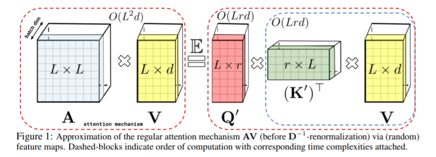
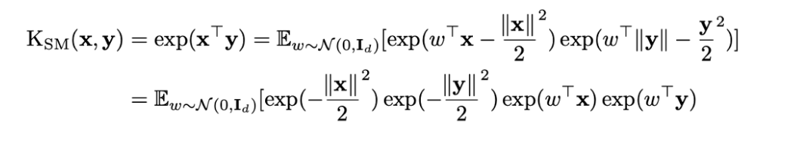
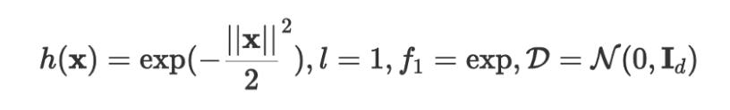
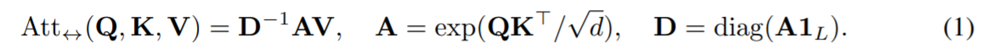
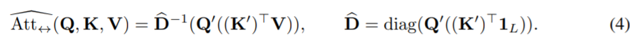
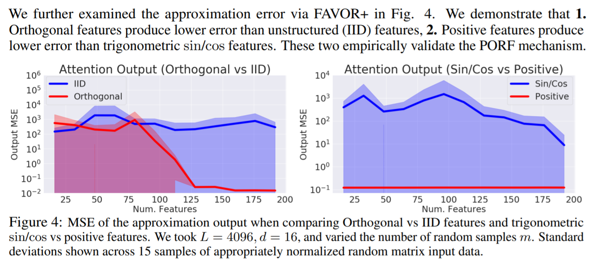

<!-- TODO: Summarize the paper:
* What is the core idea?
* How is it realized (technically)?
* How well does the paper perform?
* What interesting variants are explored? -->

While transformers have become a very popular way of working with sequential data, the equation to determine the attention of the model relies on softmax. This paper provides an alternative trick to approximate the attention in linear time complexity rather than the quadratic time complexity currently required. 

The authors suggest a new algorithm for performers called FAVOR+, which stands for fast attention via positive orthogonal random features. 

Using this approach brings the time complexity of attention from O(L^2 * D) to O(Lrd)
- This is beneficial because we can control r as a parameter and decrease the computational effort needed.

FAVOR+ uses a feature map to represent the kernel to keep time complexity low.

The similarities between the guassian kernel and the softmax kernel are noted, but guassian kernels can include negative values which leads to unstable results. 

The feature map allows for lower time complexity and the paper cites a recent publication of the gaussian kernel being represented by using a specific feature map. So this is expanded to include only positive results and stabilize the kernel. 

So they expanded on the guassian kernel to represent the softmax kernel as:

With h(x) in the feature map from the guassian kernel represented as:

So the original attention of:

is approximated by the more efficient version:

<!-- Include experiment information here -->
The experiments were done by replacing the attention aspect with FAVOR+ and evaluating the model.

The variants talked about during the experiments include Reformer (unidirectional) and Linformer (bidirectional) on the PG19 dataset.

The computational speed results of these tests backup the theoretical analysis. Performers are able to reach linear time complexity and subquadratic memory usage.

It was also proven that FAVOR+ produces better results than the IID and trigonometric features:

Experiments proved that performers worked with already trained models with minor finetuning. 

Additionally, the Performer RELU had significantly higher accuracy than both Reformer and Linformer on the bidirectional and undirectional cases of the protein sequences from the TrEMBL. The Performer softmax also had good results, and received the same results as the original softmax.

## TL;DR
- Performers provide a time and space efficient approximation of attention using the FAVOR+ approach
- They overcome the shortcomings of previous approximations that rely on priors or using localized data
- Performers work with transformers and can be extended to various benefits in fields such as biology, environment, research on transformers, and more. 