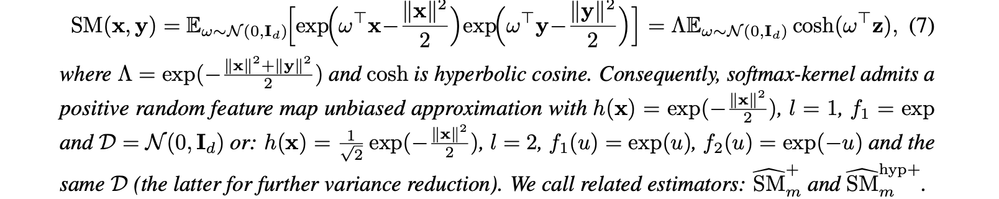
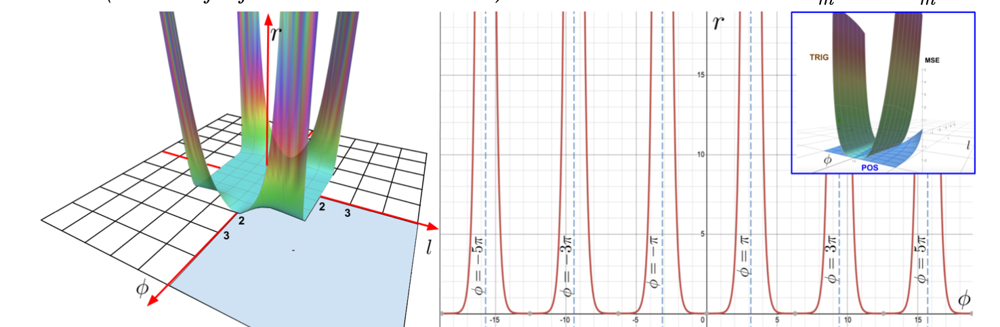
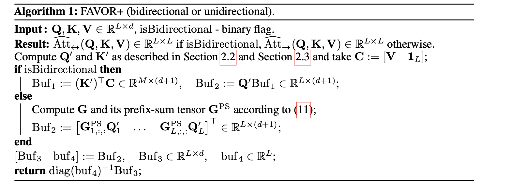
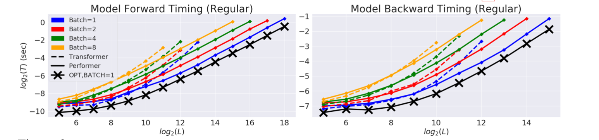
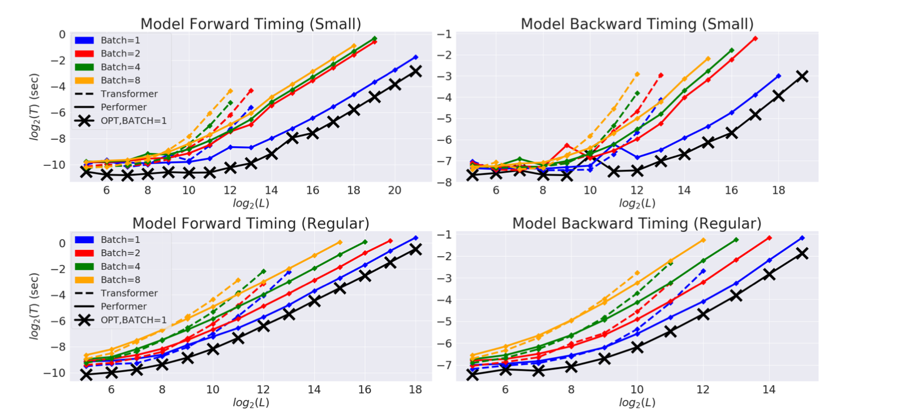
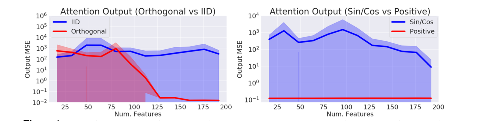
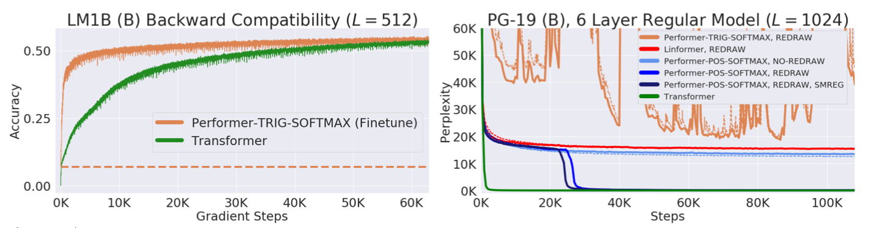
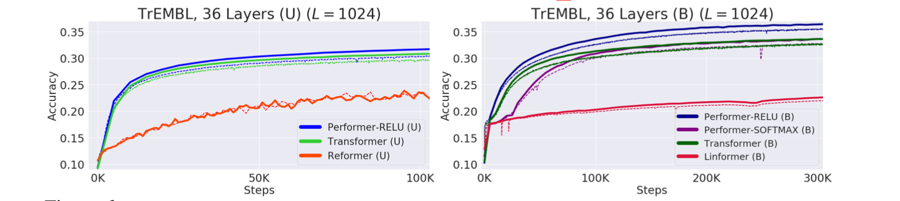
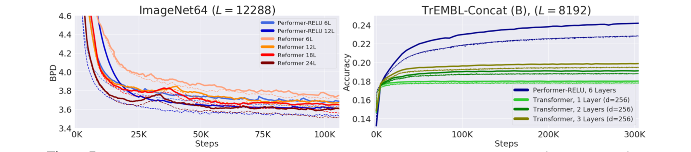

TODO: Summarize the paper:

### What is the core idea?

The authors argues using positive random orthogonal features can approximate softmax attention kernels in linear time and space complexity compared to SOTA transformer architecture that uses quadratic time,referred to as Performers.

### How is it realized (technically)?

Performers uses fast attention via positive orthogonal random features (FAVOR+) mechanism that do not rely on sparsity or low-rankness. It was achieved with the following design in mind

[1] Only non-negative kernel scores are useful.

Trigonometric functions ($sine/cosine$) used in encoding potentially generates negative dimension values that can cause instability especially for kernels close to 0 when used with random features. 

(left) Describe the utility function r, which the ratio of mean squared errors and (right) show the cross section of $r$ for a fixed $l$ = 1. (upper-right) shows comparison of both MSE estimators.

[2] Use of orthogonal random features (ORFs)

ORF is a technique used in the approximation of a gaussian kernel by linear transformation of the gaussian matrix and imposing orthogonality by random sampling from a χ-distribution. This reduces the variance of the estimator for any dimensionality d.

FAVOR+ combines the advantages of both the orthogonal random features (ORF) with positive random feature (PRF) vastly increasing the accuracy of approximation of the attention matrix. The algorithm runs in O($md + Ld + mL$) space complexity as opposed to Θ($L2 + Ld$) space complexity of the baseline and Time O($Lmd$) compared to O($L2d$) of the baseline for L ≫ m.

### How well does the paper perform?

Baseline comparison  of FAVOR+ (Performer) with normal Transformer models for both unidirectional/causal modeling and bidirectional/masked language modeling tasks

#### Dataset

- PG-19 (Rae et al., 2020) texts from Project Gutenberg contains fixed vocabulary size and made for long-length sequence training.

- BookCorpus (Zhu et al., 2015)  

- Wikipedia dataset used in BERT (Devlin et al., 2018)

Orthogonal features show lower softmax attention approximation error. Also using positive features produced lower errors compared to $sine/cosine$ features.

Performer displayed backward compatibility with pre-trained models benefitting from softmax approximation.

Performer combined with a ReLU showed better training performance on a 36-layer model on TrEMBL protein sequence dataset (Consortium, 2019). Performer compared with Transformer,Reformer and Linformer.

(Left) performer showed better training performance on ImageNet64 dataset in comparison with reformer and (Right) performer versus transformer on TrEMBL dataset

### What interesting variants are explored?
 
Hadamard/Givens ORFs - Applies a random Hadamard or Givens matrices, encoding in  O($m$) or O($m log(d)$) space and O($m log(d) $)

## TL;DR

* Choosing Positive random features are better than standard trigonometric features.

* Performer uses FAVOR+ which is computational efficient for attention approximation.

* Performers provides strong theoretical guarantees without using any priors

<!-- * To highlight the core concepts -->
