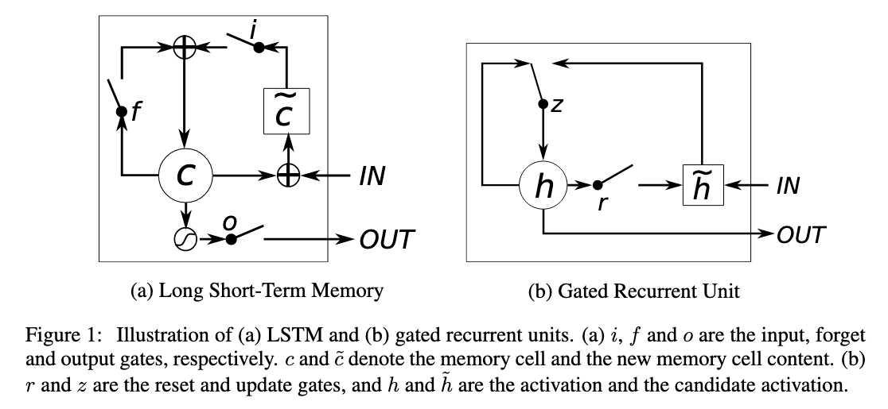
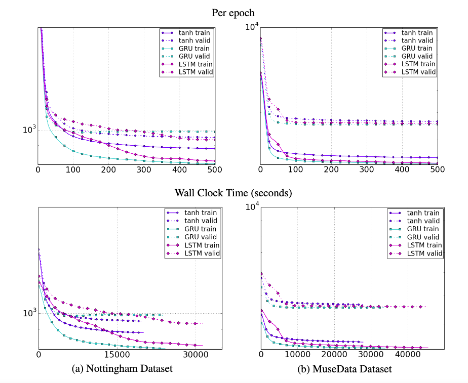
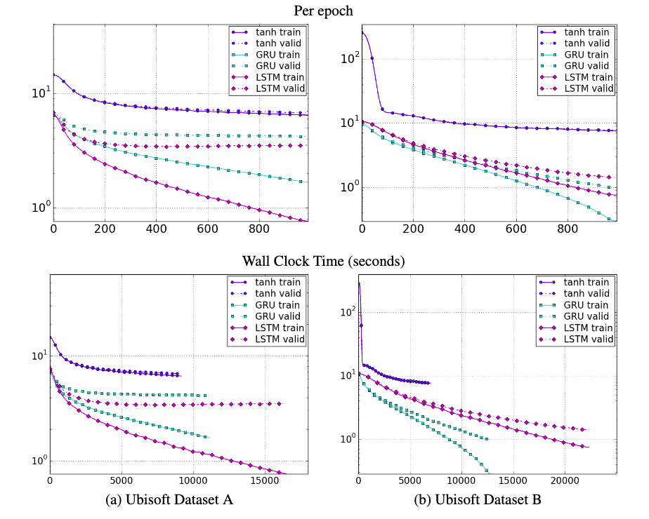

* What is the core idea?

Recurrent neural networks (RNNs) are used to model sequential data with varying in-/output lengths. 
The authors compare three types of units used in RNNs: long short-term memory units (LSTMs), the (at the time) recently introduced gated recurrent units (GRUs) and traditional tanh units.
The gated units can "decide" whether/how much of the previous state they should keep and what amount of newly generated information should be stored.
Overall, the gated LSTM and GRU units perform much better than the tanh units, which struggle with vanishing/exploding gradients.

* How is it realized (technically)?

Traditional RNNs implement a hidden state h to keep a "memory" of the previous states:

$$
h_{t}=tanh(Wx_t+Uh_{t-1})
$$

Gated units have a more complicated setup:

### LTSM

The output of the LSTM at time t is

$$
h_t=o_t tanh(c_t)\\
\textrm{where } c_t \textrm{ is the memory of the unit at time t and } o_t \textrm{ is an output gate.} 
$$

The output gate is calculated using:

$$
o_t=\sigma(W_o x_t + U_o h_{t-1} + V_o c_t)\\
\textrm{where } \sigma() \textrm{ is the sigmoid function.} 
$$

The memory cell gets updated by "erasing" a part of its memory determined by the forget gate and adding new content:

$$
c_t=f_t c_{t-1} + i_t \tilde{c_t}
$$

with the new content being

$$
\tilde{c_t}=tanh(W_c x_t + U_c h_{t-1})
$$

and the forget and input gates being

$$
f_t = \sigma(W_f x_t + U_f h_{t-1} + V_f c_{t-1})\\
i_t = \sigma(W_i x_t + U_i h_{t-1} + V_i c_{t-1})
$$

### GRU

The idea behind the GRU is similar; however it cannot control how much of the state is exposed as an output.

The activation at time t is

$$
h_t=(1-z_t) h_{t-1} + z_t \tilde{h_t}
$$

The update gate z linearly interpolates between the stored state and a candidate state.
It is calculated using:

$$
z_t = \sigma(W_z x_t + U_z h_t-1)
$$

The candidate state is computed using:

$$
\tilde{h_t} = tanh(W x_t + U(r_t \cdot h_{t-1}))
$$

The reset gate vector r decides, which parts of the state are kept (and how much of them).

$$
r_t = \sigma(W_r x_t + U_r h_{t-1})
$$

* How well does the paper perform?

The authors constructed models with the three types of units using a fixed number of parameters.
They tested them on a polyphonic music dataset and two speech signal modeling datasets.
On the music datasets, GRU performs the best in most cases. 
Both gated variants outperformed tanh on the speech datasets and converge faster.
The authors state that the evidence on which of the gated units performs better is not conclusive and the choice should probably depend on the task.

## TL;DR
* Recurrent neural networks are constructed using units such as the LSTM, GRU or tanh unit
* The more advanced LSTM and GRU units perform the tanh units in music and speech signal modeling
* The authors attribute this to exploding/vanishing gradients
