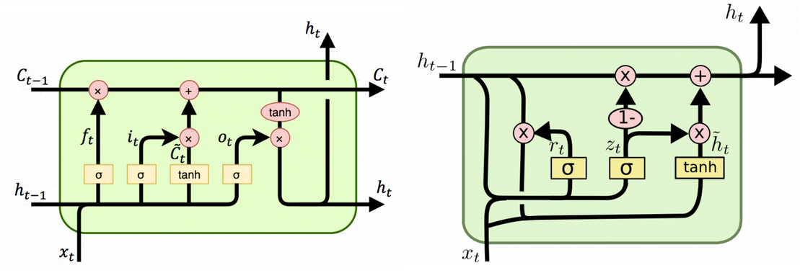
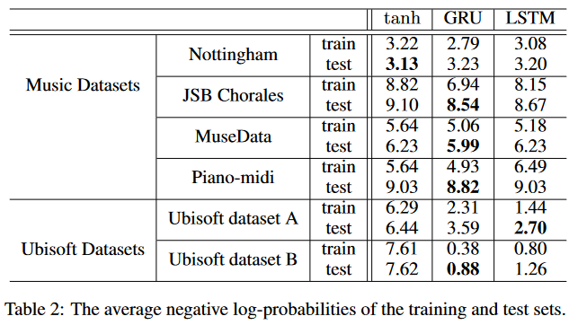
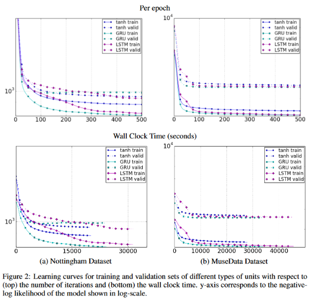
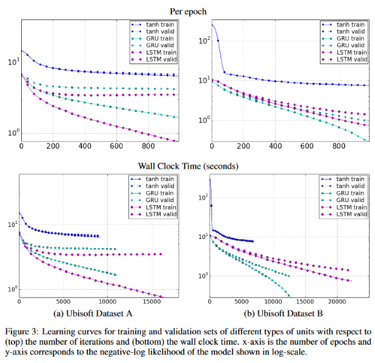

TODO: Summarize the paper:
* What is the core idea?
    * Sequential data often has long-term dependencies
    * RNNs have trouble capturing these dependencies due to vanishing/exploding gradients
    * The LSTM and GRU activation functions have been proposed to address this issue
    * In this paper, the author compare how these functions perform empirically
* How is it realized (technically)?
    
    * LSTM
        * $$\textbf{x}_t$$ and $$\textbf{h}_{t-1}$$ are used to calculate the forget gate, the input gate, and the output gate

            $$
            f_t = \sigma(W_f\textbf{x}_t + U_f\textbf{h}_{t-1} + V_f\textbf{c}_{t-1})
            $$

            $$
            i_t = \sigma(W_i\textbf{x}_t + U_i\textbf{h}_{t-1} + V_i\textbf{c}_{t-1})
            $$

            $$
            o_t = \sigma(W_o\textbf{x}_t + U_o\textbf{h}_{t-1} + V_o\textbf{c}_{t-1})
            $$

        * Candidate memory cell calculated as 

            $$
            \tilde{c}_t = \tanh(W_c\textbf{x}_t + U_c\textbf{h}_{t-1})
            $$

        * New memory cell calculated by "forgetting" some of the old memory and "inputting" some of the candidate memory according to the forget and input gates

            $$
            c_t = f_tc_{t-1} + i_t\tilde{c}_t
            $$

        * Finally, the output hidden state is calculated as 

            $$
            h_t = o_t\tanh(c_t)
            $$

    * GRU
        * $$\textbf{x}_t$$ and $$\textbf{h}_{t-1}$$ are used to calculate the reset and update gates

            $$
            r_t = \sigma(W_r\textbf{x}_t + U_r\textbf{h}_{t-1})
            $$

            $$
            z_t = \sigma(W_z\textbf{x}_t + U_z\textbf{h}_{t-1})
            $$
        
        * Candidate activation is calculated as

            $$
            \tilde{h}_t = \tanh(W\textbf{x}_t + U(\textbf{r}_t \odot \textbf{h}_{t-1}))
            $$

            where $$\odot$$ is elementwise multiplication

        * Finally, the new activation is calculated as an interpolation between the old activation and the candidate activation

            $$
            h_t = (1-z_t)h_{t-1} + z_t\tilde{h}_t
            $$

    * Clear similiarity between the two is that some memory is kept with some new memory added on top
        * Tradition recurrent units completely replace old memory
        * This helps the model remember features that occurred several time steps before
        * Also provides shortcuts for the gradient to propagate through
    * LSTM can control output $$h_t$$ through output gate
    * GRU can directly control how much of $$h_{t-1}$$ to use to calculate the new $$h_t$$
    * For GRU, one gate controls how much previous and candidate memory is used to calculate the new memory
    * For LSTM, independent gates control previous and candiate memory

* How well does the paper perform?
    * The LSTM and GRU are evaluated on the task of sequence modeling, along with tanh as a benchmark
    * They are tested on three music datasets and two Ubisoft speech datasets

    

    * For the music datasets, all three perform comparably, with GRU performing the best most of the time
    * For the speech datasets, LSTM and GRU perform way better than tanh

    
    * For the music datasets, the three types again all perform comparably, with GRU having a slight edge in terms of convergence rate

    
    * For the speech datasets, tanh converges at a much worse performance than the other two

    * Overall, LSTM and GRU are clearly better than tanh, yet results for which of the two is better are mixed

## TL;DR
* RNNs suffer from vanishing/exploding gradients
* LSTM and GRU, which are more sophisticated activation functions, can mitigate this problem
* Empirically shown that neither function has a distinct advantage over the other
