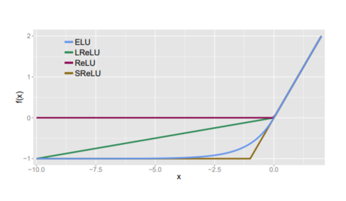
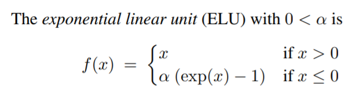

<!-- TODO: Summarize the paper:
* What is the core idea?
* How is it realized (technically)?
* How well does the paper perform?
* What interesting variants are explored? -->

# Summary 1: FAST AND ACCURATE DEEP NETWORK LEARNING BY EXPONENTIAL LINEAR UNITS (ELUS) 

This paper introduces an activation function called the exponential linear unit (ELU), which has faster learning properties than the previous most commonly used activation functions such as ReLU, LReLU, and PReLU.

ELU maintains the nice properties of ReLU by maintaining f(x) = x for x >= 0. 

- This is important to avoid the vanishing gradient property of sigmoid and tanh. 
- The gradient at almost any point in those functions is less than 1. This means at each step the gradient is becoming closer to zero. 
- Since ReLU uses the identity function for positive inputs, the gradient is always 1, which avoids the previously mentioned problem. 

ELU expands on the improvements made by LReLU and PReLU by exponentially including negative inputs. 

- As seen from LReLU and PReLU, it's useful for these functions to include negative inputs to help bring the mean closer to 0.
- The mean should be closer to 0 to help the speed of the training computation because of a reduced bias shift effect. 
- ReLU has the potential for too many inputs to be negative and drop to zero. By keeping some negative values, more inputs can remain being trained. 
- The improvement over LReLU and PReLU is that ELU allows the gradient to smoothly approach zero as the input becomes more negative. 
    - This means that the smaller (more negative) the input becomes, the gradient becomes so small that the information propagated forward essentially converges over time, which reduces noise from these deactivated numbers
- The other 2 previously mentioned functions linearly introduce negative values, which does not effectively represent their deactivation. 
- This noise-robust deactivation state is important for ELU to more effectively approximate non-linear functions.

ELU performs well on the major image recognition sets they tested on. The authors proved ELU had significantly lower activation means and training loss than other activation functions when testing with the MNIST dataset. Thus, ELU comparatively converges faster during training. However, due to the non-linear activation, it was comparitively slower than ReLU and variants during testing. At the time of their evaluations and publication, ELU held the best test score of CIFAR-100 and second best of CIFAR-10. The CIFAR-100 test error used in their evaluation is 24.28%, which is soundly lower than the previous best of 27.62%.

Their evaluations proved ELU is adaptable to many different image recognition CNN's. ELU without batch normalization performed comparatively better than ReLU with batch normalization. Batch normalization did not improve the performance of ELU in their testing.

## TL;DR
- ELU provides an easily implementable improvement to ReLU and other variants by using an exponential function for negative values to slowly reduce the gradient to zero 
- This allows for a noise-robust deactivation state that reduces variation in forward propagation 
- ELU increases speed of training and precision of results with a lower computation demand than batch normalization
