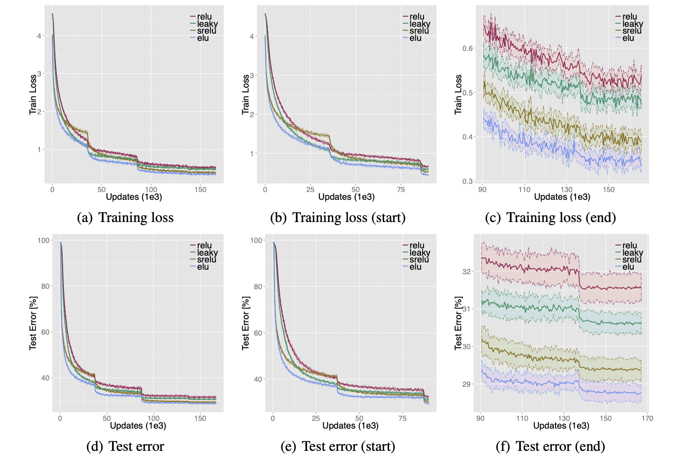

<!-- 
TODO: Summarize the paper:
* What is the core idea?
* How is it realized (technically)?
* How well does the paper perform?
* What interesting variants are explored? -->

What is the core idea?

The vanishing gradient problem as been a problem of training Deep Neural Nets.The core idea of the Exponential Linear Units centers around creating a negative activation to  shift the mean close to zero whereby increasing the learning rate as well a performance.

<!-- A function 
$$f_1(x)$$ = $$\Big$$
would now become $$f_2(x) = x + g(x)$$. -->

How is it realized (technically)?

$$
f(x) = \left\{
    \begin{array}{ll}
        x & if \hspace{.2cm} x > 0  \\
        \alpha (exp(x) - 1) & x \leq 0 
    \end{array}
\right., \hspace{.2cm}
 f(x)' = \left\{ \begin{array}{ll} 1 & if \hspace{.2cm} x > 0  \\ f(x) + \alpha & x \leq 0  \end{array} \right. $$

$\alpha$ is the hyperparameter, causes the activation to be negative.

How well does the paper perform?

ELU is significantly better than prior activations (ReLU,leaky,srelu)

## TL;DR

* Method has negative values shifting mean slower to zero
* Paper showed better performance and faster learning rates.
<!-- * To highlight the core concepts -->
