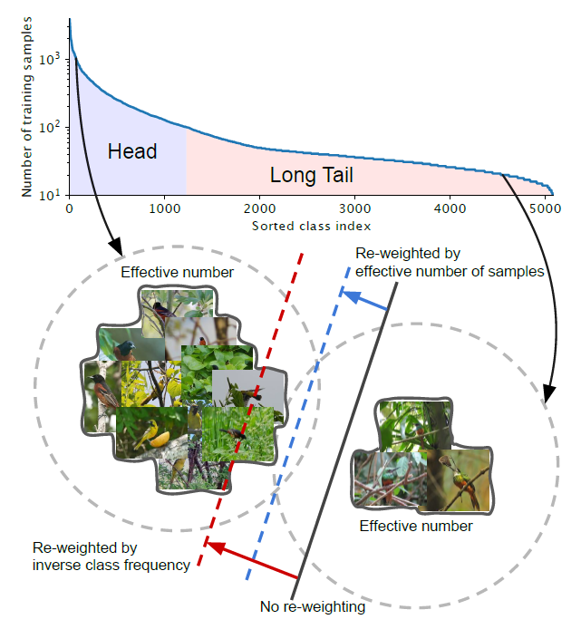
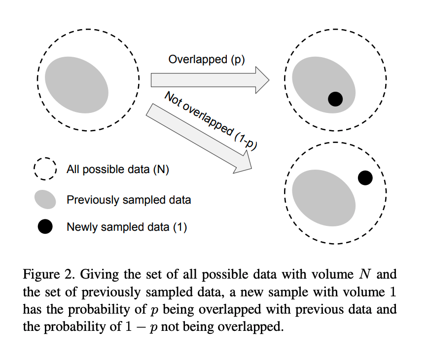
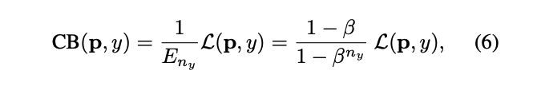
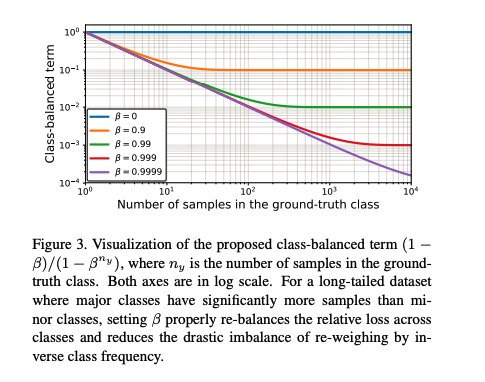
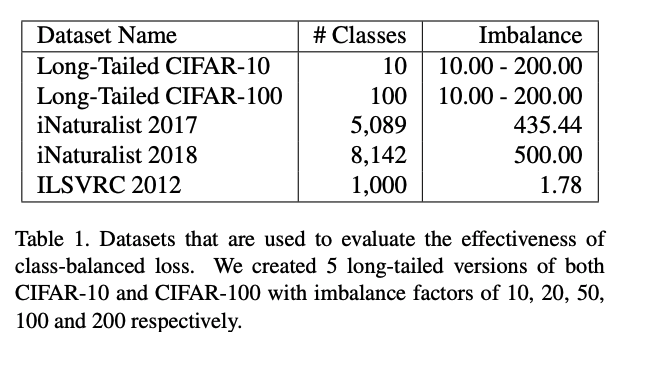
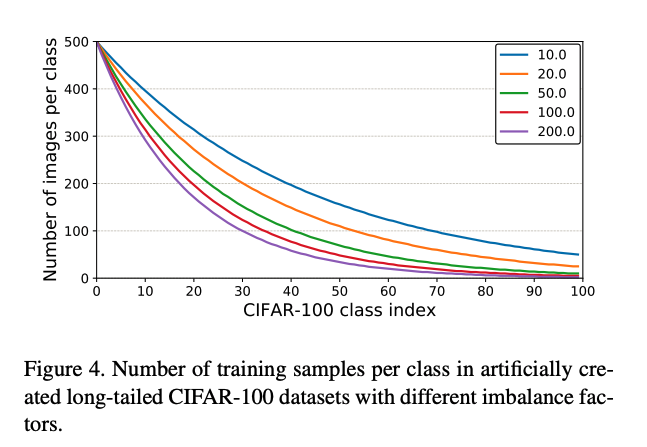

### Class Imbalance Problem

Suppose there are classes that arm imbalanced as above.

**Head:** For the class with small indices, these classes have the larger number of samples.

**Tail:** For the class with large index, these classes have the smaller number of samples.

**Black Solid Line:** Models directly trained on these samples are biased toward dominant classes.

**Red Dashed Line:** Re-weighting the loss by inverse class frequency may yield poor performance on real-world data with high class imbalance.

**Blue Dashed Line:** A class-balanced term is designed to re-weight the loss by inverse effective number of samples.

### Effective Number of Samples
#### Definition

Intuitively, the more data, the better. However, since there is information overlap among data, as the number of samples increases, the marginal benefit a model can extract from the data diminishes.

**Left:** Given a class, denote the set of all possible data in the feature space of this class as S. Assume the volume of S is N and N ≥ 1.

For a class, N can be viewed as the number of unique prototypes.

**Middle:** Each sample in a subset of S has the unit volume of 1 and may overlap with other samples.

**Right:** Each subset is randomly sampled from S to cover the entire set of S. The more data is being sampled, the better the coverage of S is.
The expected total volume of sampled data increases as the number of samples increases and is bounded by N.

Therefore, the effective number of samples is defined as the expected volume of samples.

The idea is to capture the diminishing marginal benefits by using more data points of a class.
Due to intrinsic similarities among real-world data, as the number of samples grows, it is highly possible that a newly added sample is a near-duplicate of existing samples.

In addition, CNNs are trained with heavy data augmentations, all augmented examples are also considered as same with the original example.

#### Mathematical Formulation

Denote the effective number (expected volume) of samples as $$E_n$$, where $$n$$ is the number of samples.

To simplify the problem, the situation of partial overlapping is not considered.

That is, a newly sampled data point can only interact with previously sampled data in two ways: either entirely inside the set of previously sampled data with the probability of p or entirely outside with the probability of 1-p.

Proposition (Effective Number): 

$$E_n = \frac{(1−β^n)}{(1−β)}$$

where $$ β = \frac{(N− 1)}{N} $$

This proposition is proved by mathematical induction.

### Class-Balanced Loss (CB Loss)
The Class-Balanced Loss is designed to address the
problem of training from imbalanced data by introducing a weighting factor that is inversely proportional to the effective number of samples.

The paper denotes the loss as $$ረ(p,y)$$, where $$y\in\{1,2,...,C\}$$, and $$C$$ is the total number of classes, and $$p$$ is the estimated class probability.

The class-balanced (CB) loss can be written as:

where$$n_y$$is the number of samples in the ground-truth class $$y$$. The visualization is as follows where it depicts a function of $$n_y$$ for different $$\beta$$

Note that β=0 corresponds to no re-weighting and  β→1 corresponds to re-weighing by inverse class frequency. The proposed novel concept of effective number of samples enables us to use a hyperparameter β to smoothly adjust the class-balanced term between no re-weighting and re-weighing by inverse class frequency.

### Experimental Results

## TL;DR
* The paper tackles the problem of long-tailed data distribution where a few classes account for most
of the data, while most classes are under-represented.
* The paper provides a theoretical framework to study the effective number of samples and show how to design a class-balanced term to deal with long-tailed training data.
* The paper shows that significant performance improvements can be achieved by adding the proposed class-balanced term to existing commonly used loss functions including softmax cross-entropy, sigmoid cross-entropy and focal loss.