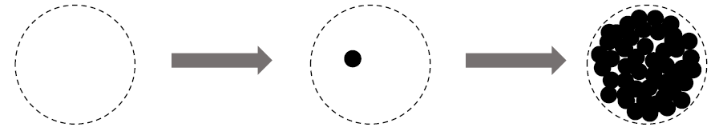

### Class Imbalance Problem
The paper tackles the problem of long-tailed data distribution where a few classes account for most
of the data, while most classes are under-represented.

**Head:** For the class with small indices, these classes have the larger number of samples.

**Tail:** For the class with large index, these classes have the smaller number of samples.

**Black Solid Line:** Models directly trained on these samples are biased toward dominant classes.

**Red Dashed Line:** Re-weighting the loss by inverse class frequency may yield poor performance on real-world data with high class imbalance.

**Blue Dashed Line:** A class-balanced term is designed to re-weight the loss by inverse effective number of samples.

### Effective Number of Samples
#### Definition

Intuitively, the more data, the better. However, since there is information overlap among data, as the number of samples increases, the marginal benefit a model can extract from the data diminishes.

**Left:** Given a class, denote the set of all possible data in the feature space of this class as S. Assume the volume of S is N and N ≥ 1.

For a class, N can be viewed as the number of unique prototypes.

**Middle:** Each sample in a subset of S has the unit volume of 1 and may overlap with other samples.

**Right:** Each subset is randomly sampled from S to cover the entire set of S. The more data is being sampled, the better the coverage of S is.
The expected total volume of sampled data increases as the number of samples increases and is bounded by N.

Therefore, the effective number of samples is defined as the expected volume of samples.

The idea is to capture the diminishing marginal benefits by using more data points of a class.
Due to intrinsic similarities among real-world data, as the number of samples grows, it is highly possible that a newly added sample is a near-duplicate of existing samples.

In addition, CNNs are trained with heavy data augmentations, all augmented examples are also considered as same with the original example.

#### Mathematical Formulation

Denote the effective number (expected volume) of samples as $$E_n$$, where $$n$$ is the number of samples.

To simplify the problem, the situation of partial overlapping is not considered.

That is, a newly sampled data point can only interact with previously sampled data in two ways: either entirely inside the set of previously sampled data with the probability of p or entirely outside with the probability of 1-p.

Proposition (Effective Number): 

$$E_n = \frac{(1−β^n)}{(1−β)}$$

where $$ β = \frac{(N− 1)}{N} $$

This proposition is proved by mathematical induction.

### Class-Balanced Loss (CB Loss)
The Class-Balanced Loss is designed to address the
problem of training from imbalanced data by introducing a weighting factor that is inversely proportional to the effective number of samples.

The paper denotes the loss as $$ረ(p,y)$$, where $$y\in\{1,2,...,C\}$$, and $$C$$ is the total number of classes, and $$p$$ is the estimated class probability.

The class-balanced (CB) loss can be written as:

where$$n_y$$is the number of samples in the ground-truth class $$y$$. The visualization is as follows where it depicts a function of $$n_y$$ for different β

Note that β=0 corresponds to no re-weighting and  β→1 corresponds to re-weighing by inverse class frequency. The proposed novel concept of effective number of samples enables us to use a hyperparameter β to smoothly adjust the class-balanced term between no re-weighting and re-weighing by inverse class frequency.
#### Class-Balanced Softmax Cross-Entropy Loss
Given a sample with class label y, the softmax cross-entropy (CE) loss for this sample is written as:

Suppose class y has $$n_y$$ training samples, the class-balanced (CB) softmax cross-entropy loss is:

#### Class-Balanced Sigmoid Cross-Entropy Loss
When using sigmoid function for multi-class problem, each output ode of the network is performing a one-vs-all classification to predict the probability of the target class over the rest of classes.

In this case, Sigmoid doesn’t assume the mutual exclusiveness among classes.

Since each class is considered independent and has its own predictor, sigmoid unifies single-label classification with multi-label prediction. This is a nice property to have since real-world data often has more than one semantic label.

The sigmoid cross-entropy (CE) loss can be written as:

The class-balanced (CB) sigmoid cross-entropy loss is:

#### Class-Balanced Focal Loss
The focal loss (FL) proposed in RetinaNet, reduce the relative loss for well-classified samples and focus on difficult samples:

The class-balanced (CB) Focal Loss is:

### Experimental Results
#### Datasets

5 long-tailed versions of both CIFAR-10 and CIFAR-100 with imbalance factors of 10, 20, 50, 100 and 200 respectively, are tried.

iNaturalist and ILSVRC are class imbalance in nature.

The above shows the number of images per class with different imbalance factors.

#### CIFAR Datasets

The search space of hyperparameters is {softmax, sigmoid, focal} for loss type, β ∈ {0.9, 0.99, 0.999, 0.9999}, and γ ∈ {0.5, 1.0, 2.0} for Focal Loss.

The best β is 0.9999 on CIFAR-10 unanimously.

But on CIFAR-100, datasets with different imbalance factors tend to have different and smaller optimal β.

On CIFAR-10, when re-weighting based on β = 0.9999, the effective number of samples is close to the number of samples. This means the best re-weighting strategy on CIFAR-10 is similar with re-weighting by inverse class frequency.

On CIFAR-100, the poor performance of using larger β suggests that re-weighting by inverse class frequency is not a wise choice. A smaller β is needed that has smoother weights across classes.

For example, the number of unique prototypes of a specific bird species should be smaller than the number of unique prototypes of a generic bird class. Since classes in CIFAR-100 are more fine-grained than CIFAR-10, CIFAR-100 have smaller N compared with CIFAR-10.

#### Large-Scale Datasets

The class-balanced Focal Loss is used since it has more flexibility and it is found that β = 0.999 and γ = 0.5 yield reasonably good performance on all datasets.

Notably, ResNet-50 is able to achieve comparable performance with ResNet-152 on iNaturalist and ResNet-101 on ILSVRC 2012 when using class-balanced Focal Loss to replace softmax cross-entropy loss.

The above figures show the class-balanced Focal Loss starts to show its advantage after 60 epochs of training.
## TL;DR
* The paper tackles the problem of long-tailed data distribution where a few classes account for most
of the data, while most classes are under-represented.
* The paper provides a theoretical framework to study the effective number of samples and show how to design a class-balanced term to deal with long-tailed training data.
* The paper shows that significant performance improvements can be achieved by adding the proposed class-balanced term to existing commonly used loss functions including softmax cross-entropy, sigmoid cross-entropy and focal loss.