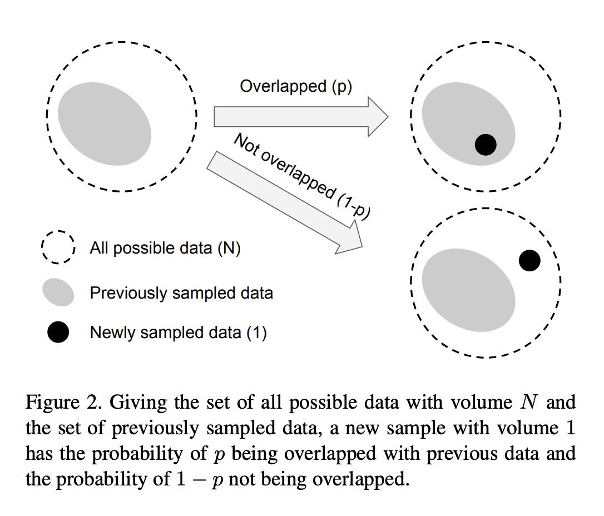
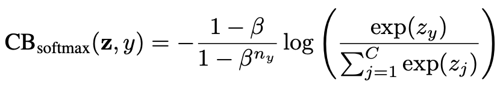
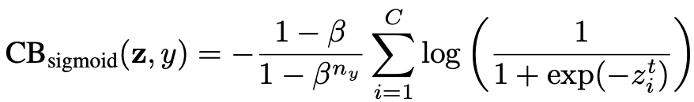
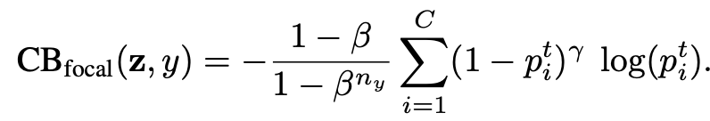
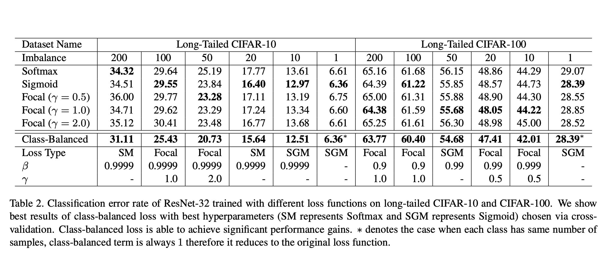
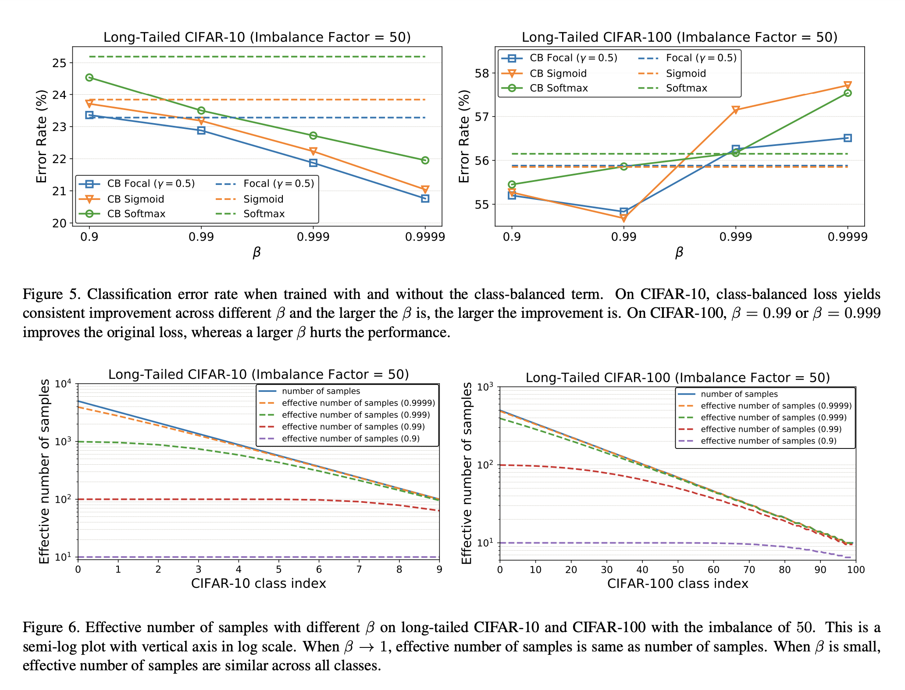
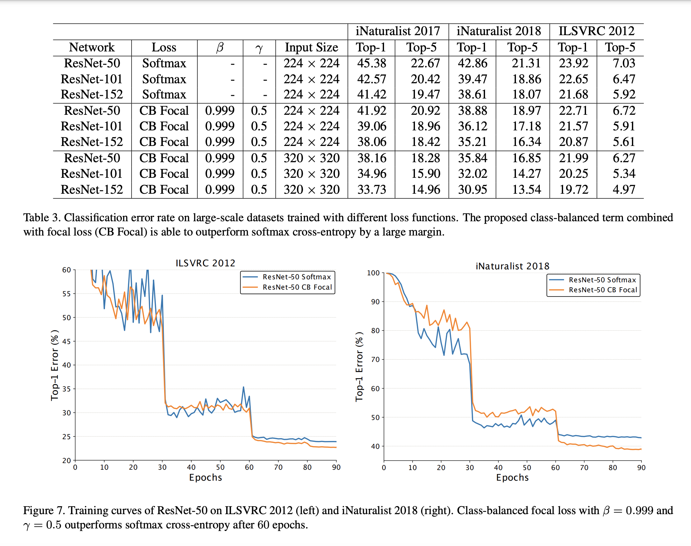

## What is the core idea?

With large-scale data comes the problem of having only a few classes account for most of the data, while most other classes being under-represented.

Therefore, it is critical to address the problem of tailed data distribution.

In this paper, the authors design a re-weighting scheme that uses the effective number of samples for each class to re-balance the loss.

The key idea is to associate each sample with a small neighboring region instead of a single point.

## How is it realized (technically)?

The effective number of samples is defined simply as:

$$E_n = \frac{(1-\beta^n)}{(1-\beta)}$$

where $$n$$ is the number of samples and $$\beta \in [0,1)]$$ is a hyperparameter.

Consider the data sampling process as a simplified version of random covering

* Given a class, let's call the set of all possibe data in the feature space of this class as $$\mathbf{S}$$.
* We assume the volume of $$\mathbf{S}$$ is $$N$$ and $$N \ge 1$$.
* Randomly sampling from $$\mathbf{S}$$ as a way to sample data and considering it as a random covering problem implies that the when more data is sampled, the coverage of $$\mathbf{S}$$ is better.
* The expected total volume of sampled data increases as the number of data increases, and is bounded by $$N$$.
  * Calculating expected total volume is a difficult problem
  * The authors simplfied the problem such that partial covering is not considered
  * Hence, newly sampled data can only interact with the previously sampeld data by either being inside the set of previously sampled data (with probability $$p$$) or not. See figure 2
  * 
  * With $$\beta = \frac{N-1}{N}$$, the formula $$E_n$$ holds through proof by induction. 

The idea of the authors is to capture the diminishing marginal benfits by using more data points of a class.

* Highly likely, due to intrinsic similarities, that in real-world data, a newly added sample is a near-duplicate of existing samples.

CNNs are trained with heavy data augmentations (random cropping, re-scaling, horizontal flipping)

* Small neighboring region of a sample able to caputre all near-duplicates that can be obtained by data augmentation.
* Hence, a large $$N$$ means the effective number of samples for a class is the same as the number of samples $$n$$, so no data overlap
  * On the other hand, a small $$N$$, $$N=1$$ means that there exists a single prototype that can represent all data in a class via data augmentation.

### Class-Balanced Loss

Addresses the problem of training imbalanced data by introducing a weighting factor inversely proportional to $$E_n$$.

The following loss functions are described in the paper.

* Class-Balanced Softmax Cross-Entropy Loss
  * 
* Class-Balanced Sigmoid Cross-Entropy Loss
  * 
* Class-Balanced Focal Loss
  * Focal Loss adds a modulating factor to the sigmoid CE loss
    * This allows the model to focus on difficult samples, instead of well-classified samples
  
  * Introducing a class-balanced version of Focal Loss will therefore be interesting to compare as both losses are trying to solve the problem introduced by class imbalance in the data.
  * 
  

## How well does the paper perform?

* Notice how the class-balanced losses, even when compared to normal Focal Loss, is the most optimal

## TL;DR
* Accounting for class imbalance in the training data by using class-balanced loss functions gives the best loss values 
* Using the effiective number of samples $$E_n$$ for some class, softmax cross entropy, sigmoid cross entropy, and focal loss can be applied in a class-balanced fashion. 
* The effective number of samples is defined as $$E_n = \frac{(1-\beta^n)}{(1-\beta)}$$
