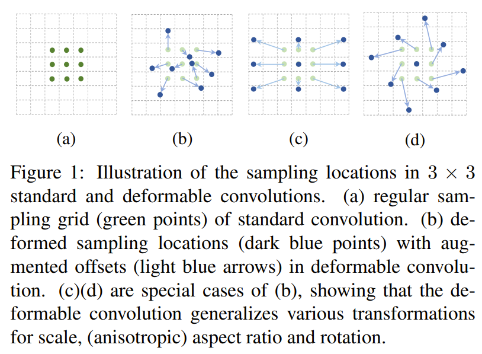
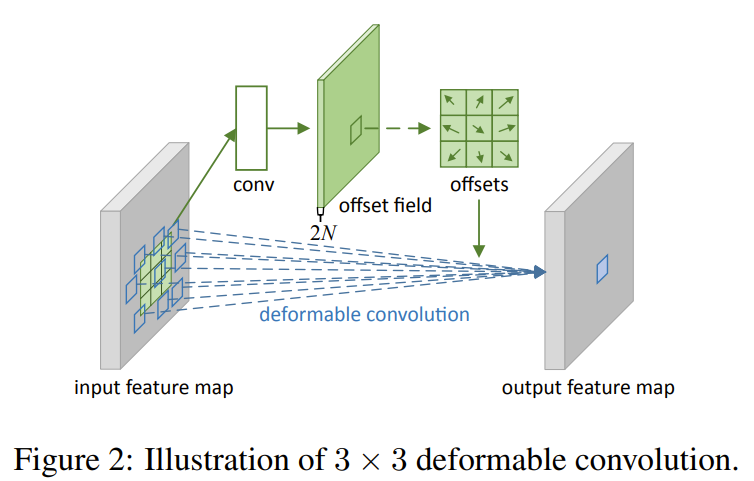
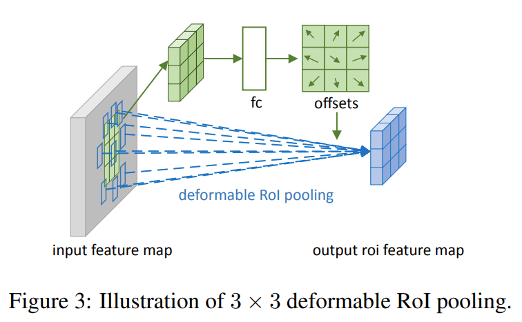
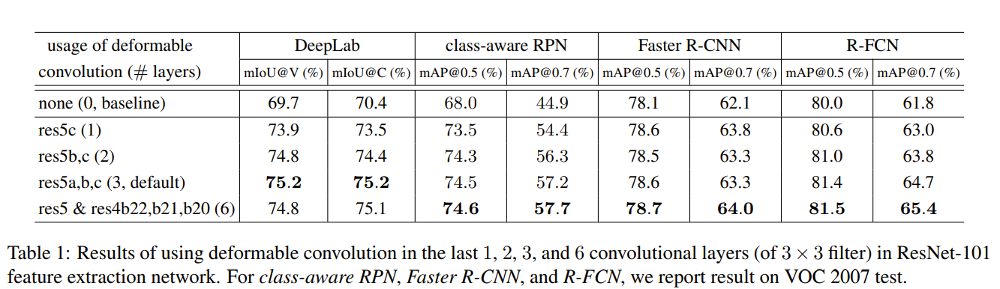
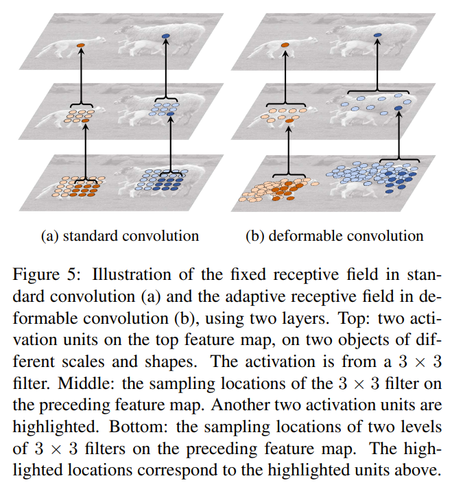
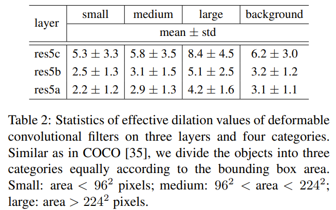

## Background

Problem: Accomodate geometric variations in object scale, pose, or viewpoint in image recognition.

Two previous solutions:
* Use data augmentations (prevents generalization to new tasks with unknown transformations).
* Use transformation-invariant features and algorithms (difficult for overly complex transformations).

CNN modules have fixed geometric structures.
* Convolutions sample the input at fixed locations.
* Pooling layers reduce the resolution at a fixed ratio.
* RIO pooling layers seperate an RIO into fixed spatial bins.
* All activations in the same CNN layer have the same receptive field sizes, but different locations may correspond to different objects with different sizes.
* Object detection still relies on bounding boxes.

## Deformable Convolution

Deformable convolution adds 2D offsets to the regular grid sampling locations in standard convolutions.

The offsets are learned from preceding feature maps.

The offsets are obtained by applying a convolutional layer over the same input.

Both convolutional kernels have the same spatial resolution and dilation.

The output offset fields have the same spatial resolution as the input, with 2N channels corresponding to N offsets.

Both convolutional kernels for producing output features and offsets are learned simulataneously during training.

## Deformable RIO Pooling

RIO pooling converts an arbitrary sized input rectagular region into fixed size features.

Similar to deformable convolutions, offsets are added to spatial binning positions.

Offsets are obtained by first generating the pooled feature maps, then running a fully connected layer to generate normalized offsets, and finally transforming the normalized offsets into real offsets by scaling it with the RIO's width and height.

Offset normalization allows offsets to be independent of RIO size.

## Results

Accuracy improves with more deformable convolutional layers:

Effective dilation is a rough measure of receptive field size of a filter.

The receptive field sizes of deformable convolutions are correlated to object sizes:

## TL;DR
* CNN's are limited due to fixed geometric structures.
* Deformable convolutions are able to accommodate geometric variations and boost performance.
* Deformable convolutions learn 2D offets to regular sampled locations.
