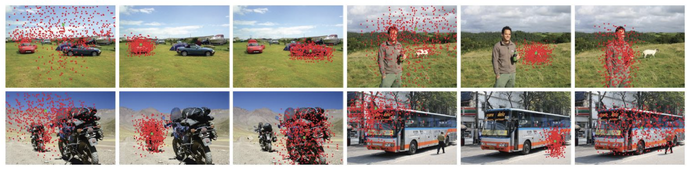

## What is the core idea?
* Standard CNNs use fixed geometric shape: a convolution unit samples the input feature map at fixed locations; a pooling layer reduces the spatial resolution at a
fixed ratio
* This paper proposes Deformable Convolution Networks (`DCN`) which enables convolution/RoI pooling units to **learn to deform the sampling locations (grid)**

## How is it realized (technically)?
### Deformable Convolution
Composed of two convolution layers:
* Regular convolution layer to generate output features but the n x n sampling grid is augmented with offsets 
* Offsets are obtained by applying a separate convolutional layer over the same input and is learned simultaneously

### Deformable Region of Interest (`RoI`) Pooling
Similar idea as deformable convolution, offsets are now added to the spatial binning positions
* Regular RoI pooling first generates the pooled feature maps, a Fully-connected layer then generates normalized offsets
* Normalized offsets are scaled back to RoI's width and height, this enables offset learning invariant to RoI size

## How well does the paper perform?
### Object Detection on COCO Dataset

### Sample Visualization

## TL;DR
* Enables convolution units to learn to sample input spatial location
* End to end trainable without additional supervision
* Gets significant improvements over traditional CNNs on object detection task
