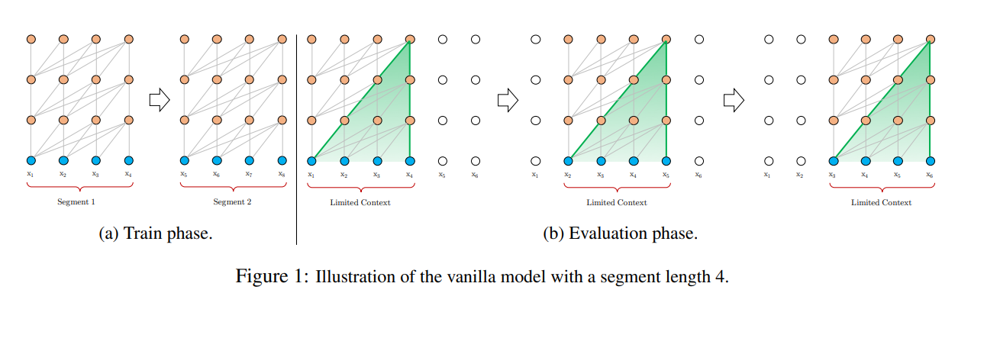
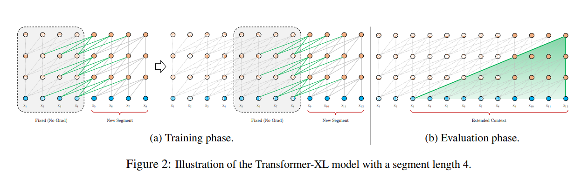
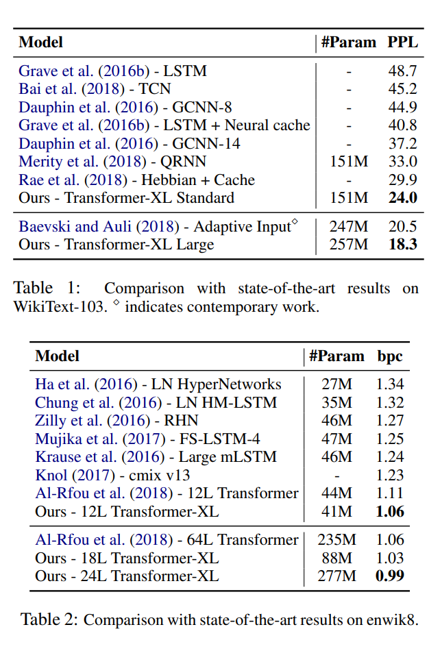
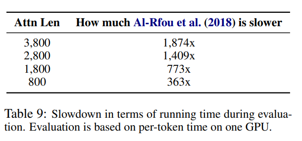

## Core Idea

For language modeling, regular RNN and LSTM transformers of the time struggled with a concept called context fragmentation.  This phenomenon occured when fixed length segments caused sentence boundaries to be ignored and thus created a model that struggled to generate the initial symbols of a sentence.

The authors developed a new Transformer-XL (Xtra-Long) model to address context fragmentation with two core features. 

## Implementation

First, Transformer-XL used Segment-Level Recurrence and State Reuse to avoid fixed length context segments.  This is done by storing the hidden state of a segment not just for the next segment, but also for future segments afterwards.  This gives the model a sense of extended "history" as segment dependencies reach farther into future segments.  Technically, this is realized with a recurrence mechanism that links two segments together and propgates their hidden states throughout the layer.

Below we can see the difference in segment connections between regular Transformers and Transformer-XL.

Advantages of this change are two-fold.  
* First, having a model of longer-term dependancy avoids context fragmentation, a problem experienced by prior transformers on this task.  
* Second, the recursive nature of the model allows faster training as information in previous segments can be easily accessed in later segments.

The second feature of Transformer-XL, which is necesary to achieve the benefits of the first Segment-Level Recurrence feature, is the introduction of Relative Positional Encodings.  In order to facilitate the re-use of prior segments, temporal bias is defined relatively in this method, rather than statistically.  Relative positional encodings thus further facilitates the previously mentioned advantages of Segment-Level Recurrence.

## Performance

In terms of how Transformer-XL performs, results showed that it outperforms state-of-the-art models in both perplexity and bits per character.  

Below we can see in Table 2 that Transformer-XL was the first to break 1.0 bit per character on the enwiki8 dataset, a notable achievement for the time.  Also in Table 1 we can see that Transformer-XL has reduced perplexity to SoTA with a comparable parameter count.

Next we look at Relative Effective Conext Length (RECL), which measures the longest length of context that causes a gain across a threshold.  Transformer-XL achieved context lengths 80% longer than RNNs and 450% longer than transformers, meaning Transformer-XL is empirically able to better capture longer-term dependency.

Finally, Transformer-XL also took less time to evaluate than the state-of-the-art language models.

## TL;DR
* Prior language model Transformers suffer from fixed-length context and context fragmentation.
* Transformer-XL avoids this using Segment-Level Recurrence and Relative Positional Encodings for longer-term dependencies.
* Transformer-XL outperforms state-of-the-art in perplexity, bits per character, context length, and validation time.
