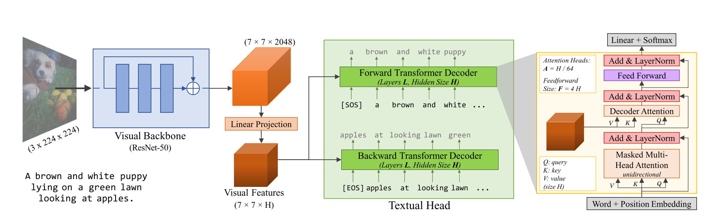
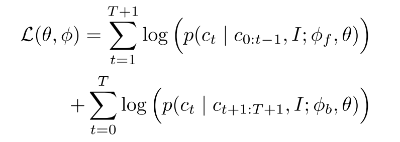

* What is the core idea?

Recently, unsupervised pretraining methods have been taking up the storm for their exceptional performance on downstream tasks and that supervised pretraining methods are expensive to annotate. However, unsupervised pretraining methods are also not very data efficient in that they require a lot of data to learn good visual representations. So, the authors of VirTex pursued a data efficient, supervised pretraining method that can learn good visual representations.

VirTex stands for learning **Vi**sual **R**epresentations from **Tex**tual annotations. A convolutional network is used to construct good visual features that can be used by Transformers to do image captioning. Since captions provide a semantically denser learning signal than unsupervised contrastive methods and supervised classification, the convolutional network is expected to learn visual features using fewer images than other methods, but with captions.

* How is it realized (technically)?

    

**Visual Backbone**: A convolutional network is used here to compute visual features of images. The authors of the paper used a standard ResNet-50. For downstream tasks, the authors either trained linear models on features extracted from the visual backbone, or fine-tuned the visual backbone end-to-end.

**Textual Head**: The textual head will receive features from the visual backbone and predict captions for images. The authors used two Transformers to do autoregressive captioning, one that predicts in the forward direction (`[SOS]` to `[EOS]`) and one that predicts in the backward direction (`[EOS]` to `[SOS]`). The Transformers used GELU instead of ReLU and share the same token embedding matrix. The captions are tokenized using the Byte-Pair Encoding algorithm.

**Objective**: All models are jointly trained to maximize the log-likelihood of the correct caption tokens in both directions:

    

The authors purposefully chose to not use the Masked Language Modeling objective because they found it to be slow in convergence. Note that Masked Language Modeling have poor sample efficiency, which means they predict a subset of tokens instead of all tokens.

* How well does the paper perform?
* What interesting variants are explored?

## TL;DR
* Three
* Bullets
* To highlight the core concepts
