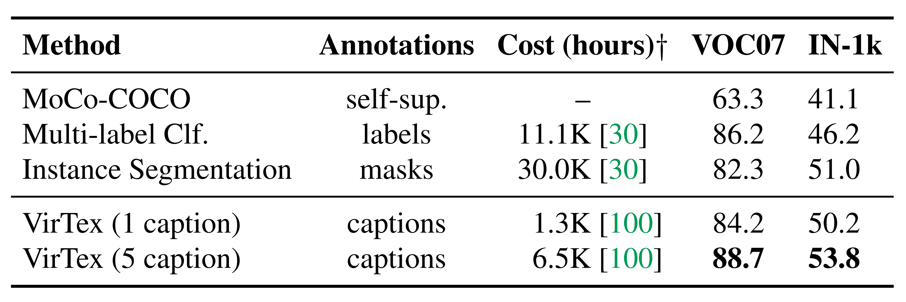
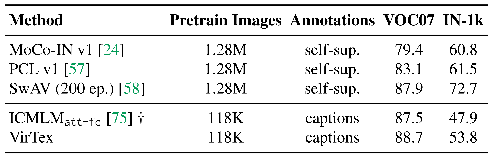
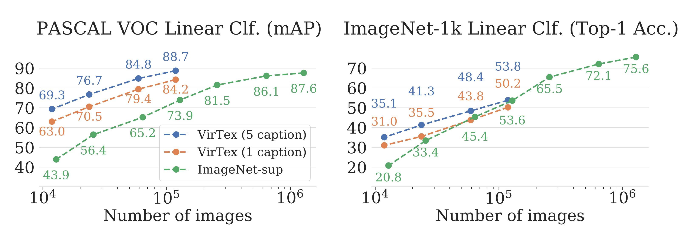
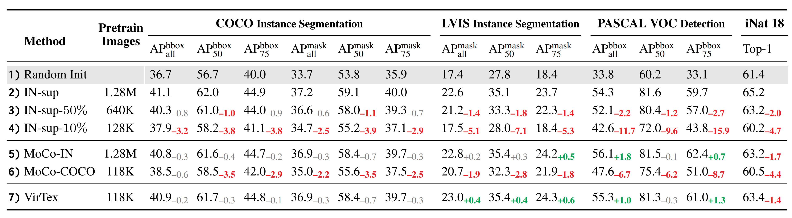
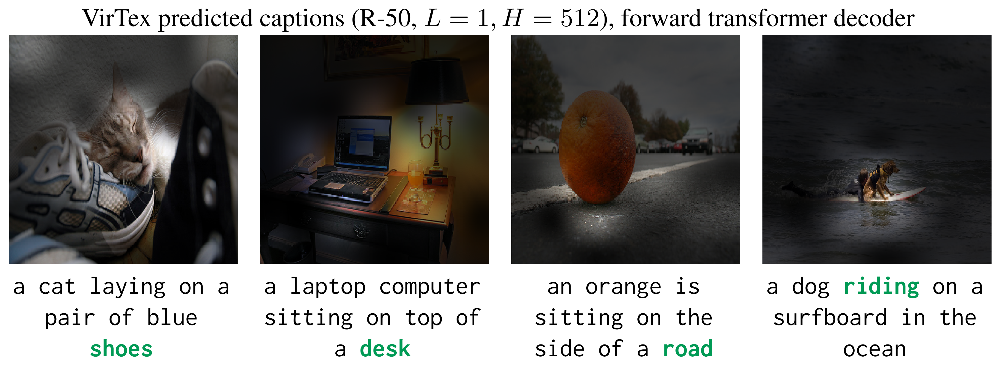

* What is the core idea?

Recently, unsupervised pretraining methods have been taking up the storm for their exceptional performance on downstream tasks and that supervised pretraining methods are expensive to annotate. However, unsupervised pretraining methods are also not very data efficient in that they require a lot of data to learn good visual representations. So, the authors of VirTex pursued a data efficient, supervised pretraining method that can learn good visual representations.

VirTex stands for learning **Vi**sual **R**epresentations from **Tex**tual annotations. A convolutional network is used to construct good visual features that can be used by Transformers to do image captioning. Since captions provide a semantically denser learning signal than unsupervised contrastive methods and supervised classification, the convolutional network is expected to learn visual features using fewer images than other methods, but with captions.

* How is it realized (technically)?

    

**Visual Backbone**: A convolutional network is used here to compute visual features of images. The authors of the paper used a standard ResNet-50. For downstream tasks, the authors either trained linear models on features extracted from the visual backbone, or fine-tuned the visual backbone end-to-end.

**Textual Head**: The textual head will receive features from the visual backbone and predict captions for images. The authors used two Transformers to do autoregressive captioning, one that predicts in the forward direction (`[SOS]` to `[EOS]`) and one that predicts in the backward direction (`[EOS]` to `[SOS]`). The Transformers used GELU instead of ReLU and share the same token embedding matrix. The captions are tokenized using the Byte-Pair Encoding algorithm.

**Objective**: All models are jointly trained to maximize the log-likelihood of the correct caption tokens in both directions:

    

The authors purposefully chose to not use the Masked Language Modeling objective because they found it to be slow in convergence. Note that Masked Language Modeling have poor sample efficiency, which means they predict a subset of tokens instead of all tokens.

* What interesting variants are explored?

The authors performed experiments using the visual backbone on 6 downstream tasks. Two of the tasks froze the backbone to extract features, and the other four tasks fine-tuned the visual backbone.

* How well does the paper perform?

**Frozen Features**: The authors trained linear models that use these features for object detection on PASCAL VOC 2007 and for image classification on ImageNet-1k. They tested VirTex against a self-supervised method (MoCo-COCO), a label-supervised method (Multi-label Classification), and an instance segmentation-supervised method. Because COCO Captions provide 5 gold captions, only 1 of the 5 is randomly sampled during pretraining for fair comparisons in data efficiency between methods. Furthermore, the authors tested VirTex against competitive self-supervised methods (MoCo-IN, PCL, SwAV) and concurrent works (ICMLM). **VirTex outperforms all models here, even when trained with only 1 caption per image.**

Note: mAP is reported for PASCAL VOC 2007 and top-1 accuracy is reported for ImageNet-1k.

    
    

**Data Efficiency**: To test the hypothesis that the semantic density of captions should allow VirTex to learn effective visual features from fewer images than other methods, the authors compared 4 VirTex models supervised using {1p, 20, 50, and 100}% of COCO Captions (118K images) and 7 ResNet-50 models (denoted IN-sup) supervised using {1, 2, 5, 10, 20, 50, and 100}% of ImageNet-1k (1.28M images). **VirTex outperforms or closely matches the ImageNet-supervised models despite using 10x less images.**

    

**Fine-Tuning**: The visual backbone of VirTex is fine-tuned here for downstream tasks. The authors tested on 4 fine-tuning tasks: 1) Instance Segmentation on COCO, 2) Instance Segmentation on LVIS, 3) Object Detection on PASCAL VOC 2007, and 4) Fine-grained Classification on iNaturalist 2018. The baselines are: 3 IN-sup models, each pretrained with {10, 50, 100}% of ImageNet images, and 2 MoCo models, one pretrained using ImageNet images (MoCo-IN) and one pretrained using COCO images (MoCo-COCO). **VirTex outperforms or closely matches all methods here despite using 10x fewer pretraining images, and it also outperforms methods that use similar or more pretraining images.**

    

**Ablations and Caption Attentions**: The authors found bicaptioning task to do better than weaker pretraining tasks - forward captioning, token classification, and masked language modeling. Bigger visual backbones and larger transformers (wider, deeper) improve downstream performance.

    

## TL;DR
* VirTex is a supervisd pretraining method.
* VirTex used a visual backbone (ResNet-50) to do feature extraction which transformers can use to do image captioning with.
* VirTex is much more data efficient than other methods because captions are semantically dense.
