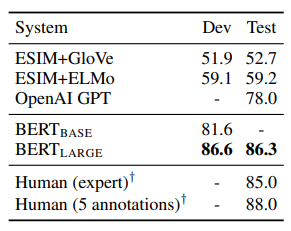

### BERT: Bidirectional Encoder Representation from Transformers
BERT is a simple and empirically powerful model that achieves state of the art results in a variety of both token and sentence level tasks. Its simplicity comes from only minimal changes needed to be done to use the model for separate tasks and its strength comes from its ability to look at text bidirectionally and pre-training that generates SOTA results when fine-tuned in a whole range of tasks. In addition to fine-tuning, BERT's pre-training can also be used for feature-based approaches in which task-specific models use BERT's representations as extra features (similar to ELMo).

  

### BERT Architecture
BERT is a multi-layer bidirectional Transformer encoder designed almost identically to the "Attention is all you need" paper. Additionally, BERT is presented in two different sizes, BERT base and BERT Large. The differences for these models can be seen in the following table.

|                      | BASE | LARGE |
|----------------------|------|-------|
| Layers               | 12   | 24    |
| Hidden Size          | 768  | 1024  |
| Self Attention Heads | 16   | 16    |
| Total Parameters     | 110M | 340M  |

Input in BERT is designed to be flexible to the variety of tasks it can handle. 

  

First, one or two sentences are tokenized via WordPiece into a sequence. Next, the first token of every sequence is '[CLS]' and if the sequence consists of two sentences they should be separated by a token '[SEP]'. Next, embeddings are generated for the tokens. In addition to generating the token embeddings, the model also generates segment embeddings and position embeddings. Segment refers to what sentence the current token is a part of (so if we're doing a two sentence task, there is two options, if were doing a single sentence task there is only one). Position is the index of the current token. Segment and Position are then embedded and added to the token embeddings. The models output is the same shape as the input so each token can be mapped to token classifications and the output value of the '[CLS]' token can used for sentence classification tasks.

### Pre-training
BERT is pre-trained through the use of unlabeled data in 2 separate tasks: Masked Language Modeling (MLM) and Next Sentence Prediction (NSP).

The MLM pretraining task is what allows the model to be bidrectional and is a token classification task. Language modeling is the task of predicting text giving context, for example chat bots that generate sentences and responses to questions. Typically, language modeling is done either left to right or right to left since doing bidirectional would allow other parts of the sequence to be seen. However BERT solves this by masking certain tokens and making those the tokens to be predicted. 15% of sequence tokens are masked and the model predicts the masked tokens. Key issue with this is that when fine-tuning the model does not recieve '[MASK]' tokens as input, so to mitigates this, 80% of the time the actual '[MASK]' token is used, 10% of the time a random token, and 10% the original.  MLM's convergence is generally slower than traditional methods but the resulting benefits are worth it.

The NSP task was motivated by tasks such as question answering and natural language inference where it is crucial for the model to understand the relationship between two sentences. NSP is a sentence binary prediction task in which two sentences are given and the model predicts if the second sentence follows the first.

### Fine-tuning
Fine tuning BERT is relatively straight forward, input and output are passed into BERT and all parameters are fine-tuned. For token classification tasks we use outputed tokens, for sentence classification tasks we use the output of the '[CLS]' token, and we can pass two sentences as input by separating with the '[SEP]' token.

## Experiments
For the first set of experiments, BERT used the General Language Understanding benchmark (GLUE).

  

BERT large achieves a 7% improvement over the previous SOTA in the benchmark and 11.1% improvement over the best non transformer model.

The second set of experiments were done on the Stanford Question Answering Dataset (SQuAD v1.1) in which a question and context is given as input. The model then predicts the span of text that contains the answer. TriviaQA is a separate dataset that the model was first fine tuned on to get top results and ensembled BERT is 7 versions of BERT are ensembled and fine-tuned to produce predictions.

  

The third experiment, SQuAD 2.0, extended SQuAD 1.1 by allowing the possibility for simple answers to not exist within the context which makes the experiment more realistic.

  

The fourth experiment was Situations With Adversarial Generations (SWAG) in which the task is that given 1 sentence, pick which of 4 sentences is a more likely continuation. This is fed to the model as 4 separate inputs and best result is given as the answer.

  

The next experiments studied the effect of pre-training tasks on different metrics. LTR refers to using left to right LM as opposed to MLM.

  

Finally, the final experiments looks at the effects of different model  sizes on results. One key point to note is generally, the sizes picked for BERT are considerably larger than all other transformers trained previously. L is the number of  transformer blocks, H is the hidden size, and A is the number of self-attention heads. Generally, as the BERT model got bigger, it performed better.

  

The final experiments explore the uses of BERT as a feature-based approach as opposed to fine-tuning. It is argued that not all  tasks can be modeled in BERT's architecture; however,  we can often find uses for BERT. The following experiment examins the strength of BERT as a feature generator on the NER task. It passes input to pre-trained (and not fine-tuned) BERT to generate contextualized embeddings and then this is fed into a BiLSTM.

  

## TL;DR
* Pre-training techniques that allow for bidirectionality (such as MLM and NSP) are important to generating good models
* Generalized pre-trained representations reduce dependencies on complex models for specific tasks
* Above mentioned points allow for SOTA results on 11 NLP tasks
