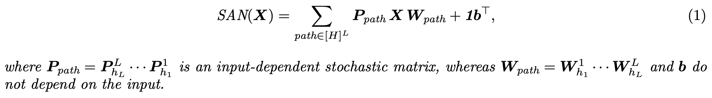
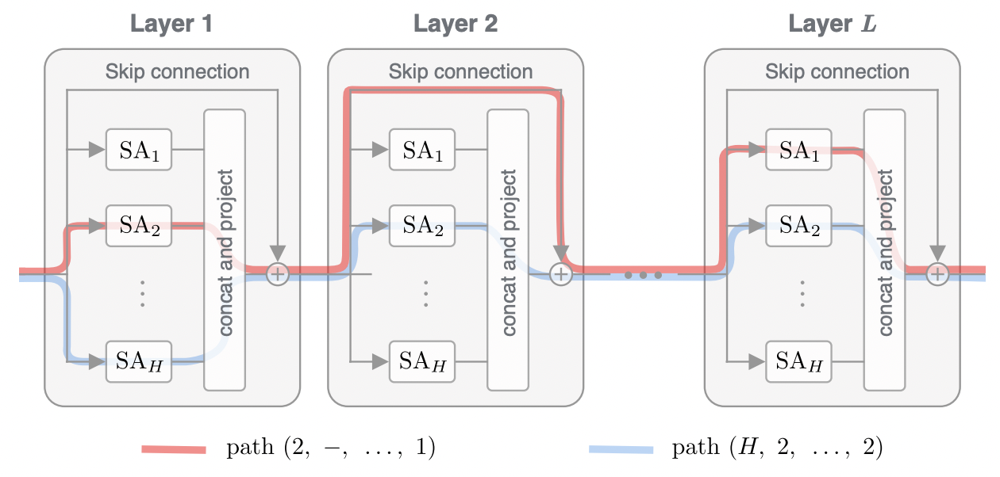
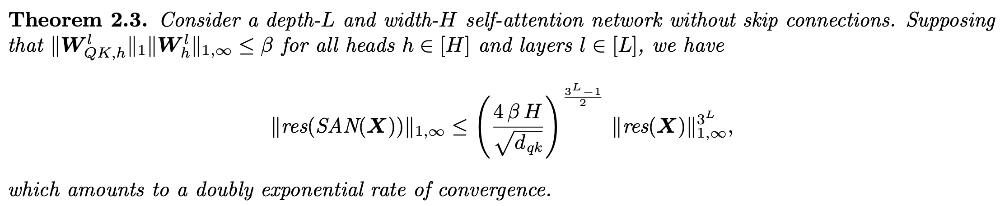
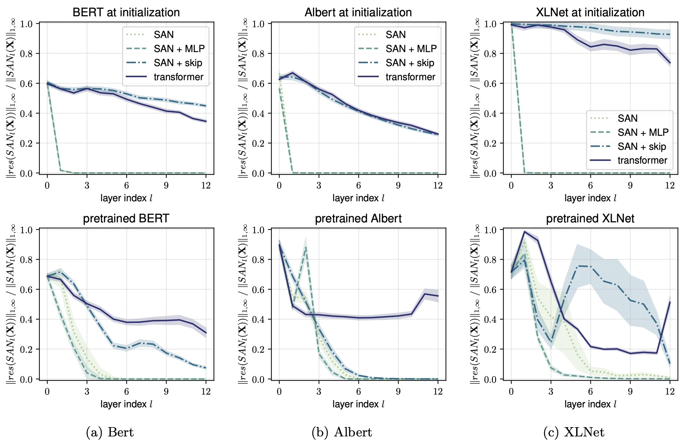
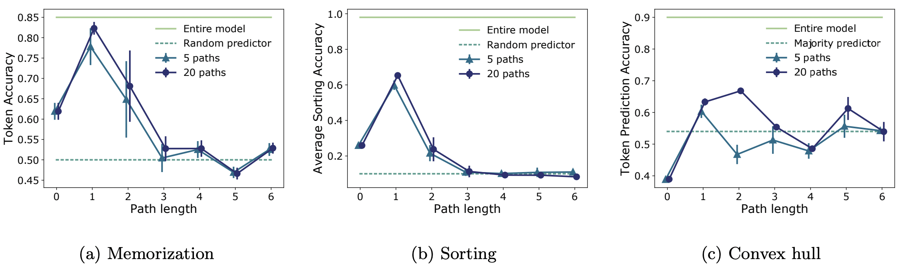

## What is the core idea?
The authors study self attention based architectures and realize following key properties:
1) Self attention layers have strong bias towards "token uniformity" and it gets exponentially worse with depth
2) Skip-connection and MLP counteract the "token uniformity" bias and hence prevent model degeneration

## Context
* Attention-based architectures have become ubiquitous in ML yet understanding of the reasons for their effectiveness is limited.
* Transformer architectures consists of multiple transformer layers stacked on each other, typical transformer layer is as following ([Source](https://jalammar.github.io/illustrated-transformer/)):

## Self-Attention Networks (`SAN`) path decomposition
The paper starts by studying self-attention networks (`SAN`s) built exclusively out of multi-head self-attention layers. 

They show that the ouput of `SAN` decomposes into the combination of simpler single-head networks, where each single-head corresponds to a unique path across `H` heads and `L` layers

## Exponential degeneration of `SAN`s
The output of `SAN` loses rank (moves towards uniform token representation) exponentially with depth

## Skip connections and MLP help in avoiding rank collapse

* Adding Skip connections leads to some paths which essentially have low depth and hence rank collapse is mitigated

* MLP increases the lipschitz constants of the function which slows down the collapse rate with depth

## Path effectiveness

Analysis of `SAN` with skip connections indicates that **path expressivity decreases with path length**, to test this hypothesis, authors isolate paths of different lengths and evaluate their predictive power
> Transformer behaves like an ensemble of shallow networks, there is underutilized capacity in long paths

## TL;DR
* Deep self attention layers tend to collapse token outputs towards degenerate representation
* Skip-connection and MLP help in avoiding such collapse
* Transformers behaves like an ensemble of shallow networks
