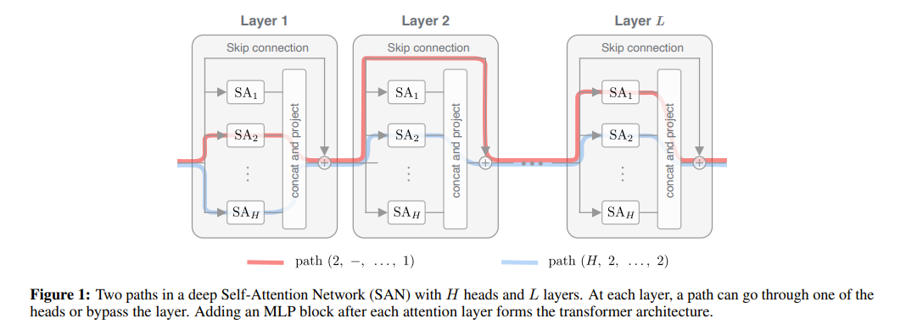
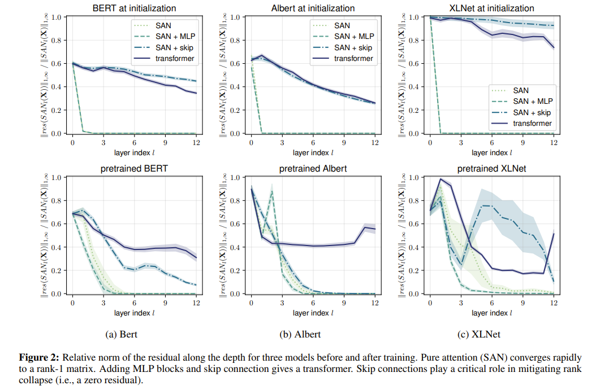
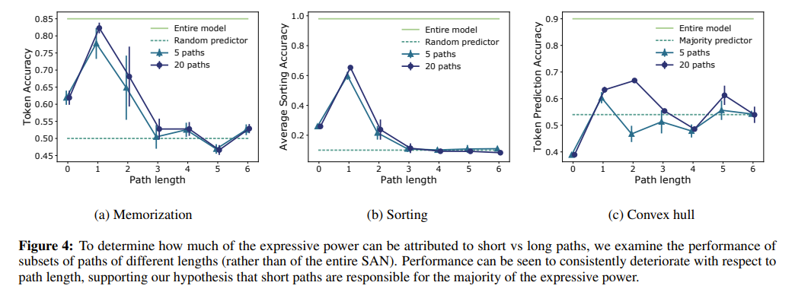

## Core Problem

Without skip connections or mutli-layer perceptrons, the output of self attention networks converges doubly exponentially to a rank 1 matrix.

Rank collapse indicates that the direction of the output vector has become independent of the actual input.

## Paper Contributions

Skip connections play a key role in mitigating rank collapse.

MLP's can slow down the convergence by increasing their Lipschitz constant.

Paper proposes a new method to analyze SAN's (Self Attention Networks) using path decomposition.

Path decomposition expresses the output of a mutli-head SAN as a sum of single-head networks.

Each path is denoted by a sequence of attention heads.

## Mechanisms that Counteract Convergence

In the presense of skip connections, hypothesize that the presence of short paths stops SAN's from degenerating to rank 1.

SAN's with skip connections heavily rely on short paths, which means SAN's behave like ensembles of shallow single-head self-attention networks.

While the effect of MLP's is less drastic than skip connections, the convergence rate can be controlled by the Lipschitz constants.

The more powerful the MLP's are the slower the convergence becomes.

Layer normalization does not slow down the convergence to rank 1.

## Path Effectiveness

Short paths carry predicive power, while the output of longer paths is not much better than a random guess.

Rapidly diminishing effectiveness of paths with respect to length indicates that attention networks rely almost entirely on short paths.

There is underutilized capacity in long paths, and one way to make them more effective is to prevent them from losing rank.

## TL;DR
* Pure attention decays in rank exponentially with depth
* Skip connections and MLP's stop the output from degeneration
* SAN's work as an ensemble of shallow networks.
