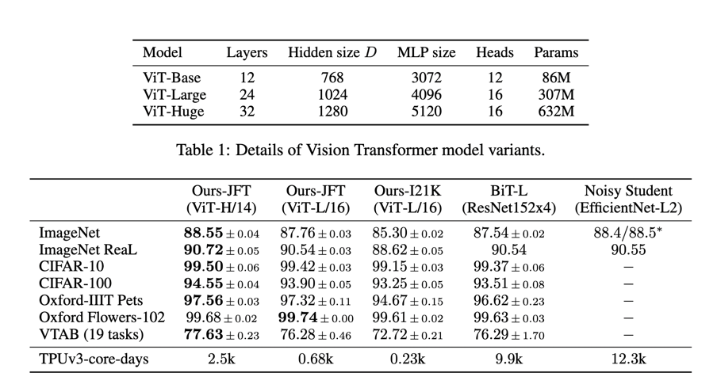
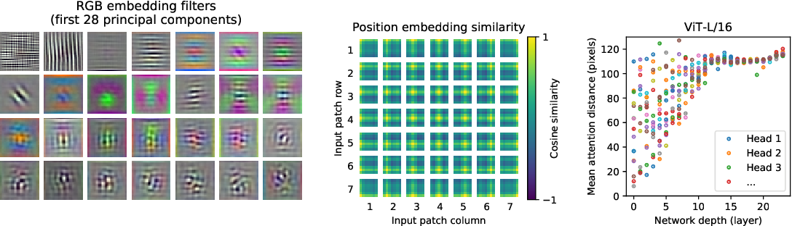
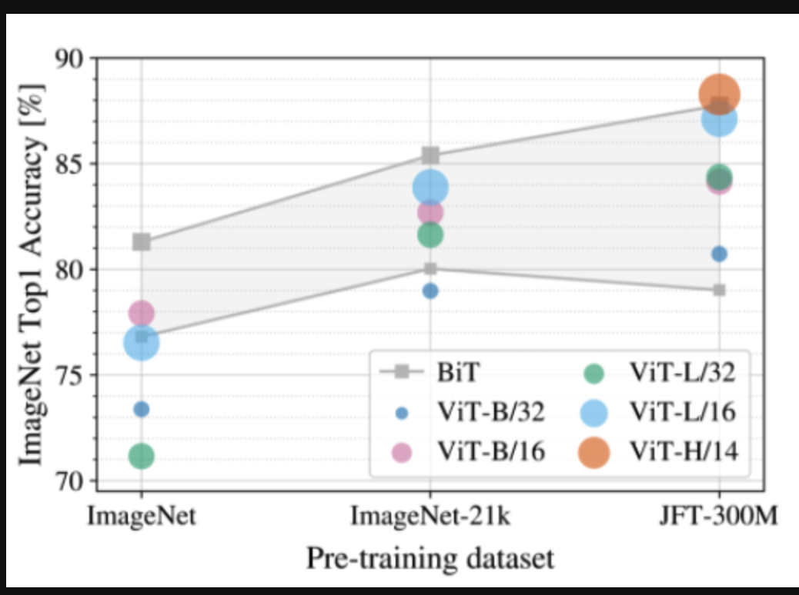

# The Big Idea

By splitting images into chunks and putting the chunks in a sequence, we can utilize transformers for image classification without heavy attention costs.

# Why can't we use transformers directly on images?

- Attention for an image would require attending every pixel to every other pixel, this is too costly to do for semi-large images

# How can we avoid the large cost?

- The main intuition is that by slicing an image into chunks, we can create a sequence of small image patches to be used in the transformer.

# How is it realized?

- We can create chunks of an image into a small size (16x16 for example) and feed in each chunk as part of a sequence to the transformer

- Each chunk will be turned into a vector (flatten the channels and pixels), and passed into a linear projection (patch embedding)
  
- Each patch embedding will also receive a position encoding sot he model knows where in the image the patch came from

- From here, we are able to use the transformer similar to BeRT and others (as shown below)

# Does it work?

- Yep! With sufficiently sized models, ViT out performs CNN based models significantly

- at 2% of the training time, ViT-L is able to achieve competitive performance to BiT
  
- at 7% ViT-L outperforms BiTL in nearly every category

# Why does it do so well?

# So why not use ViT everywhere, where's the catch?

- It comes down to the inductive bias of CNNs vs Transformers

- CNNs are built to find structural information (their inductive bias), where as a transformer does not have this "intuition"

- This means a transformer must be trained to pick up on structural information within images

- which means ViT fails to outperform CNNs until it receives **sufficient data** (data hungry / requires large datasets to train)

- Smaller datasets can actually cause the transformer to overfit, so it might be worth using a CNN in this case.

## TL;DR
- Splitting images into chunks and then embedding them as vectors allows us to use the Transformer Architecture (ViT)
- ViT learns kernel like filters and receptive fields like CNNs after sufficient training and can outperform CNN baselines
- CNNs are still better to use for small datasets