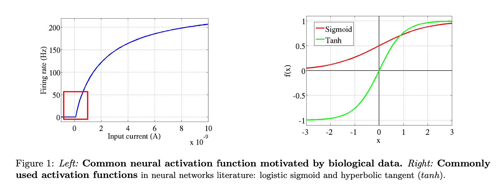
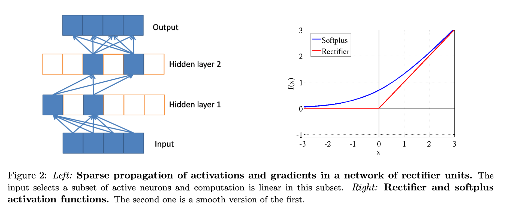

TODO: Summarize the paper:
* What is the core idea?

  * First paper (I believe) to prove using rectifier function ($$max(0,  x)$$) better than $$\em{logistic sigmoid}$$ or $$\em{hyperbolic tangent}$$ activation functions. Approaches this from the field of computational neuroscience. 

  * Proposes the use of rectifying non-linearities as alternatives to the hyperbolic tangent or sigmoid in deep artificial neural networks, in addition to using an $$L_1$$ regularizer on the activation values to promote **sparsity** and prevent potential numerical problems with unbounded activation. 

  * rectifier function brings together the fields of computational neuroscience and machine learning.

  * Rectifying neurons are a better model of biological neurons than hyperbolic tangenet networks.

  * There are gaps between computational neuroscience models and machine learning models. Two main gaps are:

    * Estimated percentage of neurons active in the brain at the same time is between 1 and 4%. Ordinary feedforward neural nets (without additional regularization such as an $$L_1$$ penalty) do not have this property.
      * Ex: the sigmoid activation "has a steady state regime around $$\frac{1}{2}$$ , therefore, after initializing with small weights, all neurons fire at half their satura- tion regime. This is biologically implausible and hurts gradient-based optimization."
    * Deep learning and neural networks literature (up to this point in 2011) most commonly used linear activation functions while biological neuron models use non-linear activation functions. (see figure 1)

    

  * Advantages of sparsity:

    * Information disentangling.
      * A claimed objective of deep learning algorithms (Bengio, 2009) is to disentangle the factors explainging the variations in the data. 
      * A dense representation is highly entangled - almost any change in the input modifies most of the entries in the representation vector.
      * A sparse representation that is robust to small input changes, therefore, conserves the set of non-zero features.
    * Efficient variable-size representation
    * Linear separability
    * Distributed but sparse

  * Disadvantages of sparsity:

    * Too much sparsity may hurt "predictive performance for an equal number of neurons" as it reduces the "effective capaicty of the model."

  

  * Advantages of **rectifier** neurons:
    * Allows network to easily obtain sparse representations
      * Is more biologicially plausible
    * Computations are also cheaper as sparsity can be exploited
    * No gradient vainishing effect due to activation non-linearities of sigmoid or tanh units.
    * Better gradient flow due on active neuons (where computation is linear - see figure 2)
  * Potential Problems:
    * Hard saturation at 0 may hurt optimization
      * Smooth version of rectifying non-linearity - $$softplu(x) = \log(1 + e^x)$$ (see figure 2)
        * loses exact sparsity but may hope to gain easier training
    * Numerical problems due to unbounded behaviour of the activations
      * Use the $$L_1$$ penalty on the activation values - also promotes additional sparsity.

* How is it realized (technically)?

  * Used stacked denoising auto-encoders (Vincent et al., 2008) with three hidden layers and 1000 units per layer. 

* How well does the paper perform?

  * Experiment results
    * Sparsity does not hurt performance until around 85% of neurons are 0. (see figure 3)
    * 
    * Rectifiers outperform softplus
    * No improvement using pre-trained autoencoders - hence just using rectifier activation function is easier to use 

* What interesting variants are explored?

  * recctifier versus softplus 

## TL;DR
* rectifier activation function better than sigmoid and tanh activation functions 
* sparsity is good - increases accuracy, computationally better performance, and representative of the biological neuron 
* 50-80% sparsity for best generalising models, whereas the brain is hypothesized to have 95% to 99% sparsity.
