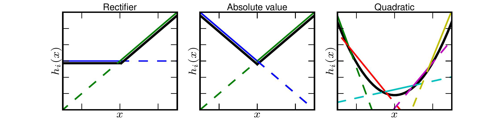

**_Main Idea_**

Taking the element-wise max of an input ran across multiple weight matrices produces a non-linear activation function
that can learn approximations of any convex function and take advantage of dropout layers while improving accuracy and 
allowing deeper networks.

**_How is it realized_**

Maxout networks use "Maxout Layers".  

Maxout Layers are composed of one or more Maxout Units

Maxout Units have multiple weight matrices and biases for the same input!  
(tip: Think of convolutional feature maps, in MLPs or linear layers they are just extra weight matrices and biases)

Maxout Units takes the values from all the weight matrices in its layer, does the element wise multiplication with the
input per weight matrix, and then does an element wise maximum across all the different activations for that input.

$$
x^T \textrm{is input to a layer (image/text/features from previous layer etc.)}
$$

$$
W_{...ij}, b_{ij} \textrm{is the jth weight matrix & bias term of the ith unit for the maxout layer}
$$

$$
z_{ij} = x^TW_{...ij} + b_{ij} 
$$

$$
h_i(x) = {max}_{j\in[1,k]} z_{ij}
$$

**_What does this mean_**

Because each input to the layer has a set of weights that are going to be Maxed over, 
the activation function has "learnable weights".

With sufficient cardinality (weight matrices per maxout unit), Maxout is capable of representing convex functions including 
Relu or Leaky Relu.

Furthermore, if you incorporate 2 Maxout units with high cardinality (as seen below), the Maxout activations can **approximate** any continuous function

they also have a more detailed proof in the paper as to why this is true.

**_Why is this important_**

Rectifiers (RELUs, etc.) suffer from dead activations, where they basically set the inputs to 0

This means Rectifiers use only a portion of the full potential of the model

Maxout Layers do not suffer from this as much because the values can be negative and rarely go to zero

Thus maxout layers will utilize more of the model than rectifiers will, which usually improves accuracy and allows for deeper networks

**_What are the costs_**

The major cost is that you now add many more weights per neuron increasing the computation time and size of your model 
for better approximations of convex functions.

**_How well does the paper perform?_**

They compare their model on various datasets incuding MNIST, CIFAR-10, CIFAR-100 and SVHN.  

They achieve state-of-the-art results in some cases reducing error by as much as 4%.

However, the biggest performance improvement is best shown by how much of the model is being utilized.  

Other models that use rectifiers suffered from dead neurons which made the gradient suffer and learning stall,
Maxout overcomes these issues.

Because of this, Maxout is able to support deeper models and make a more efficient use of the parameters, indicating that 
even better performance may be achievable.

**_Interesting Variants_**

The authors found empirically that gradient flows through the model more efficiently due to Maxout not suffering from dead neurons

The authors found empirically that Maxout trains better with Dropout than rectifiers due to Dropout performing model 
averaging because Maxout units able to stabilize better with noisy input

## TL;DR
- Maxout requires a single layer to have multiple (k) weight matrices and takes the maximum values of those k activations as the final output
- Maxout Activations take advantage of Dropout more than any other activation function (at the time of the writing of the paper)
- Maxout alleviates the dead neuron issues prevalent with rectifiers by learning a representation that is less sparse.
